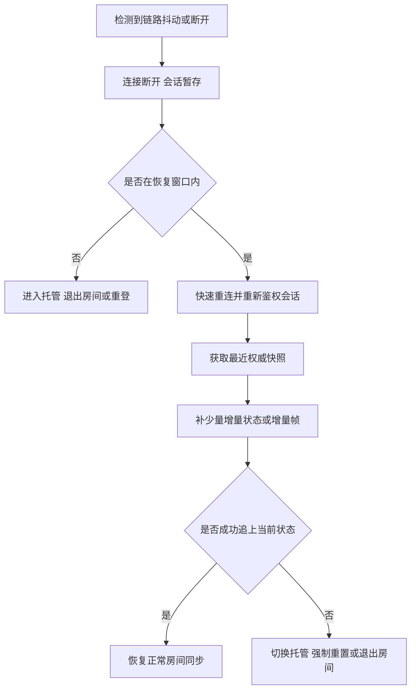

# 房间广播、弱网与国内网络环境

抽象网络讨论如果不放回真实环境，很容易停留在理想条件。对很多面向移动端、房间制和国内网络环境的游戏来说，真正的挑战不是实验室里的平均 RTT，而是弱网、切网、基站波动、后台切前台、地区链路差异，以及房间广播被少数慢连接拖住。

这一页关心的是：当一局里有多名玩家共享状态，而每个人的网络质量又持续波动时，系统怎样才能既维持可玩性，又不让整房体验被最差链路绑死。

## 为什么房间广播会放大网络问题

房间制场景和普通点对点交互不同，它天然具备两个放大器：

- 一人异常，会影响整房体验。
- 同一个状态变化，可能要广播给很多人。

所以一个玩家弱网时，不只是他自己“有点卡”，还可能引发：

- 房间广播积压。
- 同步节奏被拖慢。
- 重发和补包成本上升。
- 其他玩家看到该玩家状态异常。

这也是为什么房间广播和弱网治理必须一起设计，而不是各自独立处理。

## 国内移动网络环境里的日常现实

设计时最好直接承认下面这些现实，而不是把它们当特殊事故：

- Wi-Fi 和蜂窝网络切换非常频繁。
- 电梯、地铁、地下车库会导致短时断流和大抖动。
- 不同运营商、不同地区链路质量差异明显。
- 设备切后台、锁屏、来电会打断网络行为。
- 玩家设备性能也会影响收发节奏和重连速度。

只要项目是移动端多人在线，这些就应该被当成日常流量特征，而不是边缘 case。

## 广播优化首先是语义优化，不是压缩优化

房间广播最容易犯的错误，是一有状态变化就全量发给所有人。这样做在房间人数不多时或许还能跑，一旦人数一多、对象一多、弱网连接一多，问题会立刻暴露。更稳妥的做法通常包括：

- 区分关键广播和非关键广播。
- 允许某些状态用最新值覆盖旧值。
- 对高频状态做合并、降频和裁剪。
- 对不同接收者发送不同粒度的数据。

也就是说，广播设计首先要回答“什么值得发、发到什么粒度”，而不只是“怎么把包压得更小”。

## 什么消息该补发，什么消息该放弃

房间里不是所有广播都值得重传。更现实的原则通常是：

- 关键裁决结果：要么可靠送达，要么能通过后续快照恢复。
- 高频位置或朝向：旧消息过时后通常不值得补发。
- 状态切换类事件：要么保留可靠语义，要么保证有后继状态能覆盖。
- 大块状态恢复：更适合走快照，而不是堆很多历史增量。

如果不区分这些语义，系统很容易在弱网时把大量无价值旧消息一遍遍重发，反而拖慢真正有价值的消息。

## 弱网治理的目标不是完全一致，而是整局还能玩

弱网治理并不意味着让所有人体验完全一致，这通常做不到。更现实的目标是：

- 多数情况下整房还能继续。
- 弱网用户不会无限拖累正常用户。
- 关键状态最终能收敛。
- 异常用户可以重连、托管或被明确处理。

这就是为什么很多房间型项目需要提前定义：

- 网络质量分层。
- 超时阈值。
- 默认输入或托管接管。
- 重连窗口。
- 失败后是快照恢复、快速追帧还是直接退出房间。

## 重连恢复通常比补历史广播更重要

弱网场景下一个常见错误，是系统执着于“把断开期间所有广播都补齐”。这在很多项目里并不是最优解。更稳妥的思路通常是：

- 保留最近状态快照。
- 重连时先恢复到最近权威状态。
- 再补少量增量或少量帧。
- 超过阈值后不再盲目补历史消息。

原因很简单：断线期间的很多广播对当前状态已经没有价值，而恢复玩家最需要的是尽快回到“现在”，不是完整看完过去几秒发生了什么。

## 一条更贴近实践的弱网恢复链路

这条链路想表达的核心只有一句话：弱网恢复的目标是回到当前可玩状态，而不是补齐每一条历史消息。

## 广播策略和玩法强相关

不同房间类型，广播策略差异很大：

- 棋牌和回合类：关键状态少，但操作确认和结算必须稳。
- 派对和轻竞技：广播频率高，但很多状态允许覆盖和降级。
- 强实时房间：输入、位置、技能、命中、重连快照都要更精细设计。

所以不要把“房间广播”理解成一个通用模块，它总是和玩法时序、同步模型、重连策略绑在一起。

## 这类问题最该持续监控什么

如果项目有房间广播和弱网恢复，至少应该持续观测：

- 单房广播消息量。
- 单连接写缓冲积压。
- 重传或补发比例。
- 心跳超时率。
- 切网后重连成功率。
- 重连平均耗时。
- 因网络问题进入托管或退出房间的比例。

没有这些指标，就很难知道玩家口中的“卡”“飘”“老是重连”到底发生在哪一层。

## 常见误区

- 只在稳定网络下调试和压测，线上再把问题归咎于“用户网络不好”。
- 对弱网用户过度等待，导致整房体验被最差链路绑死。
- 执着于补齐所有历史广播，而不是尽快把掉线玩家恢复到当前权威状态。

房间广播和弱网治理真正要做的，不是把所有坏网络都强行修成好网络，而是让整局在现实网络条件下仍然可收敛、可恢复、可继续。
