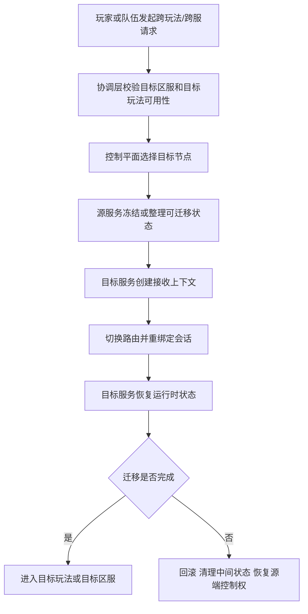

# 协调层、跨服与控制平面

很多项目早期只有数据平面，没有真正的控制平面。也就是说，节点能处理玩家请求，房间能推进战斗，场景能维护状态，但系统里没有一个正式层来回答这些更高一层的问题：

- 新房间应该落在哪台节点上
- 热点场景爆了以后谁来迁移和切流
- 某个区服什么时候进入维护态
- 玩家跨玩法、跨场景、跨服时由谁指挥
- 节点故障以后谁来决定恢复路径

项目规模小的时候，这些事情常被手工配置、临时脚本、业务层分支逻辑和隐式约定勉强顶住。规模一上来，它们就会从“以后再说”变成主系统。

## 先把数据平面和控制平面分开理解

这是理解这一章最关键的一步。

### 数据平面负责什么

数据平面直接处理业务流量和运行时状态，例如：

- 房间服推进一局战斗
- 场景服维护地图与对象状态
- 活动服处理活动进度
- 支付服流转订单状态

### 控制平面负责什么

控制平面不直接推进业务状态，它负责组织、治理和指挥这些节点，例如：

- 知道哪些节点当前可用
- 知道哪些节点负载高、哪些节点可以接新实例
- 决定新房间、新场景、新玩法实例该落在哪里
- 管理摘流、迁移、维护态、扩缩容和版本门禁
- 在故障发生时统一决定切换和恢复动作

如果系统只有数据平面，没有控制平面，调度与治理逻辑就会不可避免地散落进业务代码里。

## 协调层为什么迟早会长出来

只要系统开始进入下面这些阶段，协调层就几乎不可避免：

- 玩家需要在多个玩法和多个节点之间切换
- 匹配成功后要把队伍分配到某个实例节点
- 世界或场景节点数量会动态变化
- 跨服玩法需要临时组织一套新拓扑
- 运维需要做扩容、缩容、摘流、迁移和维护态控制

这些动作天然跨越多个服务和多个节点，不应该由任何一个业务服务单独拍板。

## 跨服真正难的不是联网，而是迁移

很多团队第一次做跨服时，会把它理解成“本服玩家去别的服打一局，打完再回来”。真做成工程以后，难点几乎都不在通信本身，而在状态与控制权迁移：

- 身份和会话怎么转移
- 哪些状态跟着玩家走，哪些留在原服
- 迁移期间长期资产怎么确认
- 中间失败时怎么回退
- 结束后怎么清算和归档

所以跨服本质上不是一次 RPC，而是一条带有状态整理、会话重绑定、控制权交接和失败恢复语义的完整链路。

## 控制平面通常要承担哪些能力

成熟项目里的控制平面不一定是一个进程，也不一定是一个独立产品，但通常会逐步收拢下面这些能力：

- 服务注册与健康检查
- 节点分组、容量视图和负载信息
- 房间、场景、玩法实例分配
- 区服状态管理，例如开放、只读、维护、下线
- 迁移、切流、摘流和扩缩容编排
- 全局配置下发、版本兼容与门禁控制

这些能力本身不产出玩法内容，但它们决定系统是否能被稳定运营。

## 一个更接近真实工程的迁移链路

这条链路真正要强调的是，跨服和迁移的难点不在“把包发过去”，而在“谁什么时候拥有控制权，以及失败后如何恢复到单一真相”。

## 没有控制平面时会出现什么后果

系统没有正式控制平面时，常见现象通常是：

- 房间分配策略写死在匹配服务里
- 场景迁移策略写死在场景节点里
- 扩容靠人工改配置和重启服务
- 节点摘流靠临时脚本和人工广播
- 玩家重连时找不到当前正确实例

前期还能跑，后期一旦进入热点活动、跨服玩法、故障切流和多区服运营，系统就会越来越难指挥。

## 协调层最容易做坏的三个地方

### 把调度逻辑散落在每个业务服务里

短期确实省事，但后果是任何调度策略调整都要同时改多个服务，而且系统全局没有统一视图。

### 只有静态配置，没有实时节点状态

控制平面如果只知道“理论上有哪些节点”，不知道节点当前健康、容量和负载，就很难做出正确分配，最终只能靠经验和人工兜底。

### 只负责分配，不负责回滚和恢复

很多系统能做“把玩家发过去”，但做不好“发过去失败怎么办”。没有回滚与恢复语义，迁移和跨服迟早会出现双重绑定、半迁移和状态悬空。

## 什么时候它不再是可选项

当项目进入下面这些阶段时，控制平面通常就不再是附属能力，而是基础设施：

- 多区服并行运营
- 多玩法节点独立部署
- 大型活动需要动态编排
- 热点房间或场景需要弹性扩缩容
- 运维需要明确维护态、摘流、迁移和切流入口

这时继续把调度能力藏在业务代码里，长期成本会非常高。

## 常见误区

最常见的错误，是只有数据平面，没有正式的控制平面。第二类错误，是把跨服理解成简单远程调用，不处理状态迁移、会话切换和失败回滚。第三类错误，是把协调逻辑散落在各个业务服务里，导致全局没有统一调度视图，也没有稳定运维入口。
