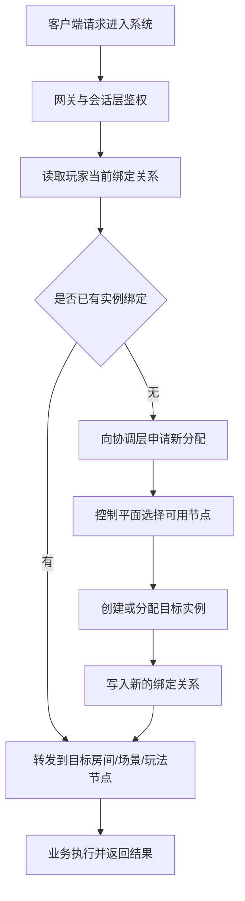

# 服务发现、路由与协作

服务一旦拆开，系统马上要回答一个非常具体的问题：这次请求到底该去哪里。玩家登录以后该落到哪个网关，匹配完成以后该进哪个房间节点，断线重连时该回哪个实例，跨服迁移时绑定关系又该怎么切。所有这些问题加在一起，才构成真正有工程价值的“服务发现、路由与协作”。

很多系统早期用静态配置、进程内路由表或者简单哈希也能勉强跑起来，但节点数量、玩法类型和运维动作一多，这一层就会迅速从边角功能变成主问题。

## 服务发现到底在发现什么

服务发现不是简单拿到 IP 和端口。更贴近游戏工程的视角，它至少还要知道：

- 哪些节点当前可用
- 每个节点承载什么角色
- 某类玩法实例可以分配到哪些节点
- 节点当前健康、容量和接单状态如何
- 某个玩家、队伍或房间当前绑定在哪个实例

如果系统只发现“地址”，不知道“职责、状态和容量”，后面的路由决策必然粗糙而脆弱。

## 为什么游戏路由比普通业务路由更难

很多普通业务系统的请求可以直接打到统一入口，再由负载均衡随机或按规则分发。游戏里的路由往往天然带有会话性和状态性：

- 同一玩家重连后必须回原房间或原场景
- 同一房间的玩家必须落到同一实例
- 同一队伍进入副本时常常需要整体绑定
- 某次跨服活动要进入特定玩法集群
- 某个热点场景迁移后必须整体切换绑定

这意味着，游戏路由不是随机分流，而是围绕会话和状态归属组织的绑定系统。

## 路由其实至少分成四类

### 入口路由

负责把玩家从登录入口或网关导向正确业务域，例如大区、区服、平台分组、版本环境。

### 会话路由

负责维护玩家当前绑定在哪个房间、场景或玩法实例。重连、切线、托管、迁移都依赖它。

### 服务间路由

负责服务调用目标选择，例如活动请求该打到哪个活动实例，某个房间结算该发给哪个结算链路。

### 迁移路由

负责在跨玩法、跨场景、跨服时变更绑定关系，并保证新旧绑定切换有序且可恢复。

把这些完全不同的问题硬塞进一个“统一路由层”里，通常只会得到一堆边界模糊的分支逻辑。更稳妥的方式，是明确每类路由的状态来源、更新条件和失效语义。

## 路由体系最怕的不是“找不到”，而是“找错了”

线上事故很多时候不是彻底无法寻址，而是下面这些更难排查的问题：

- 找到了不该去的节点
- 路由信息已经过期
- 玩家绑定关系只更新了一半
- 服务发现层认为节点可接单，实际节点已经在摘流
- 重连时回到了旧节点，但实例已经迁走

所以服务发现和路由真正解决的不是“是否能连上”，而是“请求能否被送到当前正确且有效的目标”。

## 协作为什么比“互相调用”更重要

很多团队把服务协作理解成“接口能调通就行”。这远远不够。真正的协作至少意味着：

- 多个服务围绕同一条业务链路有清楚的职责分工
- 上游知道什么时候应该同步等待、什么时候应该异步放手
- 下游知道失败后该返回什么、重试什么、补偿什么
- 所有参与方对绑定关系、控制权和完成条件有一致理解

协作的核心不是互调接口，而是多服务共同完成一件事时，边界和失败语义都被正式写清楚。

## 一个更贴近真实工程的请求流

这条链路真正想强调的是，实例分配和绑定写入不该由每个业务节点各自临时决定，而应该有统一语义和统一真相源。

## 实现手段不是重点，治理规则才是重点

无论你使用注册中心、自定义路由表、服务网格还是其他方案，真正决定质量的通常不是中间件名字，而是这些治理规则有没有建立：

- 节点状态多久刷新一次
- 健康检查是否可信
- 路由变更是否具备原子语义
- 节点摘流是否有正式流程
- 玩家和实例绑定关系是否有单一真相源

这些问题没有解决，再成熟的组件也只是在给混乱加速。

## 最能暴露问题的不是正常流量，而是异常路径

路由体系最诚实的验收场景通常不是日常请求，而是这些时刻：

- 玩家断线重连
- 节点故障切换
- 房间迁移
- 场景迁移
- 区服维护、摘流和恢复

只要这些场景经常出问题，就说明服务发现和路由体系还没有真正建起来。

## 常见误区

最常见的错误，是把服务发现理解成“拿到一组地址”，忽略了角色、健康、容量和绑定关系。第二类错误，是让每个业务服务自己维护一套路由逻辑，最后迁移和重连时全局没有统一真相源。第三类错误，是只设计正常路径，不设计节点摘流、绑定失效和迁移失败时的协作语义。
