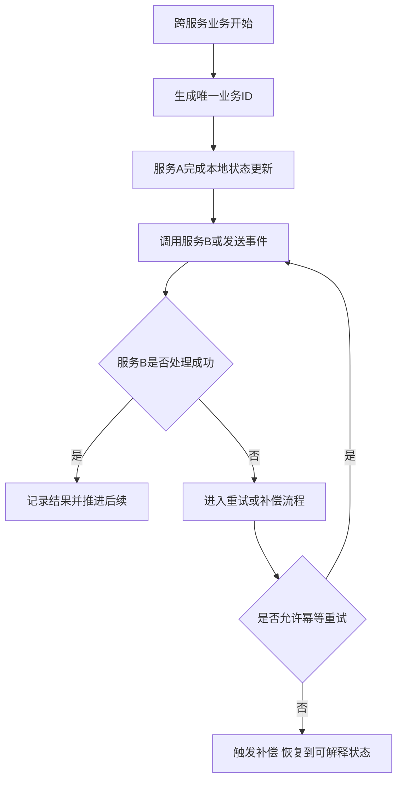

# 一致性、恢复与重连

服务拆开以后，一致性、恢复和重连不再是某个单点模块的局部问题，而是整条系统链路都必须共同承担的现实成本。单体里，一个事务失败也许只是本地回滚；分布式系统里，更常见的是这种情况：

- 这边写成功了，那边超时了
- 玩家会话已经迁移，旧节点还没完全停掉
- 房间已经结束，结算只写回了一半
- 客户端重连进来，但绑定关系还没切完

所以这里真正要讨论的，不是分布式一致性的理论大全，而是游戏项目里哪些状态需要多强的一致性，哪些状态可以接受最终一致，以及失败以后靠什么恢复。

## 先把一致性拆成两类

如果不先分层，后面几乎一定会陷入“所有东西都想强一致”的误区。

### 运行时一致性

这类一致性关注房间、场景、匹配和迁移过程中的临时状态是否自洽，例如：

- 同一玩家是否只属于一个实例
- 同一局是否只会结算一次
- 迁移时新旧节点是否不会同时拥有控制权
- 重连后会话是否能回到正确运行时上下文

### 长期资产一致性

这类一致性关注奖励、货币、道具、任务、排行、支付结果等长期状态是否最终可信，例如：

- 奖励有没有重复发
- 资产有没有丢失或重复扣减
- 战绩、排行和结算是否最终收敛
- 支付成功后发货是否最终完成

这两类问题处理方式通常不同。试图用同一套强事务手段统一解决，通常既重又慢。

## 为什么恢复能力必须和一致性一起设计

很多系统只讨论“正常路径如何成功”，却不讨论“失败以后怎么办”。这会导致线上一出问题，团队只能靠人工查日志和手工修数。

而真实项目里，这些事情迟早会发生：

- 节点异常退出
- 服务间调用超时
- 控制平面调度失败
- 客户端断线重连
- 玩家迁移中断
- 房间结算中途失败

恢复能力真正要回答的是：失败后系统如何重新进入一个可解释、可继续、可补偿的状态。

## 游戏系统里最常见的恢复问题

### 玩家重连

重连不是“重新连一下网关”这么简单。它往往同时涉及：

- 会话恢复
- 路由重新定位
- 房间或场景实例查找
- 最近状态恢复
- 已完成但客户端未确认结果的再次确认

如果这些语义没有提前定义，所谓“偶发重连问题”通常只是系统对恢复路径没有正式设计。

### 节点迁移

房间迁移、场景迁移、热点切流、摘流、扩容，本质上都属于控制权迁移问题。这里最重要的从来不是“把数据复制过去”，而是“新旧节点如何交接控制权，以及失败时回到哪里”。

### 跨服务链路失败

比如房间结算完成了，但奖励发放超时；支付成功了，但资产回写失败；活动进度更新了，但战绩记录没写进去。这类问题几乎都不能只靠一次调用解决，必须依赖幂等、补偿和恢复语义。

## 幂等和补偿为什么是常备能力

很多跨服务链路根本不适合依赖一个全局大事务。更现实的做法通常是：

- 关键操作带唯一业务 ID
- 各服务基于业务 ID 做幂等处理
- 失败后进入明确的重试或补偿路径

例如：

- 同一场战斗结算重复到达，不会重复发奖
- 同一笔支付回调重复触发，不会重复发货
- 同一份迁移请求重复执行，不会导致玩家双重绑定

幂等不是附加优化，而是让分布式恢复真正可行的基础设施。

## 重连语义为什么必须提前写清楚

成熟系统通常会把下面这些问题提前定死，而不是等线上报错再猜：

- 重连窗口有多长
- 玩家当前状态以哪个服务为准
- 断线期间房间或场景是否继续推进
- 重连后是拉快照、追增量，还是重新入局
- 已完成但客户端没收到的结果如何再次确认

只要这些语义模糊，后面所有重连 bug 都会显得像随机故障，实际上只是规则没写清楚。

## 一条更贴近工程实际的恢复链路

这条链路最关键的不是流程图，而是两件事：

- 每条关键业务必须有唯一标识
- 每次失败都必须有明确定义的去向，而不是停在半完成状态

## 恢复能力通常应该落在哪些位置

比较稳妥的系统，通常会提前在这些位置埋恢复落点：

- 房间和场景的最近状态快照
- 玩家会话绑定和迁移记录
- 结算、奖励、订单的唯一业务编号
- 控制平面的调度操作日志
- 关键长链路的重试、补偿和审计记录

有了这些设施，故障以后系统至少能朝着“可解释”恢复，而不是完全依赖人脑拼日志。

## 一致性强度应该怎么分层取舍

并不是所有链路都值得同样强的一致性。更现实的做法通常是：

- 局内高频状态优先保证运行时语义清楚，必要时接受局部最终收敛
- 长期资产优先保证幂等、审计和最终正确
- 外围通知和低价值链路允许延迟，不应该拖垮主路径

这种分层，比试图让所有状态都同步且强一致，更接近长期可维护的工程方案。

## 常见误区

最常见的错误，是只讨论正常路径如何协作，不讨论失败后如何恢复。第二类错误，是试图用统一强事务解决所有一致性问题，结果复杂度和性能同时失控。第三类错误，是没有唯一业务 ID 和幂等语义，导致重试、回调、重连一来就出现重复副作用。第四类错误，是把重连只当接入层小功能，不把它放回跨服务状态恢复链路里一起设计。
