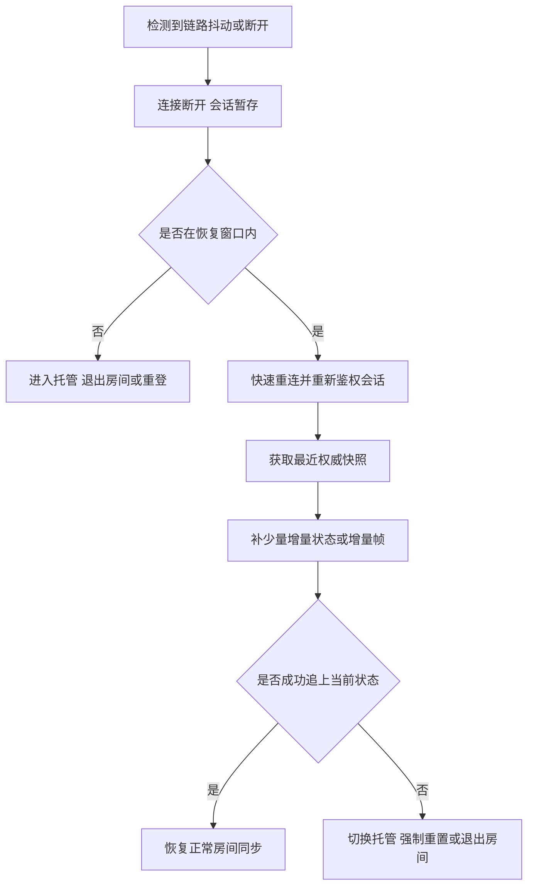

# 房间广播、弱网与国内网络环境

## Category

networking / 弱网治理。节点定位：把房间广播放回国内移动网络的现实条件里设计。

## Definition


抽象网络讨论如果不放回真实环境，很容易停留在理想条件。对很多面向移动端、房间制和国内网络环境的游戏来说，真正的挑战不是实验室里的平均 RTT，而是弱网、切网、基站波动、后台切前台、地区链路差异，以及房间广播被少数慢连接拖住。

这一页关心的是：当一局里有多名玩家共享状态，而每个人的网络质量又持续波动时，系统怎样才能既维持可玩性，又不让整房体验被最差链路绑死。


### 为什么房间广播会放大网络问题

房间制场景和普通点对点交互不同，它天然具备两个放大器：

- 一人异常，会影响整房体验。
- 同一个状态变化，可能要广播给很多人。

所以一个玩家弱网时，不只是他自己“有点卡”，还可能引发：

- 房间广播积压。
- 同步节奏被拖慢。
- 重发和补包成本上升。
- 其他玩家看到该玩家状态异常。

这也是为什么房间广播和弱网治理必须一起设计，而不是各自独立处理。

## Problem


### 广播优化首先是语义优化，不是压缩优化

房间广播最容易犯的错误，是一有状态变化就全量发给所有人。这样做在房间人数不多时或许还能跑，一旦人数一多、对象一多、弱网连接一多，问题会立刻暴露。更稳妥的做法通常包括：

- 区分关键广播和非关键广播。
- 允许某些状态用最新值覆盖旧值。
- 对高频状态做合并、降频和裁剪。
- 对不同接收者发送不同粒度的数据。

也就是说，广播设计首先要回答“什么值得发、发到什么粒度”，而不只是“怎么把包压得更小”。

### 什么消息该补发，什么消息该放弃

房间里不是所有广播都值得重传。更现实的原则通常是：

- 关键裁决结果：要么可靠送达，要么能通过后续快照恢复。
- 高频位置或朝向：旧消息过时后通常不值得补发。
- 状态切换类事件：要么保留可靠语义，要么保证有后继状态能覆盖。
- 大块状态恢复：更适合走快照，而不是堆很多历史增量。

如果不区分这些语义，系统很容易在弱网时把大量无价值旧消息一遍遍重发，反而拖慢真正有价值的消息。

### 弱网治理的目标不是完全一致，而是整局还能玩

弱网治理并不意味着让所有人体验完全一致，这通常做不到。更现实的目标是：

- 多数情况下整房还能继续。
- 弱网用户不会无限拖累正常用户。
- 关键状态最终能收敛。
- 异常用户可以重连、托管或被明确处理。

这就是为什么很多房间型项目需要提前定义：

- 网络质量分层。
- 超时阈值。
- 默认输入或托管接管。
- 重连窗口。
- 失败后是快照恢复、快速追帧还是直接退出房间。

### 重连恢复通常比补历史广播更重要

弱网场景下一个常见错误，是系统执着于“把断开期间所有广播都补齐”。这在很多项目里并不是最优解。更稳妥的思路通常是：

- 保留最近状态快照。
- 重连时先恢复到最近权威状态。
- 再补少量增量或少量帧。
- 超过阈值后不再盲目补历史消息。

原因很简单：断线期间的很多广播对当前状态已经没有价值，而恢复玩家最需要的是尽快回到“现在”，不是完整看完过去几秒发生了什么。

### 一条更贴近实践的弱网恢复链路



这条链路想表达的核心只有一句话：弱网恢复的目标是回到当前可玩状态，而不是补齐每一条历史消息。

### 广播策略和玩法强相关

不同房间类型，广播策略差异很大：

- 棋牌和回合类：关键状态少，但操作确认和结算必须稳。
- 派对和轻竞技：广播频率高，但很多状态允许覆盖和降级。
- 强实时房间：输入、位置、技能、命中、重连快照都要更精细设计。

所以不要把“房间广播”理解成一个通用模块，它总是和玩法时序、同步模型、重连策略绑在一起。

### 这类问题最该持续监控什么

如果项目有房间广播和弱网恢复，至少应该持续观测：

- 单房广播消息量。
- 单连接写缓冲积压。
- 重传或补发比例。
- 心跳超时率。
- 切网后重连成功率。
- 重连平均耗时。
- 因网络问题进入托管或退出房间的比例。

没有这些指标，就很难知道玩家口中的“卡”“飘”“老是重连”到底发生在哪一层。

### 常见误区

- 只在稳定网络下调试和压测，线上再把问题归咎于“用户网络不好”。
- 对弱网用户过度等待，导致整房体验被最差链路绑死。
- 执着于补齐所有历史广播，而不是尽快把掉线玩家恢复到当前权威状态。

房间广播和弱网治理真正要做的，不是把所有坏网络都强行修成好网络，而是让整局在现实网络条件下仍然可收敛、可恢复、可继续。

### 实战案例：一次「越重连越卡，整房被最慢的人拖住」的弱网恢复排查

> 案例为教学示例（非摘自真实项目），数字经过取整简化。它把本页「什么消息该补发，什么消息该放弃」「重连恢复通常比补历史广播更重要」「弱网治理的目标不是完全一致，而是整局还能玩」用到深水区：断线期间的广播被逐条补齐——这是恢复语义没先定的排查，也是「回到当前而不是回看历史」的完整展开。

**背景与现象**：某射击手游重连走全量历史广播补齐，重连平均耗时 **45** 秒；弱网玩家的慢连接拖住房间广播，单房广播消息量 **12000** 条/分钟，因弱网退出房间占比 **18%**，正常玩家跟着「飘」。

### 第一步：现象与口径——先分清是恢复慢还是广播堵

恢复口径：重连平均耗时 **45** 秒，玩家反馈「掉线回来就不想再排了」；断线期间的旧广播对当前状态已无价值，却仍被逐条重放。

广播口径：单房广播消息量 **12000** 条/分钟，弱网连接的写缓冲持续积压，广播给整房间时被最慢的几个连接拖住。

### 第二步：分层归因——按本页弱网治理清单排查

```text
越重连越卡归因  占比
  执着补齐历史广播、不走权威快照恢复      46%
  对弱网用户过度等待、整房被最差链路绑死  34%
  广播不分关键与非关键、旧消息反复重发    20%
```

逐项比对：断线期间所有广播都被补齐，本页说得很直接——弱网恢复的目标是回到当前可玩状态，而不是补齐每一条历史消息；慢连接让整房同步节奏被拖慢；高频位置旧消息过时后仍反复重发。三类都在，补历史那条占比最大。

### 第三步：根因——把「恢复」理解成了「回放」

系统设计假设重连 = 完整回看断线期间每一条消息，于是重连窗口被历史广播塞满，慢连接又把广播队列拖长，形成越重连越堵的循环。而本页的口径是：弱网治理并不意味着让所有人体验完全一致，更现实的目标是多数情况下整房还能继续、弱网用户不无限拖累正常用户、关键状态最终能收敛。

### 第四步：处置与回填——按快照优先重排恢复链路

1. 权威快照优先：重连先恢复到最近权威状态，再补少量增量或少量帧，超过阈值不再盲目补历史消息。
2. 补发语义分档：关键裁决可靠送达或快照兜底，高频位置过时即丢，大块恢复走快照，状态切换保证后继覆盖。
3. 弱网不等待：网络质量分层、超时阈值、默认输入托管、重连窗口、失败策略五件事提前定，弱网用户不拖累整房。

复核账：重连平均耗时 **45** 秒 → **3** 秒；单房广播消息量 **12000** 条/分钟 → **3000** 条/分钟；因弱网退出房间占比 **18%** → **4%**。

**回填清单**：

| 回填项 | 动作 | 回填处 |
|-----|------|--------|
| 补发语义分档 | 裁决可靠送达、位置过时丢弃、大块走快照、切换保后继 | 什么消息该补发，什么消息该放弃 |
| 弱网目标口径 | 整局能玩、弱网不拖累、关键状态收敛、异常明确处理 | 弱网治理的目标不是完全一致，而是整局还能玩 |
| 权威快照优先恢复 | 重连先回最近权威状态，再补少量增量，超阈值不补历史 | 重连恢复通常比补历史广播更重要 |
| 恢复指标看板 | 单房广播量、写缓冲积压、重传比例、重连耗时逐项盯 | 这类问题最该持续监控什么 |

### 案例的三个教训

1. **恢复的目标是回到现在，不是回看过去**。断线期间的很多广播对当前状态已经没有价值，补得越多，堵得越久。
2. **弱网治理求的是整局可玩，不是全员一致**。对弱网用户过度等待，整房体验就会被最差链路绑死。
3. **房间广播和弱网治理真正要做的，不是把所有坏网络都强行修成好网络，而是让整局在现实网络条件下仍然可收敛、可恢复、可继续**。

## Used By

房间制玩法（MOBA、射击、棋牌）的广播与重连设计；弱网灰度与地区链路差异排查。

## Related

上游：消息模式与广播（05）。下游：断线重连与追帧（server 树同步节点）、AOI（server 树，减少广播扇出）。关系链：广播语义 → 弱网补偿 → 重连恢复。

## Reference

本页为工程经验归纳；现网体验以运营商链路实测为准，实验室 RTT 只做参照；页内实战案例为教学示例（数字取整简化）。

