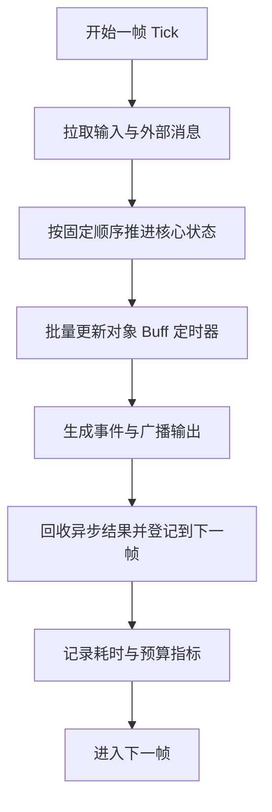

# Tick 驱动与逻辑执行

## Category

server / runtime 子树。节点定位：Tick 是主循环、调度单位、性能预算与恢复语义的共同底座——把顺序说清楚是它最值钱的部分。

## Definition


Tick 驱动与逻辑执行，讨论的不是“每秒跑多少次”这么简单，而是运行时如何围绕逻辑时间组织工作。只要系统里存在房间战斗、Buff 和技能时序、帧同步或状态同步、周期任务和对象更新，Tick 就不再是一个定时器，而会成为主循环、调度单位、性能预算和恢复语义的共同底座。

## Problem

Tick 讨论不是「每秒跑多少次」：房间战斗、Buff 技能时序、帧同步、周期任务、对象更新都在逻辑时间上组织工作。顺序不说清、帧预算不提前设，性能与恢复语义会在事故里被重新发现。


### 为什么 Tick 是运行时问题，而不只是同步问题

第 4 章已经从战斗和同步角度讲过 Tick，这里要补的是运行时视角。从运行时角度看，Tick 决定的是：

- 一轮逻辑执行包含哪些步骤。
- 哪些任务在本帧做，哪些延到下一帧。
- 一帧超预算时如何追帧、跳帧或降级。
- 哪些模块共享同一时间基准。

所以 Tick 驱动不是网络特性，而是整个逻辑执行模型的一部分。

### 一个完整的 Tick 循环通常包含什么

一个完整的逻辑 Tick，通常不只是“更新对象列表”，还可能包括：

1. 收集并整理输入。
2. 消费跨线程或跨服务投递的消息。
3. 推进核心状态机。
4. 更新对象、Buff、投射物和定时器。
5. 生成战斗事件或广播事件。
6. 处理本帧的持久化或异步投递结果。
7. 统计耗时、记录指标并准备下一帧。

如果这些步骤的顺序没有被明确写下来，系统看似有 Tick，实际上只是多个模块各自“差不多每帧更新一下”。

### Tick 驱动最值钱的地方是把顺序说清楚

对很多游戏逻辑来说，顺序比并行更重要。Tick 的最大收益通常是：

- 执行顺序稳定。
- 时间基准统一。
- 事件产生点清晰。
- 回放和重演更容易。
- 问题定位可以落到具体帧。

也正因为如此，很多核心运行时即使有多线程，也仍然会让关键逻辑围绕单一 Tick 主循环推进。

### Tick 驱动最怕什么

最常见的运行时问题通常包括：

- 单帧工作量不可控，突然超预算。
- 某些异步结果随时插入，破坏执行顺序。
- 不同模块各自维护自己的时钟。
- 外围任务和核心逻辑争用同一帧预算。

这些问题一旦出现，表现往往不是立即崩，而是：

- 时序越来越难解释。
- 高峰期帧耗时抖动。
- 追帧和补帧成本上升。
- 回放和线上行为越来越不一致。

### Tick 和异步任务应该怎样配合

Tick 驱动不意味着所有工作都必须在主循环里做完。更合理的做法通常是：

- 核心状态推进和顺序敏感逻辑放在 Tick 主链上。
- 可异步的重任务外包到线程池或任务系统。
- 异步结果以明确边界回到下一帧消费。

关键点在于：异步工作可以并行，最终写回和状态生效仍应被 Tick 序组织起来。

这样既能利用并行能力，又不把主逻辑时序打碎。

### 帧预算和节流不能事后补

Tick 驱动系统非常需要预算思维。常见需要被预算化的包括：

- 单帧最多处理多少对象。
- 单帧最多消费多少外部消息。
- 单帧最多执行多少补帧。
- 异步结果回收是否有上限。

如果这些预算不存在，系统平时也许看不出问题，一到高峰就会出现“某几帧特别慢，然后整条链路开始雪崩”的情况。

### Tick 驱动和批处理天然相配

很多高性能运行时喜欢把 Tick 和批处理放在一起，是有原因的。因为一旦逻辑围绕固定周期推进，你就更容易：

- 批量处理同类对象。
- 批量应用状态变化。
- 批量输出事件。
- 批量写统计和日志。

这也是为什么 Tick 驱动经常和 ECS、批处理 AI、批量碰撞和事件聚合一起出现。它们都在利用“同一时间片里做同类事”的工程优势。

### 什么时候不应该强行 Tick 化

不是所有逻辑都值得放进 Tick 主循环。比如：

- 大文件下载。
- 慢查询。
- 外围通知。
- 延迟容忍较高的后台统计。

把这些东西强行塞进 Tick 主链，通常只会污染预算和时序。更稳妥的做法是让它们异步存在，但在进入核心状态时再回到 Tick 边界。

### 一个更贴近实践的主循环模型



这条链路的重点不是形式，而是把“什么时候做什么”固定下来。

### 常见误区

- 以为有一个定时器就算 Tick 驱动，实际上模块各自维护时钟、各自决定执行顺序。
- 把所有任务都塞进主循环，导致帧预算被外围工作污染。
- 异步结果随时写回核心状态，不经过帧边界，最后把时序可推理性彻底破坏。

Tick 真正值钱的地方，不是“整齐”，而是它让运行时变得可推理、可回放、可治理。

### 实战案例：一次「整点活动一开，战斗帧耗时雪崩」的帧预算污染排查

> 案例为教学示例（非摘自真实项目），数字经过取整简化。它把本页「一个完整的 Tick 循环通常包含什么」「Tick 和异步任务应该怎样配合」「帧预算和节流不能事后补」用到深水区：平时帧耗时很稳，整点一到就抖——这是外围任务污染帧预算的排查，也是「怎样把外围工作挡在 Tick 边界之外」的完整展开。

**背景与现象**：某 MMO，整点活动（全服公告 + 全服奖励发放）一开，战斗帧耗时 P99 从 **8** 毫秒抖到 **90** 毫秒，持续约 **40** 秒；玩家体感是整点必卡，技能延迟明显。活动结束后帧耗时自己回落，平时看不出任何问题。

### 第一步：现象与口径——把抖动窗口和活动窗口对齐

帧耗时口径：P99 **8** 毫秒 → **90** 毫秒，抖动窗口与整点活动窗口完全重合，持续 **40** 秒后回落。

工作量口径：单帧内除战斗对象更新外，还混进了全服公告广播、奖励发放和埋点上报——这三样都是外围任务，却和核心战斗共用同一帧预算。

对照口径：把活动流量按 1/10 灰度重放，帧耗时抖动按比例减小——确认是活动工作量直接压进了主循环。

### 第二步：分层归因——按本页 Tick 最怕清单排查

```text
帧耗时雪崩归因  占比
  外围任务塞进 Tick 主链，污染帧预算         58%
  异步结果随时写回核心状态，不经帧边界        27%
  无单帧预算上限，超预算也没有降级           15%
```

逐项比对：外围任务和核心逻辑争用同一帧预算（本页「Tick 驱动最怕什么」第二条与第四条）；异步结果（奖励发放回调、埋点回写）随时插入核心状态，破坏执行顺序；没有单帧预算，超预算时没有任何降级手段，只能整帧变慢。

### 第三步：根因——帧预算被外围工作污染，异步结果不经过帧边界

改造时把公告、奖励、埋点这些外围任务直接写进了主循环，又没有给单帧设预算上限。核心状态推进和外围工作抢同一帧预算，异步结果又绕开帧边界写回，顺序和预算一起失控。

### 第四步：处置与回填——外围挡在 Tick 之外，预算写进主循环

1. 外围任务外包异步：公告广播、奖励发放、埋点上报交给任务系统，结果在下一帧边界统一消费，不再当场插入主循环。
2. 单帧预算：单帧最多处理 **N** 个对象、最多消费 **200** 条外部消息、最多补 **4** 帧，超出部分延到下一帧。
3. 超预算降级：逼近预算时先降外围表现（公告延迟、埋点抽样），核心战斗裁决不受影响。

复核账：P99 帧耗时 **90** 毫秒 → **9** 毫秒；整点卡顿投诉清零；帧耗时抖动收敛到平时水位，活动期间也不再雪崩。

**回填清单**：

| 回填项 | 动作 | 回填处 |
|-----|------|--------|
| Tick 循环步骤顺序 | 把一帧的七步顺序写下来，外围任务不进核心推进段 | 一个完整的 Tick 循环通常包含什么 |
| 异步回帧边界 | 异步结果在下一帧边界统一消费，不随时写回核心状态 | Tick 和异步任务应该怎样配合 |
| 帧预算 | 单帧对象数、外部消息数、补帧数各自设上限，超预算延后 | 帧预算和节流不能事后补 |
| 不该 Tick 化的清单 | 公告、奖励、埋点、慢查询列入不进主循环清单 | 什么时候不应该强行 Tick 化 |

### 案例的三个教训

1. **帧预算一旦被外围工作污染，整点就是雪崩点**。公告、奖励这些「顺手塞进主循环」的工作，恰恰是压垮帧预算的最后一根稻草。
2. **异步结果要回到帧边界消费，不能随时写回**。绕开帧边界的异步写回会打碎执行顺序，让时序再也说不清。
3. **预算是设计出来的，不是等压测补的**。没有单帧上限，系统平时看不出问题，一到高峰就是「某几帧特别慢，然后整条链路开始雪崩」。

## Used By

Tick 循环设计；帧预算与节流规划；异步任务与 Tick 的配合约定。

- **Nakama**（commit `e920249`）：对局节拍就是运行时 Tick——每对局单 goroutine 持 ticker 与三条输入队列 callCh/joinAttemptCh/signalCh（`server/match_handler.go:102-105`），节拍 `time.NewTicker(time.Second / Rate)`（同文件 `:176`），队列容量取配置（`:163-165`）

## Related

关系链：运行时底座 → 循环构成 → 顺序 → 最怕什么 → 异步配合 → 帧预算 → 批处理相配。上游：runtime/01（执行模型的调度面）、sync/01（时间模型）。下游：server/sync（战斗时序的消费方）。

## Reference

本页为工程经验归纳；页内实战案例为教学示例（数字取整简化）。

