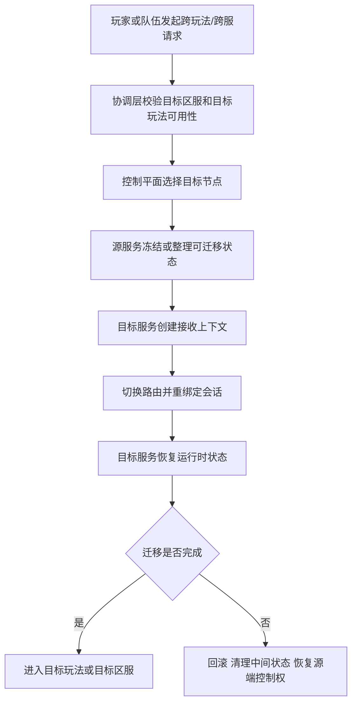

# 协调层、跨服与控制平面

## Category

server / services 子树。节点定位：数据平面之外迟早要长出控制平面——协调层、跨服迁移、控制面能力清单与没有它的后果。

## Definition


很多项目早期只有数据平面，没有真正的控制平面。也就是说，节点能处理玩家请求，房间能推进战斗，场景能维护状态，但系统里没有一个正式层来回答这些更高一层的问题：

- 新房间应该落在哪台节点上
- 热点场景爆了以后谁来迁移和切流
- 某个区服什么时候进入维护态
- 玩家跨玩法、跨场景、跨服时由谁指挥
- 节点故障以后谁来决定恢复路径

项目规模小的时候，这些事情常被手工配置、临时脚本、业务层分支逻辑和隐式约定勉强顶住。规模一上来，它们就会从“以后再说”变成主系统。

## Problem

早期只有数据平面能干活，但「节点算不算活、流量落谁身上、状态往哪搬」这些更高一层的问题没人正式回答：没有控制平面，这些答案散落在脚本与人脑里，迁移与故障时集中爆发。


### 先把数据平面和控制平面分开理解

这是理解这一章最关键的一步。

### 数据平面负责什么

数据平面直接处理业务流量和运行时状态，例如：

- 房间服推进一局战斗
- 场景服维护地图与对象状态
- 活动服处理活动进度
- 支付服流转订单状态

### 控制平面负责什么

控制平面不直接推进业务状态，它负责组织、治理和指挥这些节点，例如：

- 知道哪些节点当前可用
- 知道哪些节点负载高、哪些节点可以接新实例
- 决定新房间、新场景、新玩法实例该落在哪里
- 管理摘流、迁移、维护态、扩缩容和版本门禁
- 在故障发生时统一决定切换和恢复动作

如果系统只有数据平面，没有控制平面，调度与治理逻辑就会不可避免地散落进业务代码里。

### 协调层为什么迟早会长出来

只要系统开始进入下面这些阶段，协调层就几乎不可避免：

- 玩家需要在多个玩法和多个节点之间切换
- 匹配成功后要把队伍分配到某个实例节点
- 世界或场景节点数量会动态变化
- 跨服玩法需要临时组织一套新拓扑
- 运维需要做扩容、缩容、摘流、迁移和维护态控制

这些动作天然跨越多个服务和多个节点，不应该由任何一个业务服务单独拍板。

### 跨服真正难的不是联网，而是迁移

很多团队第一次做跨服时，会把它理解成“本服玩家去别的服打一局，打完再回来”。真做成工程以后，难点几乎都不在通信本身，而在状态与控制权迁移：

- 身份和会话怎么转移
- 哪些状态跟着玩家走，哪些留在原服
- 迁移期间长期资产怎么确认
- 中间失败时怎么回退
- 结束后怎么清算和归档

所以跨服本质上不是一次 RPC，而是一条带有状态整理、会话重绑定、控制权交接和失败恢复语义的完整链路。

### 控制平面通常要承担哪些能力

成熟项目里的控制平面不一定是一个进程，也不一定是一个独立产品，但通常会逐步收拢下面这些能力：

- 服务注册与健康检查
- 节点分组、容量视图和负载信息
- 房间、场景、玩法实例分配
- 区服状态管理，例如开放、只读、维护、下线
- 迁移、切流、摘流和扩缩容编排
- 全局配置下发、版本兼容与门禁控制

这些能力本身不产出玩法内容，但它们决定系统是否能被稳定运营。

### 一个更接近真实工程的迁移链路



这条链路真正要强调的是，跨服和迁移的难点不在“把包发过去”，而在“谁什么时候拥有控制权，以及失败后如何恢复到单一真相”。

### 没有控制平面时会出现什么后果

系统没有正式控制平面时，常见现象通常是：

- 房间分配策略写死在匹配服务里
- 场景迁移策略写死在场景节点里
- 扩容靠人工改配置和重启服务
- 节点摘流靠临时脚本和人工广播
- 玩家重连时找不到当前正确实例

前期还能跑，后期一旦进入热点活动、跨服玩法、故障切流和多区服运营，系统就会越来越难指挥。

### 协调层最容易做坏的三个地方

### 把调度逻辑散落在每个业务服务里

短期确实省事，但后果是任何调度策略调整都要同时改多个服务，而且系统全局没有统一视图。

### 只有静态配置，没有实时节点状态

控制平面如果只知道“理论上有哪些节点”，不知道节点当前健康、容量和负载，就很难做出正确分配，最终只能靠经验和人工兜底。

### 只负责分配，不负责回滚和恢复

很多系统能做“把玩家发过去”，但做不好“发过去失败怎么办”。没有回滚与恢复语义，迁移和跨服迟早会出现双重绑定、半迁移和状态悬空。

### 什么时候它不再是可选项

当项目进入下面这些阶段时，控制平面通常就不再是附属能力，而是基础设施：

- 多区服并行运营
- 多玩法节点独立部署
- 大型活动需要动态编排
- 热点房间或场景需要弹性扩缩容
- 运维需要明确维护态、摘流、迁移和切流入口

这时继续把调度能力藏在业务代码里，长期成本会非常高。

### 常见误区

最常见的错误，是只有数据平面，没有正式的控制平面。第二类错误，是把跨服理解成简单远程调用，不处理状态迁移、会话切换和失败回滚。第三类错误，是把协调逻辑散落在各个业务服务里，导致全局没有统一调度视图，也没有稳定运维入口。

### 实战案例：一次「跨服活动一开，玩家卡在『迁移中』」的控制平面缺失排查

> 案例为教学示例（非摘自真实项目），数字经过取整简化。它把本页「跨服真正难的不是联网，而是迁移」「控制平面通常要承担哪些能力」「协调层最容易做坏的三个地方」用到深水区：迁移把包发出去了，控制权没人交接——这是只有数据平面的排查，也是「一条带失败恢复语义的迁移链路」的完整展开。

**背景与现象**：某 MMO 首次开跨服竞技场，上线两天迁移失败率 **6**%，失败后玩家卡在「迁移中」无法进玩法也无法返回原服；半迁移状态与双重绑定累计 **300** 多起，客服只能手工改库解绑。

### 第一步：现象与口径——失败不回滚，状态就悬空

失败口径：迁移失败率 **6**%，失败后没有回滚路径——中间态不清理、路由不回切、源端控制权不恢复，玩家就悬在「迁移中」。

调度口径：房间分配策略写死在匹配服务里，场景迁移策略写死在场景节点里，跨服活动临时又写了一套——同一个「该落在哪个节点」的问题有三个答案，全局没有统一视图。

节点口径：控制平面只有一份静态节点清单，不知道哪个节点当前健康、容量还剩多少，跨服高峰把新实例全压到一台接近满载的节点上。

### 第二步：分层归因——按本页做坏三点比对

```text
迁移故障归因  占比
  只负责分配，不负责回滚和恢复       52%
  调度逻辑散落业务服务，无统一视图    33%
  只有静态配置，没有实时节点状态      15%
```

逐项比对：失败后悬空与双重绑定占大头——命中「只负责分配，不负责回滚和恢复」；三类调度策略各写各的——命中「调度逻辑散落」；静态清单导致压满载节点——命中「没有实时节点状态」。三点全中，回滚缺失影响面最大。

### 第三步：根因——把跨服理解成了一次远程调用

团队把跨服当成「把包发过去」：目标节点创建上下文、切换路由之后就算完成，没有失败回滚、没有控制权交接的单一真相。跨服本质上不是一次 RPC，而是一条带有状态整理、会话重绑定、控制权交接和失败恢复语义的完整链路——链路的后半段整个没做。

### 第四步：处置与回填——补上链路的后半段

1. 收拢控制平面：服务注册与健康检查、容量视图、实例分配、迁移编排先落在协调层，调度策略不再各写各的。
2. 迁移链路补回滚语义：失败即回滚——清理中间状态、路由回切、恢复源端控制权，玩家最多重试一次，不再悬空。
3. 节点状态实时上报：健康、容量、负载进入分配决策，满载节点不接新实例。

复核账：迁移失败率 **6**% → **0.4**%；半迁移与双重绑定 **300** 起 → **0** 起；卡「迁移中」的工单清零；单节点过载接单 **0** 次。

**回填清单**：

| 回填项 | 动作 | 回填处 |
|-----|------|--------|
| 控制面能力清单 | 注册健康、容量视图、实例分配、迁移编排逐项收拢到协调层 | 控制平面通常要承担哪些能力 |
| 迁移回滚语义 | 失败即清理中间态、路由回切、恢复源端控制权 | 一个更接近真实工程的迁移链路 |
| 实时节点状态 | 健康、容量、负载实时上报，分配决策不再只看静态配置 | 只有静态配置，没有实时节点状态 |
| 调度收口 | 房间、场景、跨服分配统一走协调层，业务服务不自带调度 | 把调度逻辑散落在每个业务服务里 |

### 案例的三个教训

1. **「把包发过去」只是迁移的一半**。没有回滚与恢复语义，失败就变成双重绑定、半迁移和状态悬空。
2. **调度逻辑散落，等于没有调度**。三个服务三个答案，全局没有统一视图，跨服一开立刻互相打架。
3. **静态配置撑不起分配**。不知道节点当前健康与容量，控制平面就只能靠经验和人工兜底。

## Used By

控制平面能力建设；跨服迁移链路设计；协调层的三个做坏点检查。

- **BigWorld**（commit `088d3b84`，路径相对 `programming/bigworld/`）：控制面能力的两个实例——cellappmgr 按空间边界动态均衡负载（`server/cellappmgr/internal_node.cpp:310`、`:445`、`:470`），baseappmgr 维护 bestBaseApp 并下发给登录者（`server/baseappmgr/baseappmgr.cpp:508`、`:532-540`）
- **KBEngine**（commit `0bc93d5`）：组件发现由 machine 承担——`findComponent` 按组件类型查找（`kbe/src/server/machine/machine.cpp:72`、`:113`），内部管理端口走配置端口池 30099-30199（`kbe/res/server/kbengine_defaults.xml:244-245`）

## Related

关系链：两平面 → 协调层长出 → 跨服迁移 → 控制面能力 → 迁移链路 → 无控制面后果 → 做坏点。上游：services/01。下游：glossary/07（控制平面词条）、server/capacity/03（迁移与合服）。

## Reference

本页为工程经验归纳；页内实战案例为教学示例（数字取整简化）。

