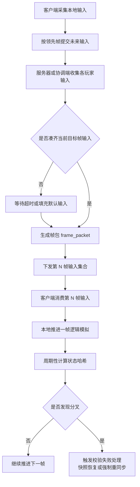

# 帧同步详解

## Category

server / sync 子树。节点定位：帧同步是围绕共享逻辑帧的整套工程——输入窗口、默认输入、追帧、重连、哈希校验缺一不可。

## Definition


帧同步不是一个口号，而是一整套围绕“共享逻辑帧”组织战斗的工程方案。它的核心不是省带宽，而是让所有参与者围绕同一帧号、同一输入窗口和同一模拟规则推进战斗。很多团队第一次做帧同步时，只记住了“发输入不发状态”，结果后面在延迟帧、默认输入、追帧、重连、暂停、哈希校验这些地方全部踩坑。

## Problem

只记住「发输入不发状态」就上帧同步，会在延迟帧、默认输入、追帧、重连、暂停、哈希校验处全部踩坑。帧同步最硬的现实是输入窗口与超时策略——它决定整条链路的工程量，不能事后补。


### 帧同步到底在同步什么

帧同步的最小定义可以写成一句话：所有参与者在第 `N` 逻辑帧消费同一组输入，然后按同一规则推进到第 `N + 1` 帧。只要输入一致、顺序一致、模拟一致，最终状态就应该一致。

但真实项目里的帧同步并不只有一种形态。常见差异包括：

- 谁负责汇总输入，是房主、协调服务器还是权威服务器。
- 服务端只是组织帧号，还是也参与权威模拟。
- 输入是严格等齐后才发帧，还是有超时默认输入。
- 客户端是否允许对未来若干帧先做局部前馈。
- 状态是否定期做快照与哈希校验。

所以“用了帧同步”并不能说明系统长什么样，只能说明系统选择了按帧组织一致性。

### 为什么很多项目会被帧同步吸引

帧同步最吸引人的地方，通常有三点：

- 输入包通常比完整状态广播更轻。
- 一致性、回放和裁决语言天然围绕同一帧号组织。
- 对强博弈场景来说，很多争议都能落到明确帧序上。

这也是 RTS、部分格斗、强实时房间制游戏和一些竞技项目长期偏爱它的原因。但它真正昂贵的部分不在传输，而在配套工程。

### 一套能上线的帧同步至少依赖什么

一套能上线的帧同步，通常至少要有下面这些核心对象：

- `frame_id`：当前逻辑帧号，所有裁决讨论的共同语言。
- `input_delay`：本地输入领先多少帧提交，给网络抖动留缓冲。
- `input_buffer`：存放未来若干帧输入的缓冲区。
- `frame_packet`：服务器或协调端下发的某一帧输入集合。
- `default_input`：超时或掉线时的保底输入，例如空操作、保持方向或托管输入。
- `state_hash`：周期性校验当前状态是否一致。
- `checkpoint`：用于重连和长对局恢复的定期快照。
- `catch_up_policy`：客户端落后时如何追帧、何时切快照、何时认定无法恢复。

少了其中任何一项，帧同步都很容易在边缘场景里崩。

### 一条更接近真实工程的帧同步链路



这个流程说明了一件事：帧同步不是“大家自己跑”，而是输入窗口、超时策略、哈希校验和恢复策略共同组成的一条链。

### 延迟帧和输入窗口是帧同步最硬的现实

帧同步不可能真做到“当前帧输入、当前帧所有人立刻一致执行”，因为网络传播需要时间。真实做法通常是：

- 客户端在本地第 `L` 帧时，提交未来第 `L + K` 帧的输入。
- `K` 就是领先帧或输入延迟窗口。
- 服务器收集所有人对第 `L + K` 帧的输入，再下发这一帧的帧包。

`K` 设得太小，系统容易被抖动打爆；设得太大，输入延迟体感会明显变差。这个窗口的本质，是在即时性和稳定性之间买时间。

### 默认输入和超时策略绝不能事后补

只要项目存在弱网、掉线、后台挂起和高峰抖动，帧同步就一定要回答一个问题：如果第 `N` 帧迟迟等不到某个玩家输入，系统怎么办。

常见选择有：

- 判定超时，直接空操作。
- 保持上一帧方向或上一帧输入态。
- 进入托管 AI。
- 暂停整局，等待少量恢复时间。
- 直接判负或强制退出房间。

没有哪种方案天然正确，关键是要和玩法匹配。但最大错误是根本不定义，最后所有人都在等待一个永远不会来的输入。

### 状态哈希和检查点是救命工具

帧同步项目里，最危险的不是丢包，而是分叉不自知。客户端和服务端可能都在正常跑帧、都在收到帧包，但某个平台的浮点、某个脚本分支、某次集合遍历顺序不同，就足够让双方从第 300 帧开始慢慢偏离。

因此，帧同步体系通常需要：

- 固定周期计算关键状态哈希。
- 在房间内比较哈希是否一致。
- 发现分叉后快速定位最早异常帧。
- 保留最近一段时间的检查点与日志。

没有这些工具，线上不同步通常只能靠“感觉哪里不对”。

### 重连为什么不能只靠逐帧追

帧同步项目里，断线重连后如果客户端只会从断开帧开始逐帧补算，很容易出两个问题：

- 落后帧数太多，客户端永远追不上。
- 客户端一边加载资源一边补逻辑，结果越补越落后。

所以比较稳妥的实践通常是：

- 定期生成房间检查点或战斗快照。
- 重连时优先加载最近检查点，而不是从很久以前开始回放。
- 检查点之后只追一小段增量帧。
- 超过追赶阈值时直接切快照恢复，不再盲目追帧。

没有快照的帧同步，长对局和重连体验通常很难做稳。

### 什么系统适合纳入帧同步主链路

帧同步最适合的是那些直接影响胜负、必须围绕同一逻辑时间推进的对象：

- 角色输入与位移。
- 技能释放与命中。
- Buff 触发和移除。
- 投射物推进。
- 核心资源变更。
- 死亡、复活和结算条件。

不适合强行塞进主链路的通常包括：

- 纯表现特效。
- UI 动画。
- 非关键音效。
- 与胜负无关的外围系统表现。

把所有东西都塞进帧同步，只会把整条链路变重。

### 什么情况下帧同步值得用

帧同步最适合那些满足以下特征的战斗：

- 对公平和时序极度敏感。
- 核心对象数量相对可控。
- 团队愿意投入确定性、哈希校验、快照和调试工具。
- 可接受为了稳定性引入若干领先帧。

如果项目更偏大世界、强服务端权威、复杂外围系统和大量非确定性内容，纯帧同步往往不是最划算的答案。

### 常见误区

- 把帧同步理解成“只发输入，所以简单”。
- 没有默认输入和超时策略，让整局等待掉线玩家。
- 没有状态哈希和检查点，出了分叉只能重开。
- 重连时试图从断开那一帧开始无脑逐帧回放，最终把客户端拖进永久追帧或永久加载。

帧同步真正难的地方，不在第 0 天能不能跑起来，而在第 100 天掉线重连、跨端差异和线上争议来临时还能不能解释清楚。

### 实战案例：一次「同一帧，两台机器输入顺序不同」的帧包乱序排查

> 案例为教学示例（非摘自真实项目），数字经过取整简化。它把本页「延迟帧和输入窗口是帧同步最硬的现实」「状态哈希和检查点是救命工具」「默认输入和超时策略绝不能事后补」用到深水区：输入一致、模拟一致，状态还是分叉了——这是帧包内输入顺序不一致的排查，也是「怎样让输入、顺序、模拟三者都一致」的完整展开。

**背景与现象**：某 RTS 手游，4v4 对局，帧同步方案。上线一个月后分叉率 **0.7**%/局，表现为对局中期「双方看到的战场不一样」；回放复盘时，同一局在两台机器上重放结果不同，回放一致率只有 **96**%，争议工单日 **150** 单。

### 第一步：现象与口径——先用哈希定位最早分叉帧

哈希口径：每 **60** 帧比对一次状态哈希，分叉局最早异常帧集中在开局后 **1400–1600** 帧，且分叉起点总是同一类操作之后。

输入集合口径：抓同一帧的帧包，8 名玩家的输入集合内容相同，但**顺序不同**——一台机器按玩家加入顺序，另一台按内部哈希表遍历顺序。

模拟口径：单测同一输入集合按两种顺序推演，第 **1420** 帧状态哈希出现差异——顺序不一致，模拟结果就不一致。

### 第二步：分层归因——按本页依赖清单逐项排查

```text
分叉局归因  占比
  帧包内输入未按固定顺序排序，遍历顺序不稳定    62%
  集合遍历依赖哈希表实现，跨平台顺序不同        26%
  默认输入填充顺序未定义                        12%
```

排查路径：输入内容一致（排除丢包）；模拟规则一致（同一份逻辑代码，排除）；问题在**顺序**——帧包把输入塞进集合后没排序，集合遍历顺序依赖语言运行时，跨平台、跨版本都可能不同，一台机器从第 **1420** 帧开始慢慢偏离。这正是本页说的「输入一致、顺序一致、模拟一致，最终状态才一致」，三者缺了顺序。

### 第三步：根因——输入窗口收了输入，却没有定义顺序

帧包只保证「第 N 帧消费同一组输入」，没有保证「同一组输入按同一顺序消费」。默认输入的填充也按到达顺序，进一步放大了顺序的不确定。没有哈希工具时，分叉还会一直不自知。

### 第四步：处置与回填——三处改动，把顺序钉死

1. 帧包内输入按玩家 ID 稳定排序：无论谁先到达，第 N 帧的输入集合在所有人手里顺序一致。
2. 默认输入按同一顺序填充：超时或掉线的默认输入插在玩家 ID 对应位置，不打乱顺序。
3. 集合遍历改稳定顺序：涉及裁决的容器改为有序结构，杜绝依赖哈希表遍历顺序。
4. 状态哈希与检查点常态化：每 **60** 帧比对哈希，发现分叉快速定位最早异常帧，保留最近检查点。

复核账：分叉率 **0.7**% → **0.02**%；回放一致率 **96**% → **99.9**%；争议工单日 **150** 单 → **20** 单。

**回填清单**：

| 回填项 | 动作 | 回填处 |
|-----|------|--------|
| 输入窗口定序 | 帧包内输入按玩家 ID 稳定排序，顺序写进协议约定 | 延迟帧和输入窗口是帧同步最硬的现实 |
| 默认输入顺序 | 默认输入插在玩家 ID 对应位置，不按到达顺序追加 | 默认输入和超时策略绝不能事后补 |
| 状态哈希与检查点 | 每 60 帧比对关键状态哈希，保留检查点，分叉可定位最早异常帧 | 状态哈希和检查点是救命工具 |
| 稳定遍历 | 参与裁决的容器改有序结构，禁止依赖哈希表遍历顺序 | 什么系统适合纳入帧同步主链路 |

### 案例的三个教训

1. **「输入一致」不够，顺序一致才算一致**。同一组输入按不同顺序消费，第 1420 帧就会分叉——帧包定序和内容传输一样重要。
2. **跨平台的集合遍历顺序是隐藏的非确定性来源**。它不报错、不崩溃，只在状态哈希上慢慢显形，必须靠稳定容器和哈希校验兜住。
3. **没有哈希工具，分叉只能靠玩家录像发现**。每 **60** 帧一次哈希比对，把「感觉不对」变成「第 1420 帧开始不对」，定位成本差一个数量级。

## Used By

帧同步方案评审；对战玩法的落地检查单。

## Related

关系链：共享逻辑帧 → 吸引力 → 依赖清单 → 真实链路 → 输入窗口 → 默认输入 → 哈希检查点 → 重连。上游：sync/02（模型选择）。下游：sync/04（暂停与重连共用时钟）、sync/06（确定性）。

## Reference

本页为工程经验归纳；页内实战案例为教学示例（数字取整简化）。

