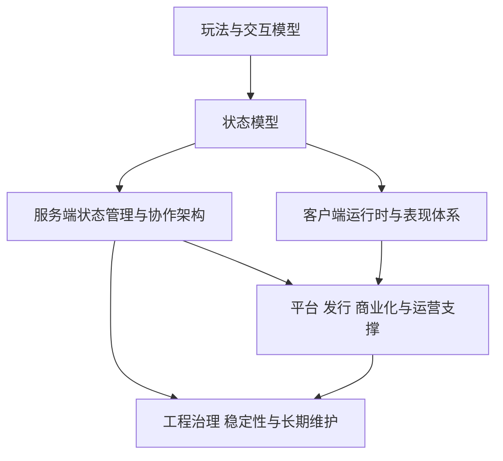
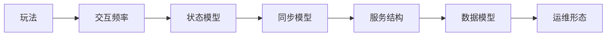

# 1. 总论与方法论

这一章不解决某个具体技术点，而是先回答一个更根本的问题：`如何正确分析一个游戏项目`。

游戏开发里的知识很容易被错误地切成“客户端知识”“后端知识”“运营知识”“平台知识”几大桶，然后各写各的。这样整理会有一个致命问题：真正决定架构的，从来不是技术名词本身，而是玩法、交互频率、在线关系、商业模式、平台约束和团队能力的组合。

所以这套知识库的出发点不是“按流行技术罗列”，而是先建立分析框架，再讨论技术选型。

## 游戏开发知识地图

游戏开发可以粗分成五条主线：

1. 玩法与交互模型
2. 客户端运行时与表现体系
3. 服务端状态管理与协作架构
4. 平台、发行、商业化与运营支撑
5. 工程治理、稳定性与长期维护

这五条线不是平行关系，而是相互约束关系。

例如：

- 一个强实时对战游戏，会强烈约束网络协议、同步模型、房间逻辑和反作弊策略
- 一个长周期成长型产品，会把更多压力放到配置管线、运营工具、经济系统和数据分析
- 一个小游戏平台产品，会把包体、更新方式、SDK 接入和平台审核放到非常高的优先级

因此分析顺序应该是：

1. 先看游戏在解决什么交互问题
2. 再看它需要什么状态模型和运行模型
3. 再看它如何部署、运营和长期演进

如果顺序反过来，常见结果就是一上来讨论“要不要微服务”“要不要 Redis”“要不要 ECS”，最后发现核心问题根本不在那里。

## 游戏类型、平台与商业形态

一个项目的技术形态，通常由三组因素共同决定：

1. 游戏类型
2. 运行平台
3. 商业与运营形态

游戏类型决定的是交互问题。例如：

- 房间局游戏更关注建房、匹配、局内广播、断线重连和结算
- 强实时对战更关注延迟、一致性、判定、公平性和回放
- 持续在线世界更关注场景分片、在线状态、世界状态和跨服协作
- 长周期成长型产品更关注配置、经济、活动、留存和版本运营

运行平台决定的是技术约束。例如：

- 移动端更容易遇到弱网、机型分化、前后台切换和热更新
- PC / 主机更容易拉高性能、输入精度和长期内容体量
- 小游戏平台会额外限制包体、更新方式、平台能力接入和审核节奏

商业形态决定的是外围系统权重。例如：

- 买断制产品更看重内容交付、性能、平台发行和版本节奏
- 长线运营产品更看重活动体系、付费设计、BI、风控和运维稳定性
- 平台或 UGC 型产品还会显著增加审核、分发、创作者生态和治理问题

这三组因素共同决定系统重点，而不是谁单独决定一切。

## 从玩法到架构的分析方法

分析一个游戏项目，建议固定使用下面这条路径：

1. 先描述玩家在做什么
2. 再描述系统必须持续维护什么状态
3. 再描述状态是如何推进、同步和持久化的
4. 最后才讨论服务拆分、协议、中间件和部署方式

一个简单例子：

如果玩家主要在单局房间内做离散操作，例如出牌、落子、回合选择，那么核心问题往往是：

- 房间生命周期
- 操作顺序
- 广播与重连
- 局内状态快照
- 结算和反作弊

这类游戏通常不需要为“超大世界状态并发同步”付出成本。

如果玩家在连续时间轴上做高频输入，例如移动、射击、技能、碰撞，那么核心问题就会变成：

- Tick 推进
- 输入采样
- 同步与预测
- 延迟补偿
- 服务器权威判定

这时“数据库怎么分表”通常不是最前面的架构问题。

所以真正有效的方法不是按组件列清单，而是按问题链路往下推：

`玩法 -> 交互频率 -> 状态模型 -> 同步模型 -> 服务结构 -> 数据模型 -> 运维形态`

## 游戏后端设计的核心取舍

游戏后端最常见的取舍，不是“功能能不能做”，而是“用什么代价做”。

最常见的几组取舍包括：

### 一致性与延迟

强一致设计通常更安全，但实时链路里可能代价太高；低延迟设计更顺滑，但需要接受补偿、重试和局部不一致。

### 简单性与扩展性

一个产品在验证阶段过早做超大规模架构，往往会把开发效率拖垮；但如果已经明确是长线复杂项目，完全不预留扩展空间也会很快撞墙。

### 单点权威与分布式协作

很多游戏核心逻辑天然适合单点权威，例如房间内结算、战斗判定、世界分片内状态推进。把这些问题过早做成跨节点强协作，通常只会让复杂度失控。

### 通用性与专项优化

游戏系统里有些能力可以平台化，例如账号、支付、埋点、配置导出；但同步、战斗、地图、AI 调度这类链路通常需要强专项设计，过度抽象反而有害。

一个成熟的技术判断，不是追求“最先进”的设计，而是能清楚说明：

- 这个问题真正的瓶颈在哪里
- 哪部分要优先优化
- 哪部分故意不优化
- 当前阶段接受什么限制

## 客户端、服务端、平台与运营的边界

这四者不是孤立模块，而是责任边界不同。

### 客户端

客户端负责表现、输入采集、局部预测、资源管理和用户体验兜底。客户端可以做很多计算，但不能天然被信任。

### 服务端

服务端负责权威状态、跨玩家协调、结算、持久化和治理规则。只要涉及公平性、共享状态或商业资产，最终权威通常都要落在服务端。

### 平台

平台负责分发、登录能力、支付渠道、社交能力、审核要求和系统级约束。平台不是附属问题，它会直接改变工程形态。

### 运营

运营系统负责活动投放、用户分层、商业化配置、触达、报表、实验和长期内容节奏。对长线产品来说，运营不是外围补丁，而是系统的一部分。

这四者的边界要清楚，但接口必须前置设计。很多项目的问题不是模块没做，而是这些边界在项目后期才被迫缝合。

## 游戏项目生命周期与团队协作

同一个系统，在不同阶段的目标完全不同。

### 立项和验证期

优先目标是低成本验证玩法和核心循环，不应该为了未来百万 DAU 先搭一套复杂平台。

### 研发和联调期

优先目标是提升协作效率，确保客户端、服务端、策划配置、资源、协议和测试工具能稳定联动。

### 首发和爬坡期

优先目标会切换为稳定性、版本节奏、平台适配、灰度发布、告警和应急能力。

### 长线运营期

优先目标会进一步转向内容生产效率、运营工具链、数据分析、商业化调优、容量治理和历史包袱控制。

团队协作也会随着阶段变化：

- 早期更依赖高带宽沟通和快速迭代
- 中期更依赖流程、规范和自动化
- 后期更依赖边界清晰、平台化和经验沉淀

如果团队一直用同一种工作方式覆盖所有阶段，通常会出问题。

## 如何系统化积累游戏开发经验

游戏开发经验如果只停留在“做过什么项目”，很快就会碎掉。更有效的积累方式是把项目经验抽成可复用的判断模板。

建议长期沉淀四类内容：

### 1. 问题模型

不要只记“某项目用了什么”，要记“它为什么会遇到这个问题”。

### 2. 选型理由

不要只记最终用了哪个方案，要记候选方案、约束条件和淘汰原因。

### 3. 事故模式

高价值经验往往不是成功案例，而是失败和事故。比如：

- 为什么某次热更新出问题
- 为什么某个同步模型在特定场景下失效
- 为什么某个服务拆分让协作成本暴涨

### 4. 检查清单

把易错点收敛成固定检查项，比“靠经验记得住”更可靠。

这也是本知识库后面保留“复盘与清单”章节的原因。知识不应该只帮助理解系统，也应该帮助减少犯错。
