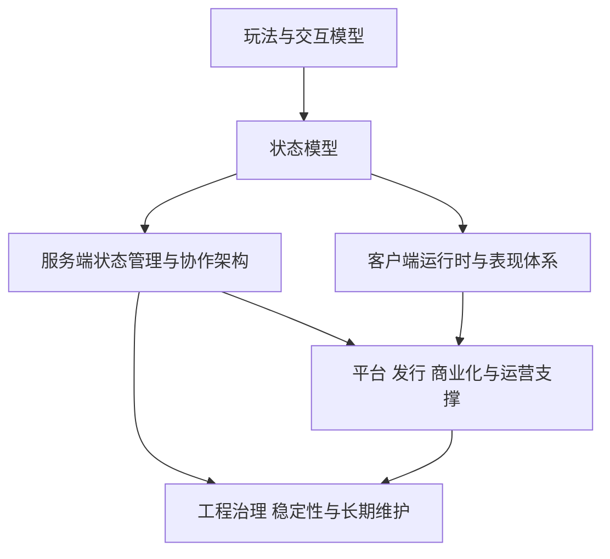

# 游戏开发知识地图

“游戏开发知识地图”不是课程目录，也不是岗位拆分图，而是一张`问题依赖图`。它的价值在于提醒你：游戏系统不是一堆平行模块，而是一条从玩法出发、逐层传导到工程治理的约束链。

## 为什么需要一张知识地图

很多团队的知识沉淀方式是按职能分桶：

- 客户端整理客户端的
- 服务端整理服务端的
- 运维整理运维的
- 策划整理数值和配置的

这样做在组织上方便，但在技术判断上会有一个严重后果：`你看到的是职责切分，不是问题来源`。

例如一个实时对战项目，真正决定复杂度的不是“客户端要做什么”或“服务端要做什么”，而是：

- 玩家输入是连续高频的
- 共享状态要实时推进
- 判定必须相对公平
- 弱网环境下还要维持手感
- 后续还要支持回放、观战、仲裁和反作弊

这些约束会同时压到客户端、网络层、战斗服、日志系统、运维系统上。也就是说，复杂度来源是同一个，表现为多个岗位都很痛。

## 五条主线分别解决什么问题

游戏开发可以粗分成五条主线：

1. 玩法与交互模型
2. 客户端运行时与表现体系
3. 服务端状态管理与协作架构
4. 平台、发行、商业化与运营支撑
5. 工程治理、稳定性与长期维护

### 1. 玩法与交互模型

这条线回答的是：玩家到底在和什么交互，交互频率多高，交互结果由谁裁决。

它决定的不是 UI，而是后面几乎所有架构问题的起点。例如：

- 回合制更关心顺序、回放、重连和结算
- FPS 更关心输入采样、命中裁定、延迟补偿
- 持续在线世界更关心地图迁移、在线状态、世界分片

### 2. 客户端运行时与表现体系

客户端不只是“把服务端结果画出来”。它还承担：

- 输入采集
- 局部预测
- 动画、特效和镜头表现
- 资源加载与内存管理
- 弱网和异常场景下的体验兜底

客户端技术栈的选择，往往和玩法表现密度、平台能力、热更新策略直接相关。

### 3. 服务端状态管理与协作架构

这条线关注的是：`哪些状态必须权威保存，如何推进，如何在多个服务之间协作`。

房间服、场景服、世界服、匹配、排行、活动、支付回调、日志审计，这些都属于这条主线的不同部分。但它们的重要性不是固定的，而是由项目问题模型决定。

### 4. 平台、发行、商业化与运营支撑

很多失败的技术方案，并不是被玩法打败，而是被平台和运营打败。

例如：

- 小游戏平台限制包体和更新方式
- iOS/Android 渠道能力和审核节奏不同
- 重运营产品需要频繁上活动、灰度、A/B 实验
- 强商业化产品需要完整的支付、风控、审计和申诉链路

这条线不是“外围系统”，而是很多长线产品的收益核心。

### 5. 工程治理、稳定性与长期维护

系统能跑起来不等于系统能长期活下去。项目一旦进入长线运营，真正拉开团队差距的往往是：

- 发布节奏是否可控
- 配置和脚本是否有防呆
- 告警、排障、回放和复盘体系是否完整
- 历史包袱是否被持续治理

## 五条线之间不是并列关系

这五条线不是平行关系，而是约束关系。

例如：

- 一个强实时对战游戏，会强烈约束网络协议、同步模型、房间逻辑和反作弊策略
- 一个长周期成长型产品，会把更多压力放到配置管线、运营工具、经济系统和数据分析
- 一个小游戏平台产品，会把包体、更新方式、SDK 接入和平台审核放到非常高的优先级

可以把这种关系理解成：

- 玩法定义核心问题
- 状态模型把问题变成系统约束
- 客户端与服务端分别承担不同侧面的实现责任
- 平台与运营把“能做”变成“能上线并持续赚钱”
- 工程治理决定系统能不能在真实线上环境里长期稳定运行

因此分析顺序应该是：

1. 先看游戏在解决什么交互问题
2. 再看它需要什么状态模型和运行模型
3. 再看它如何部署、运营和长期演进

## 这张地图怎么用

它最适合用在三个场景。

### 1. 项目前期做技术判断

先把项目主导问题放到地图上定位，再决定哪里需要重投入，哪里先不做。

### 2. 中期审视系统边界

如果你发现“任何改动都在跨团队扯皮”，通常意味着地图上的边界没理顺，某条主线压到了另一条主线上。

### 3. 复盘失败方案

很多失败不是技术点错，而是顺序错了。比如先做微服务，再去找玩法；先做通用战斗框架，再去验证交互；先追求极致扩展性，再发现产品留存没过。

如果顺序反过来，常见结果就是一上来讨论“要不要微服务”“要不要 Redis”“要不要 ECS”，最后发现核心问题根本不在那里。
