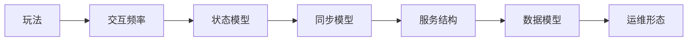

# 从玩法到架构的分析方法

分析一个游戏项目，最怕两件事：

- 从技术名词出发，不从玩家行为出发
- 从“未来可能很大”出发，不从当前主问题出发

更可靠的方法是固定使用一条推导链：

1. 先描述玩家在做什么
2. 再描述系统必须持续维护什么状态
3. 再描述状态是如何推进、同步和持久化的
4. 最后才讨论服务拆分、协议、中间件和部署方式

## 第一步：描述玩家到底在做什么

这一层不要写成“这是一个 RPG”或“这是一个卡牌项目”，那没有信息量。要写成玩家行为：

- 玩家是一局一局地匹配并进入房间，还是持续待在一个世界里
- 输入是每秒几十次，还是几秒一次
- 玩家操作是命令式的，还是连续控制式的
- 玩家是否直接对抗，还是更多异步比较和积累

一旦行为描述清楚，很多“伪问题”会自动消失。

## 第二步：识别系统必须维护的状态

技术系统最终都是在维护状态，只是不同项目的状态类型不同。

常见状态包括：

- 房间状态
- 战斗状态
- 角色成长状态
- 世界状态
- 经济资产状态
- 社交关系状态

关键不是“状态多不多”，而是：

- 哪些状态要实时共享
- 哪些状态只在结算时汇总
- 哪些状态必须强权威
- 哪些状态允许最终一致或离线修正

## 第三步：推导状态如何推进

状态推进方式直接决定同步和服务结构。

常见推进方式有：

- 事件驱动：来一条操作，推进一次
- Tick 驱动：固定节拍推进
- 请求触发：用户操作到达时计算
- 异步作业：定时结算、补偿、归档、清算

不同推进方式意味着不同的代价。例如 Tick 驱动有利于实时一致性，但会带来持续计算成本和排障复杂度；事件驱动开发简单，但不适合强实时链路。

## 第四步：再讨论架构实现

只有前三步做完，下面这些问题才有资格被讨论：

- 协议怎么选
- 房间服要不要独立
- 是否做单线程权威执行
- 数据如何分层缓存
- 运维是按区服、按场景还是按世界分片

这时你讨论的就不是“喜欢哪种技术”，而是“哪种技术最符合当前问题模型”。

一个简单例子：

如果玩家主要在单局房间内做离散操作，例如出牌、落子、回合选择，那么核心问题往往是：

- 房间生命周期
- 操作顺序
- 广播与重连
- 局内状态快照
- 结算和反作弊

这类游戏通常不需要为“超大世界状态并发同步”付出成本。

如果玩家在连续时间轴上做高频输入，例如移动、射击、技能、碰撞，那么核心问题就会变成：

- Tick 推进
- 输入采样
- 同步与预测
- 延迟补偿
- 服务器权威判定

这时“数据库怎么分表”通常不是最前面的架构问题。

## 这条分析链最大的价值

这条方法真正的价值不在于“理论上完整”，而在于它能帮助你拒绝无效复杂度。

例如一个轻量房间局项目，如果你按这条链推导，往往会得出：

- 核心问题是房间生命周期和结算幂等
- 主链路无需跨节点强一致
- 没必要过早做复杂分布式事务
- 数据库分表不是启动阶段的关键路径

这能直接避免很多“看上去很先进，实际上拖慢项目”的设计。

所以真正有效的方法不是按组件列清单，而是按问题链路往下推：

`玩法 -> 交互频率 -> 状态模型 -> 同步模型 -> 服务结构 -> 数据模型 -> 运维形态`
