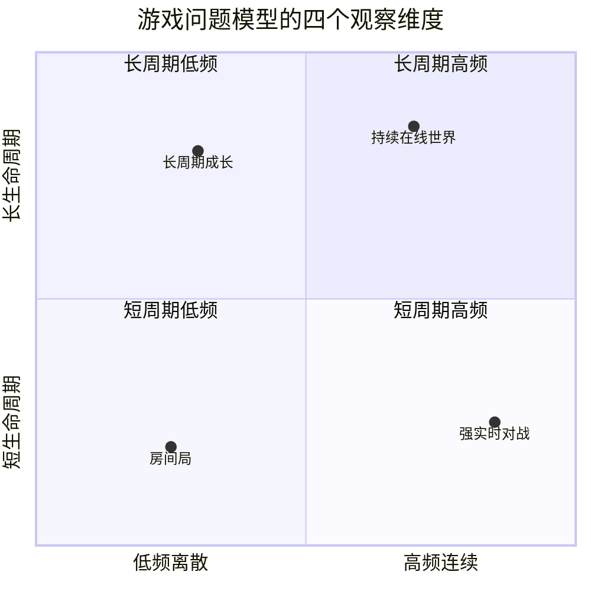
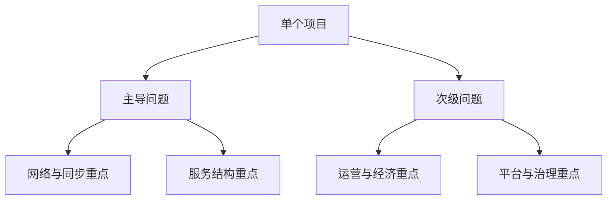

# 2. 游戏类型与问题模型

这一章的目的不是给游戏贴标签，而是建立一种更有用的认识方式：`不同游戏形态，最终会收敛成不同的问题模型`。

真正影响架构的，通常不是“它是不是 RPG”，而是：

- 玩家是否在共享同一份状态
- 交互是离散的还是连续的
- 判定是否必须实时
- 状态是短生命周期还是长生命周期
- 商业资产和社会关系是否很重

从这个角度看，很多表面类型不同的游戏，底层问题反而很像；而同一个大类里的两个产品，底层问题也可能完全不同。

## 游戏类型的分类方法

可以从四个维度对一个游戏做技术分类。

### 交互频率

- 低频离散交互：例如出牌、回合选择、策略指令
- 高频连续交互：例如移动、瞄准、碰撞、即时技能释放

### 状态生命周期

- 短生命周期：例如一局结束后状态大部分清空
- 长生命周期：例如角色成长、世界状态、赛季资产长期积累

### 共享状态范围

- 小范围共享：例如单房间、单战斗、少量玩家同步
- 大范围共享：例如地图场景、世界状态、跨服关系

### 资产和生态复杂度

- 轻资产：例如单局胜负、少量结算
- 重资产：例如商城、货币、交易、社交、公会、赛季、排行榜

这四个维度比“品类名”更适合指导架构设计。

## 单局房间型游戏问题模型

单局房间型游戏的核心特征是：`玩家先形成小规模会话，再在一个封闭生命周期内完成一局交互`。

典型场景包括：

- 棋牌游戏
- 多数卡牌对战
- 派对小游戏
- 部分回合制对局玩法

核心问题通常是：

1. 房间如何创建、匹配和销毁
2. 局内操作如何排序和广播
3. 断线重连如何恢复现场
4. 结算如何保证幂等和防作弊
5. 局外资产如何和局内结果对接

这类游戏的典型特征是：

- 共享状态规模有限
- 局内逻辑边界清晰
- 更适合单房间权威执行
- 更容易做回放和仲裁

因此架构上往往适合：

- 登录 / 大厅 / 匹配 / 房间 / 结算这种比较稳定的职责拆分
- 房间内以单线程或单逻辑实例推进
- 局外资产和局内逻辑分层处理

这类项目常见误区是把局内系统过度平台化，或者过早引入复杂的跨节点一致性方案。

## 强实时对战型游戏问题模型

强实时对战型游戏的核心特征是：`玩家在连续时间轴上做高频输入，系统必须快速推进共享状态并给出公平判定`。

典型场景包括：

- MOBA
- FPS / TPS
- 格斗
- 体育竞技
- 高强度动作对战

这类游戏的首要问题不是“存储什么”，而是“如何让时间推进与判定成立”。

核心问题通常是：

1. 输入如何采样、传输和对齐
2. 状态如何推进
3. 网络延迟如何处理
4. 命中和碰撞如何裁决
5. 回放、观战和仲裁如何建立

这类项目的架构重心会明显前移到：

- 协议开销
- Tick 模型
- 同步策略
- 数值一致性
- 服务器权威判定

如果把这类项目当成普通房间游戏处理，通常会在高延迟、作弊、公平性和观战复盘上迅速暴露问题。

## 持续在线世界型游戏问题模型

持续在线世界型产品的核心特征是：`系统需要长期维护大规模、长生命周期、多人共享的在线状态`。

典型场景包括：

- MMORPG
- 大世界在线游戏
- 多场景持久世界
- 重社交重世界状态产品

核心问题通常是：

1. 世界如何分区、分片和迁移
2. 玩家如何跨场景移动和恢复状态
3. 世界状态和角色状态如何协同
4. 跨服关系如何建立
5. 运维、扩容、合服和长期治理如何承接

这类项目不一定都强实时，但一定重状态管理和系统演化。它们往往会引入：

- 场景服 / 地图服 / 世界服的分层
- 在线状态与持久状态的分层
- 跨服中心、目录服务或控制平面
- 更复杂的服务路由和恢复策略

这种模型的难点通常不在某一次战斗，而在系统如何长期活着。

## 长周期成长与异步交互型游戏问题模型

这类产品的核心特征是：`玩家价值主要来自长期积累，而不是单次实时对抗`。

典型场景包括：

- 放置
- 经营
- SLG 的大量非实时成长环节
- 养成卡牌的大量外围系统

核心问题通常是：

1. 配置和数值如何驱动内容
2. 长周期成长如何建模
3. 大量异步系统如何协调
4. 活动和商业化如何持续迭代
5. 经济系统如何长期稳定

这类项目的技术重心通常在：

- 数据模型
- 配置管线
- 运营工具
- 经济设计
- BI 与实验分析

它们的实时链路未必复杂，但外围系统一定很重。很多团队低估了这类产品的工程复杂度，原因就在于只看到了“战斗不复杂”，没看到“运营体系极重”。

## 经济与平台型游戏问题模型

当一个产品开始承载大量经济关系、交易关系或平台关系时，它的技术问题会从“玩法系统”扩展到“治理系统”。

典型场景包括：

- 交易行、拍卖行很重的产品
- UGC / 创作者生态产品
- 社交平台型游戏
- 强渠道依赖、强平台接入产品

核心问题通常是：

1. 资产如何记账和追踪
2. 交易如何审计和防作弊
3. 平台能力如何接入和约束业务
4. 风控、处罚和申诉如何治理
5. 外部生态和内部规则如何对齐

这类项目里，日志、审计、风控和运营支持不再是附属能力，而是核心系统。

## 高频对象与重表现型游戏问题模型

有些游戏的技术难点并不主要来自世界规模或商业复杂度，而是来自高频对象、大量表现、密集计算或特殊运行时要求。

典型场景包括：

- 弹幕
- 大量召唤物与子弹对象
- 重表现动作系统
- 高频碰撞和复杂技能组合

这类模型常见问题是：

1. 对象更新频率极高
2. 内存分配和回收压力大
3. 客户端表现与服务端判定难以统一
4. 网络同步带宽容易爆炸
5. 回放和复盘成本高

它们通常会反向推动：

- ECS 或更数据导向的对象组织方式
- 更严格的对象生命周期控制
- 更精细的带宽管理和状态裁剪
- 客户端与服务端不同层次的表现抽象

## 模型之间如何组合

真实项目往往不是单一模型，而是组合模型。

例如：

- MMORPG 里可能包含强实时战斗子系统
- 卡牌产品可能同时拥有重运营和重经济系统
- 小游戏可能在技术平台上轻量，但在商业化和版本节奏上非常重

所以分类的目的不是把游戏硬塞进某个桶，而是回答两个问题：

1. 这个项目的主导问题是什么
2. 哪些次级问题会在后期成为复杂度来源

只要这两个问题答清楚，后面的网络、同步、服务拆分、配置管线和运维设计才有依据。
