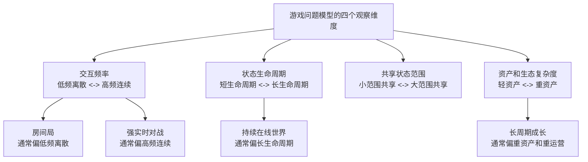

# 游戏类型的分类方法

给游戏做技术分类时，最没用的方式是直接说“这是 RPG”“这是 SLG”“这是卡牌”。这些标签适合市场和发行，不适合推导架构。

更有效的做法是从四个技术维度分类。

## 1. 交互频率

这决定的是系统对时间和网络的敏感程度。

- 低频离散交互：例如出牌、回合选择、策略指令
- 高频连续交互：例如移动、瞄准、碰撞、即时技能释放

低频离散交互更容易做成事件驱动，因为每次操作天然有明确边界；高频连续交互则更容易走向 Tick、预测、插值、回滚、裁决等一整套实时链路问题。

## 2. 状态生命周期

- 短生命周期：例如一局结束后状态大部分清空
- 长生命周期：例如角色成长、世界状态、赛季资产长期积累

短生命周期系统更强调局内执行和结算闭环；长生命周期系统则必须考虑版本演进、历史数据、跨周期活动、资产安全和数据修复。

## 3. 共享状态范围

- 小范围共享：例如单房间、单战斗、少量玩家同步
- 大范围共享：例如地图场景、世界状态、跨服关系

共享状态范围越大，系统越难靠“单局内自然收敛”解决问题，就越容易引入世界分区、路由、迁移、目录服务和控制平面。

## 4. 资产和生态复杂度

- 轻资产：例如单局胜负、少量结算
- 重资产：例如商城、货币、交易、社交、公会、赛季、排行榜

资产和生态越重，系统复杂度越不在主玩法本身，而在治理、审计、配置、客服、活动和风控。

## 为什么这四个维度比品类名更有用

因为它们能直接映射到工程问题。例如：

- 高频连续 + 小范围共享，通常会把问题集中在实时同步和判定
- 低频离散 + 重资产，通常会把问题集中在经济、配置和活动治理
- 长生命周期 + 大范围共享，通常会把问题集中在世界状态和长期运维

这四个维度比“品类名”更适合指导架构设计。

这四个维度比“品类名”更适合指导架构设计。
