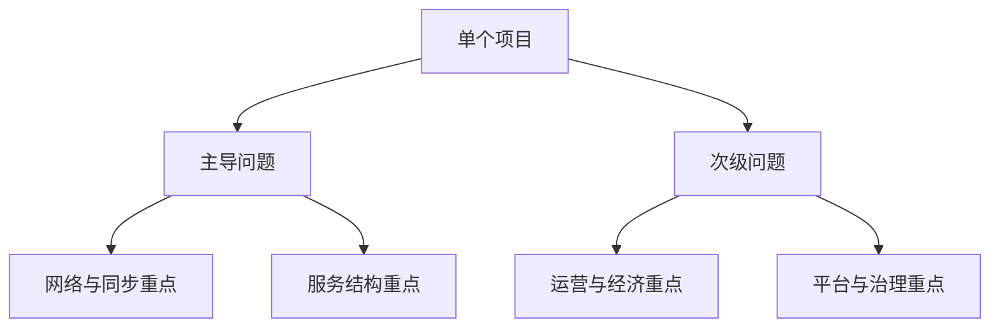

# 模型之间如何组合

真实项目往往不是单一模型，而是组合模型。

## 为什么必须接受“组合模型”这个现实

因为真正的线上产品会演化。一个项目首发时也许只是房间局，但一年后可能已经叠上：

- 排行和赛季
- 公会和社交
- 大量活动与成长体系
- 跨服战和观战
- 平台接入和风控治理

也就是说，主导问题可能不变，但次级问题会持续增长。

例如：

- MMORPG 里可能包含强实时战斗子系统
- 卡牌产品可能同时拥有重运营和重经济系统
- 小游戏可能在技术平台上轻量，但在商业化和版本节奏上非常重

所以分类的目的不是把游戏硬塞进某个桶，而是回答两个问题：

1. 这个项目的主导问题是什么
2. 哪些次级问题会在后期成为复杂度来源

一个有用的实践方式是：先确定“主导问题决定主架构”，再标注“次级问题决定哪些扩展点必须预留”。这样既不会一开始过度设计，也不会完全没有演进空间。

只要这两个问题答清楚，后面的网络、同步、服务拆分、配置管线和运维设计才有依据。
