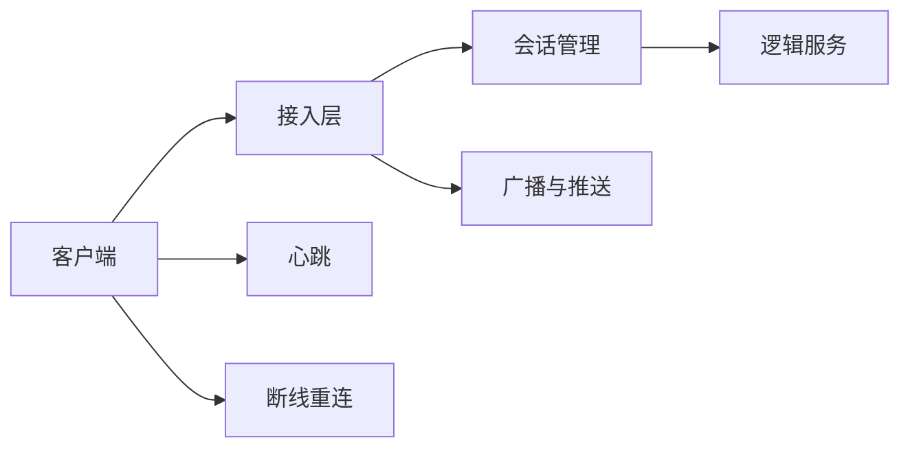
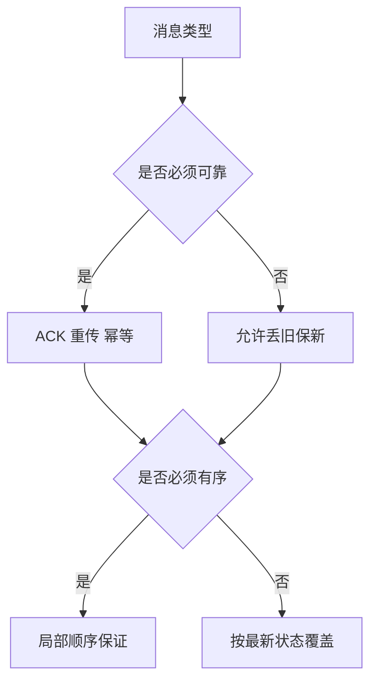

# 3. 网络与接入协议

这一章讨论的是客户端到接入层之间的网络链路，而不是所有“消息系统”问题。

边界约束：

- 这里主要讨论接入协议、连接管理、会话可靠性和弱网问题
- 服务内部的 IPC、消息总线和跨服务通信模型统一放到第 7 章

对游戏来说，网络不是一个单纯的吞吐问题，而是玩家体验、公平性和系统成本的共同约束。

## 游戏网络基础

游戏网络和普通 Web 请求最大的区别在于：很多交互不是“发一个请求，等一个结果”，而是持续在线、长期保持连接、反复交换状态。

因此游戏接入链路通常要同时处理：

- 连接生命周期
- 会话状态
- 心跳与保活
- 断线重连
- 广播与推送
- 顺序与可靠性
- 弱网和高抖动

如果一个系统主要面对的是登录、支付校验、活动配置拉取这类低频操作，HTTP 往往就够了；但只要进入局内持续交互，通常就要转向长连接模型。

## I/O 模型与事件通知机制

从运行时角度看，接入层首先要解决的是：`如何高效地管理大量连接`。

常见基础能力包括：

- 非阻塞 I/O
- I/O 多路复用
- 事件驱动读写
- 读写缓冲区管理

在工程上，真正重要的不是背术语，而是理解几个后果：

1. 连接数量上来以后，不能把一个线程长期阻塞在单连接上
2. 单连接上的慢读、慢写和突发流量会影响整体稳定性
3. 收包、解包、业务处理、发包不应该完全耦合在一起

接入层如果没有明确的事件与缓冲策略，常见结果就是：

- 个别异常连接拖垮整体
- 广播时写缓冲爆炸
- 业务线程被网络 I/O 反向阻塞

## 传输层与接入协议选择

选择协议时，不要先问“哪个先进”，而要先问“链路需要什么性质”。

### TCP

优点：

- 成熟稳定
- 可靠有序
- 生态完整

代价：

- 队头阻塞
- 丢包恢复可能带来额外延迟

适合：

- 房间局
- 多数长连接业务
- 对实现复杂度敏感的项目

### UDP

优点：

- 更灵活
- 可按业务自定义可靠性与顺序策略

代价：

- 需要自己处理更多问题
- 调试、治理和跨平台细节更复杂

适合：

- 强实时链路
- 对低延迟和定制传输要求很强的项目

### KCP / QUIC 等增强方案

这类方案本质上是在“延迟、可靠性、实现复杂度、部署环境”之间重新做平衡。

判断重点不是名词，而是：

- 目标网络环境是什么
- 团队是否有能力维护复杂传输栈
- 是否真的需要额外收益

### HTTP / WebSocket

HTTP 更适合低频请求或外围链路；WebSocket 适合浏览器或 H5 场景下的长连接交互。

但需要注意，WebSocket 只是连接形式，不会自动解决实时同步、公平性和可靠性设计问题。

## 数据帧与协议契约

协议不只是“发什么字段”，而是客户端与服务端之间的契约。

一个成熟的协议设计至少要明确：

1. 消息边界怎么切
2. 帧头里有什么元信息
3. 消息体怎么序列化
4. 如何做版本兼容
5. 如何处理校验、压缩和加密

常见帧头字段包括：

- 协议号或消息类型
- 请求 ID / 序列号
- 长度
- 标志位
- 版本信息

协议设计常见错误包括：

- 把业务语义和传输语义混在一起
- 协议号演进无规划
- 为了省一点字节损失大量可维护性
- 客户端和服务端各自维护一套不一致的契约

对游戏项目来说，协议一旦上线，就会迅速成为高变更成本区域，所以一开始就要把演进路径想清楚。

## 消息模式与事件分发

客户端到服务端的交互，通常可以抽成几种模式：

- 请求 / 响应
- 单向上报
- 服务端主动推送
- 广播

不同模式对应的关注点不同。

请求 / 响应更关注超时、重试和幂等；推送更关注订阅边界和时序；广播更关注风暴和裁剪。

不要把所有行为都做成“客户端发请求，服务端回一坨大包”。进入实时链路以后，很多时候真正需要的是：

- 更小的消息粒度
- 更明确的优先级
- 更清晰的增量更新

## 可靠性、顺序与兼容性

游戏链路里最容易被误解的一点是：`不是所有消息都需要同样的可靠性和顺序保证`。

例如：

- 登录确认、结算结果、支付结果通常必须可靠
- 高频位置更新未必值得逐条可靠重传
- 某些状态同步只需要“最新状态”，而不需要完整历史

因此要先区分消息类型，再决定：

- 是否需要 ACK
- 是否需要重传
- 是否必须有序
- 是否允许丢弃旧消息

兼容性也是同样的逻辑。版本迭代时，要区分：

- 传输协议版本
- 业务字段版本
- 客户端行为兼容窗口

如果这些层次不分开，版本演进时就会非常痛苦。

## 房间广播、弱网与国内网络环境

真正把游戏网络做难的，往往不是实验室环境，而是线上环境。

房间广播的挑战在于：

- 多个玩家同时上报操作
- 服务端同时生成多人可见事件
- 部分玩家网络很差
- 个别玩家发送或接收速度明显慢于其他人

如果广播策略粗糙，容易出现：

- 慢连接堆积写缓冲
- 广播拖慢主循环
- 局内状态和表现时序越来越乱

弱网环境下要优先考虑：

- 心跳与断线判定不能过于理想化
- 重连必须可恢复而不是只能重进
- 协议大小和消息频率要控制
- 网络异常时客户端体验要有降级设计

国内网络环境通常还会引入更多现实约束，例如网络路径复杂、移动网络切换频繁、区域差异明显。这意味着很多理论上“可行”的方案，线上未必稳定。

网络设计的最终目标不是追求某种纯技术上的漂亮，而是让玩家在真实环境里感觉系统是稳定、可预期、能恢复的。
