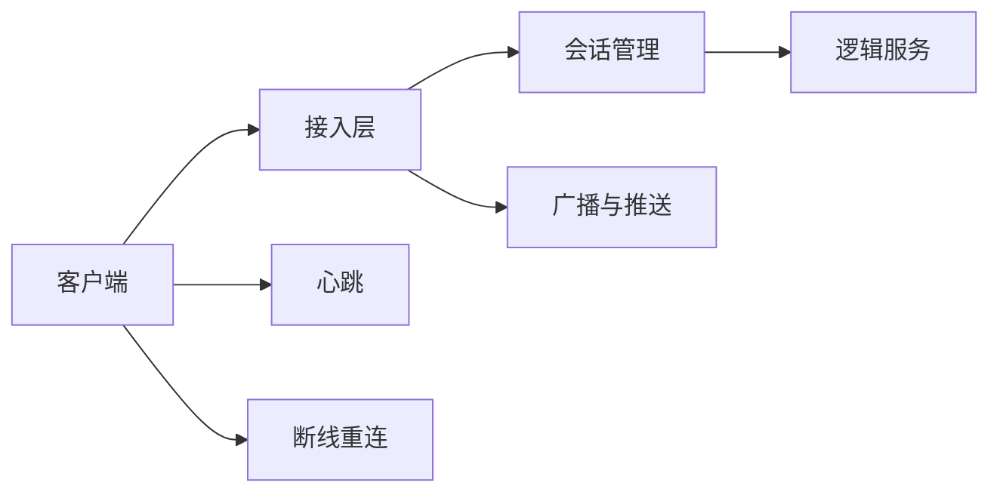

# 游戏网络基础

游戏网络和普通 Web 请求最大的区别在于：很多交互不是“发一个请求，等一个结果”，而是持续在线、长期保持连接、反复交换状态。

## 为什么游戏网络是独立问题域

普通 Web 业务更像离散事务：发请求、处理、返回、结束。游戏网络更像持续会话：连接建立后，双方不断交换输入、状态、事件和控制信息。

这会带来几个直接后果：

- 连接本身变成资源
- 会话状态需要持续维护
- 网络异常不是失败一次请求，而是打断整段体验
- 服务端不仅要“回包”，还要主动推送和广播

因此游戏接入链路通常要同时处理：

- 连接生命周期
- 会话状态
- 心跳与保活
- 断线重连
- 广播与推送
- 顺序与可靠性
- 弱网和高抖动

如果一个系统主要面对的是登录、支付校验、活动配置拉取这类低频操作，HTTP 往往就够了；但只要进入局内持续交互，通常就要转向长连接模型。
