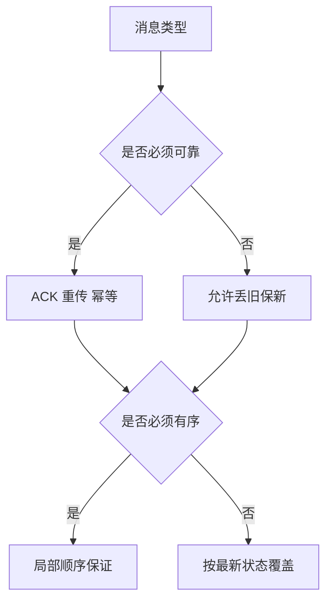

# 可靠性、顺序与兼容性

游戏链路里最容易被误解的一点是：`不是所有消息都需要同样的可靠性和顺序保证`。

例如：

- 登录确认、结算结果、支付结果通常必须可靠
- 高频位置更新未必值得逐条可靠重传
- 某些状态同步只需要“最新状态”，而不需要完整历史

因此要先区分消息类型，再决定：

- 是否需要 ACK
- 是否需要重传
- 是否必须有序
- 是否允许丢弃旧消息

“所有消息都可靠有序”听起来安全，实际上常常是性能和体验灾难。因为高频状态类消息一旦积压，玩家拿到的往往不是最新状态，而是一串已经过期但还在排队补发的历史包。

兼容性也是同样的逻辑。版本迭代时，要区分：

- 传输协议版本
- 业务字段版本
- 客户端行为兼容窗口

如果这些层次不分开，版本演进时就会非常痛苦。
