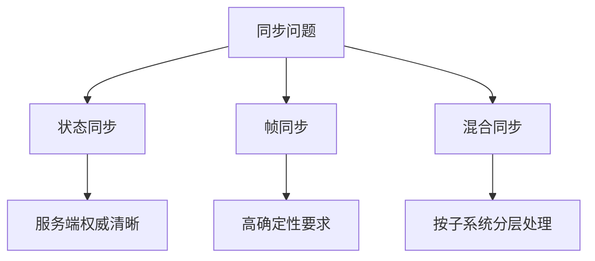

# 4. 同步、战斗与实时交互

这一章讨论实时游戏中最难、也最容易被误判的一条主线：`时间如何推进，状态如何一致，判定如何公平`。

很多团队会把“同步”理解成一个网络问题，实际上它是时间模型、状态模型、数值模型和协议模型的共同结果。

## Tick 与时间推进

实时游戏首先要回答：`世界是怎么往前走的`。

最常见的做法是建立 Tick 或固定步长推进模型，也就是把连续时间切成稳定的小片段，再在每个片段内处理输入、更新状态、产生事件。

固定步长的价值在于：

- 逻辑推进更可控
- 输入处理更容易对齐
- 回放更容易建立
- 性能分析更有基准

但固定步长也不是免费的。Tick 越小，系统更新频率越高，CPU、网络和实现复杂度都会上升；Tick 越大，延迟感越明显，控制精度也可能下降。

所以 Tick 本质上是一个体验与成本的平衡点，而不是越小越好。

## 同步模型

没有万能同步模型，只有适不适合当前问题的同步模型。

### 状态同步

状态同步的思路是：服务端定期或按需把权威状态发送给客户端，客户端主要负责表现。

优点：

- 服务端权威清晰
- 客户端更容易信任结果
- 对复杂共享状态更直观

代价：

- 带宽压力可能大
- 高频动作手感容易受延迟影响

适合：

- 房间制和中低频实时交互
- 状态结构清晰、权威边界明确的系统

### 帧同步

帧同步的思路是：各端共享输入，在同样的时间推进规则下独立演算状态。

优点：

- 理论上带宽更省
- 回放和复盘天然友好

代价：

- 对确定性要求极高
- 跨平台和跨语言细节容易出问题
- 一旦某端漂移，定位难度高

适合：

- 对局内状态可强约束的对战玩法
- 团队能严控运行时和数值一致性的场景

### 混合同步

很多现代项目并不会纯用某一种模型，而是：

- 核心判定按权威状态推进
- 输入和表现层做局部预测
- 某些子系统用事件同步
- 某些对象用低频状态校正

混合同步更贴近真实需求，但要求团队非常清楚每一层到底在同步什么。

## 预测、补偿与纠正

只要存在网络延迟，客户端就几乎一定会面临一个问题：`玩家已经操作了，但权威结果还没回来`。

解决这个问题，通常要用到三类机制。

### 客户端预测

客户端先根据本地输入提前表现结果，减少“按了没反应”的感觉。

### 服务端纠正

服务端返回权威状态，当客户端发现本地预测偏离时进行回正。

### 延迟补偿

在某些判定中，服务端会考虑输入产生时的历史时刻，而不是只看消息到达时刻。

这三者的目标不是让延迟消失，而是把延迟的伤害分摊到玩家更能接受的位置。

常见错误是：

- 预测做得太激进，回正时画面频繁抖动
- 补偿做得太宽松，公平性被侵蚀
- 所有对象都做同样级别的预测和校正，导致成本失控

真正成熟的系统会区分：

- 哪些对象必须即时响应
- 哪些对象允许慢一点但更稳
- 哪些判定必须绝对权威

## 确定性与数值一致性

一旦采用输入驱动演算或需要高可信回放，就必须正视确定性问题。

确定性并不是一句“大家都跑同样代码”就能保证的。真正的风险来自：

- 浮点误差
- 不同平台和编译器差异
- 随机数使用不一致
- 更新顺序不稳定
- 容器遍历顺序不稳定

因此一套想要稳定的同步系统，通常会约束：

1. 随机数来源和消费顺序
2. 运算顺序
3. 状态更新顺序
4. 数据结构访问顺序
5. 数值表达方式

某些项目会选择定点数、统一数学库或严格运行时约束，本质上都是在压缩不确定性的来源。

## 回放、观战与裁决

回放不是附属功能，而是同步系统是否成熟的重要证明。

如果一个系统连稳定回放都做不出来，通常意味着：

- 输入和状态没有被稳定记录
- 时间推进不稳定
- 数值一致性不可控
- 关键事件缺乏可追溯性

观战和裁决也是同样的道理。它们要求系统不仅能“当下跑起来”，还要能：

- 重建历史
- 解释判定
- 对外展示结果

对竞技产品来说，这甚至会直接影响申诉、仲裁和赛事能力。

因此在架构上，回放和裁决不应该最后才补，而应该在同步模型设计时一起考虑。
