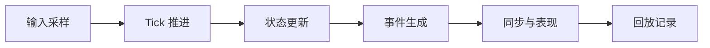

# Tick 与时间推进

实时游戏首先要回答：`世界是怎么往前走的`。这个问题没有答案，后面所有同步、判定、回放和性能分析都会失去基准。

最常见的做法是建立 Tick 或固定步长推进模型，也就是把连续时间切成稳定的小片段，再在每个片段内处理输入、更新状态、产生事件。

## 为什么固定步长这么常见

固定步长的价值在于：

- 逻辑推进更可控
- 输入处理更容易对齐
- 回放更容易建立
- 性能分析更有基准

但固定步长也不是免费的。Tick 越小，系统更新频率越高，CPU、网络和实现复杂度都会上升；Tick 越大，延迟感越明显，控制精度也可能下降。

## 关键不是 Tick 存不存在，而是全链路是否承认它

很多项目名义上有 Tick，实际上：

- 输入采样不是按 Tick 对齐
- 逻辑更新里混入了即时异步修改
- 客户端表现和服务端推进不是同一节拍
- 回放记录也不是按同一时间基准组织

这种系统表面看有 Tick，实质上没有统一时间模型。

所以 Tick 本质上是一个体验与成本的平衡点，而不是越小越好。更重要的是：`一旦选定时间基准，全链路都要围绕它组织`。
