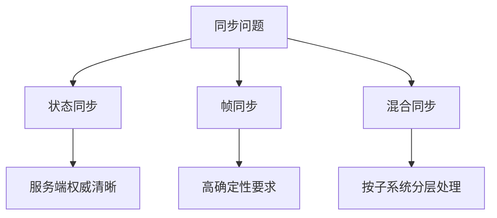

# 同步模型

没有万能同步模型，只有适不适合当前问题的同步模型。

同步模型讨论的不是“包怎么发”，而是：`共享状态如何在多个参与者之间成立`。这件事至少包含四个层面：

- 谁是权威
- 输入和状态谁被同步
- 不一致出现时谁让步
- 玩家最终感受到的是响应优先还是结果优先

### 状态同步

状态同步的思路是：服务端定期或按需把权威状态发送给客户端，客户端主要负责表现。

优点：

- 服务端权威清晰
- 客户端更容易信任结果
- 对复杂共享状态更直观

代价：

- 带宽压力可能大
- 高频动作手感容易受延迟影响

适合：

- 房间制和中低频实时交互
- 状态结构清晰、权威边界明确的系统

它真正的优势不是“简单”，而是权威边界清楚。代价则是客户端想要好手感，就必须额外做预测、插值和局部遮蔽。

### 帧同步

帧同步的思路是：各端共享输入，在同样的时间推进规则下独立演算状态。

优点：

- 理论上带宽更省
- 回放和复盘天然友好

代价：

- 对确定性要求极高
- 跨平台和跨语言细节容易出问题
- 一旦某端漂移，定位难度高

适合：

- 对局内状态可强约束的对战玩法
- 团队能严控运行时和数值一致性的场景

很多团队低估帧同步的地方在于：它并不是“只发输入所以天然更高级”，而是把复杂度从带宽和权威状态同步，转移到了确定性、调试、平台一致性和工具链上。

### 混合同步

很多现代项目并不会纯用某一种模型，而是：

- 核心判定按权威状态推进
- 输入和表现层做局部预测
- 某些子系统用事件同步
- 某些对象用低频状态校正

混合同步更贴近真实需求，但要求团队非常清楚每一层到底在同步什么。

## 真正该怎么选

最实用的选法不是问“我们用状态同步还是帧同步”，而是逐项问：

1. 哪些对象必须服务端权威
2. 哪些输入必须即时反馈
3. 哪些状态可以周期校正
4. 哪些结果必须可回放和可仲裁

一旦这些答案清楚，同步模型自然会收敛，而不是靠口号决定。
