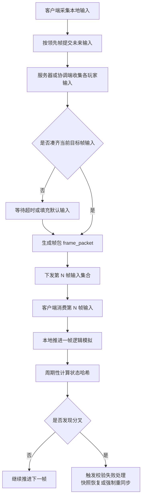

# 帧同步详解

帧同步不是一个口号，而是一整套围绕“共享逻辑帧”组织战斗的工程方案。它的核心不是省带宽，而是让所有参与者围绕同一帧号、同一输入窗口和同一模拟规则推进战斗。很多团队第一次做帧同步时，只记住了“发输入不发状态”，结果后面在延迟帧、默认输入、追帧、重连、暂停、哈希校验这些地方全踩坑。

## 帧同步到底是什么

帧同步的最小定义可以写成一句话：所有参与者在第 `N` 逻辑帧消费同一组输入，然后按同一规则推进到第 `N + 1` 帧。只要输入一致、顺序一致、模拟一致，最终状态就应该一致。

但真实项目里的帧同步通常并不只有一种形态。常见落地差异包括：

- 谁负责汇总输入，是房主、转发服务器还是权威服务器。
- 服务端只是协调帧号，还是也参与权威模拟。
- 输入是严格等齐后才发帧，还是有超时默认输入。
- 客户端是否允许对未来若干帧先做本地前馈。
- 状态是否定期做快照与哈希校验。

所以“用了帧同步”并不能说明系统长什么样，只能说明系统选择了按帧组织一致性。

## 为什么很多项目会被帧同步吸引

帧同步最打动人的地方，通常有三点：

- 输入包通常比完整状态广播更轻。
- 一致性、回放、裁决语言天然围绕同一帧号组织。
- 对强博弈场景来说，很多争议都能落到明确帧序上。

这也是 RTS、部分格斗、强实时房间制游戏和一些竞技项目长期偏爱它的原因。但它真正昂贵的部分不在传输，而在配套工程。

## 帧同步真正依赖哪些运行时对象

一套能上线的帧同步，通常至少要有下面这些核心对象：

- `frame_id`：当前逻辑帧号，所有裁决讨论的共同语言。
- `input_delay`：本地输入领先多少帧提交，给网络抖动留缓冲。
- `input_buffer`：存放未来若干帧输入的缓冲区。
- `frame_packet`：服务器或协调端下发的某一帧输入集合。
- `default_input`：超时或掉线时的保底输入，例如空操作、保持方向、托管输入。
- `state_hash`：周期性校验当前状态是否一致。
- `checkpoint`：用于重连和长对局恢复的定期快照。
- `catch_up_policy`：客户端落后时如何追帧、何时切快照、何时认定无法恢复。

少了其中任何一项，帧同步都很容易在边缘场景里崩。

## 一条更接近真实工程的帧同步链路

这个流程说明了一件事：帧同步不是“大家自己跑”，而是输入窗口、超时策略、哈希校验和恢复策略共同组成的一条链。

## 常见的几种帧同步方案

### 1. 严格锁步

所有参与者必须等到当前帧输入齐备后才能推进下一帧。这个模型最纯，也最容易解释，但对弱网和单点掉队最敏感。任何一个人卡住，整局都得陪着等。

它的优点是实现概念最干净，缺点是线上环境通常最难扛。

### 2. 服务器协调型帧同步

服务器负责收集所有玩家对未来帧的输入，凑齐或超时后生成帧包，再统一下发。服务端未必自己做完整模拟，但至少是帧组织者。

这是很多房间制项目更现实的落点，因为它把帧号组织、超时、托管和掉线判断收拢到了服务器一侧。

### 3. 服务端权威模拟型帧同步

服务器不仅协调帧号，还自己消费同一组输入推进一份权威模拟。客户端也按帧推进，但服务端拥有最终校验权。

这种方案比纯客户端锁步更稳，也更利于反作弊和重连恢复，但服务端成本会上升。

### 4. 帧同步加局部预测或回滚

某些对手感极端敏感的项目，会在帧同步外再叠加本地前馈、回滚或局部预测。它的目标是缩短输入到反馈的体感延迟，但代价是实现和调试复杂度大幅上升。

如果团队没有强工具链，不建议一开始就碰最重的变种。

## 延迟帧和输入窗口是帧同步的核心现实

帧同步不可能真做到“当前帧输入，当前帧立刻所有人都一致执行”，因为网络传播需要时间。真实做法通常是：

- 客户端在本地第 `L` 帧时，提交未来第 `L + K` 帧的输入。
- `K` 就是领先帧或输入延迟窗口。
- 服务器收集所有人对第 `L + K` 帧的输入，再下发该帧帧包。

`K` 设得太小，系统容易被抖动打爆；设得太大，输入延迟体感会明显变差。这个窗口的本质，是在即时性和稳定性之间买时间。

## 超时和默认输入不能事后补

只要项目存在弱网、掉线、后台挂起和高峰抖动，帧同步就一定要回答一个问题：如果第 `N` 帧迟迟等不到某个玩家输入，系统怎么办。

常见选择有：

- 判定超时，直接空操作
- 保持上一帧方向或上一帧输入态
- 进入托管 AI
- 暂停整局，等待少量恢复时间
- 直接判负或强制退出房间

没有哪种方案天然正确，关键是要和玩法匹配。但最大错误是根本不定义，最后所有人都在等待一个永远不会来的输入。

## 状态哈希和校验点是救命工具

帧同步项目里，最危险的不是丢包，而是分叉不自知。客户端和服务端可能都在正常跑帧、都在收到帧包，但某个平台的浮点、某个脚本分支、某次集合遍历顺序不同，就足够让双方从第 300 帧开始慢慢偏离。

因此，帧同步体系通常需要：

- 固定周期计算关键状态哈希
- 在房间内比较哈希是否一致
- 发现分叉后快速定位到最早异常帧
- 保留最近一段时间的检查点与日志

如果没有这些工具，线上不同步通常只能靠“感觉哪里不对”。

## 重连为什么不能只靠逐帧追

这和你后面关心的暂停、继续、追帧问题直接相关。帧同步项目里，断线重连后如果客户端只会从断开帧开始逐帧补算，很容易出两个问题：

- 落后帧数太多，客户端永远追不上
- 客户端一边加载资源一边补逻辑，结果越来越落后

所以比较稳妥的实践通常是：

- 定期生成房间检查点或战斗快照
- 重连时优先加载最近检查点，而不是从很久以前开始回放
- 检查点之后只追一小段增量帧
- 超过追赶阈值时直接切快照恢复，不再盲目追帧

没有快照的帧同步，长对局和重连体验通常很难做稳。

## 什么系统适合纳入帧同步

帧同步最适合的是那些直接影响胜负、必须围绕同一逻辑时间推进的对象：

- 角色输入与位移
- 技能释放与命中
- Buff 触发和移除
- 投射物推进
- 核心资源变更
- 死亡、复活、结算条件

不适合强行塞进帧同步主链路的通常包括：

- 纯表现特效
- UI 动画
- 非关键音效
- 与胜负无关的外围系统表现

把所有东西都塞进帧同步，只会把整条链路变重。

## 什么时候帧同步值得用

帧同步最适合那些满足以下特征的战斗：

- 对公平和时序极度敏感
- 核心对象数量相对可控
- 团队愿意投入确定性、哈希校验、快照和调试工具
- 可接受为了稳定性引入若干领先帧

如果项目更偏大世界、强服务端权威、复杂外围系统和大量非确定性内容，纯帧同步往往不是最划算的答案。

## 更接近最佳实践的结论

比较稳妥的帧同步设计，不是只定义一个帧号递增器，而是同时把下面这些东西一起设计出来：

- 领先帧与输入窗口
- 服务器协调或权威角色
- 默认输入和超时策略
- 周期性状态哈希
- 快照与重连恢复机制
- 追帧上限和失败兜底

帧同步的真正复杂度不在第 0 天能不能跑起来，而在第 100 天掉线重连、暂停恢复、跨端差异和线上争议来临时还能不能解释清楚。

## 常见误区

最常见的误区，是把帧同步理解成“只发输入，所以简单”。第二类误区，是没有默认输入和超时策略，让整局等待掉线玩家。第三类误区，是没有状态哈希和检查点，出了分叉只能重开。第四类误区，是重连时试图从断开那一帧开始无脑逐帧回放，最终把客户端拖进永久追帧或永久加载。
