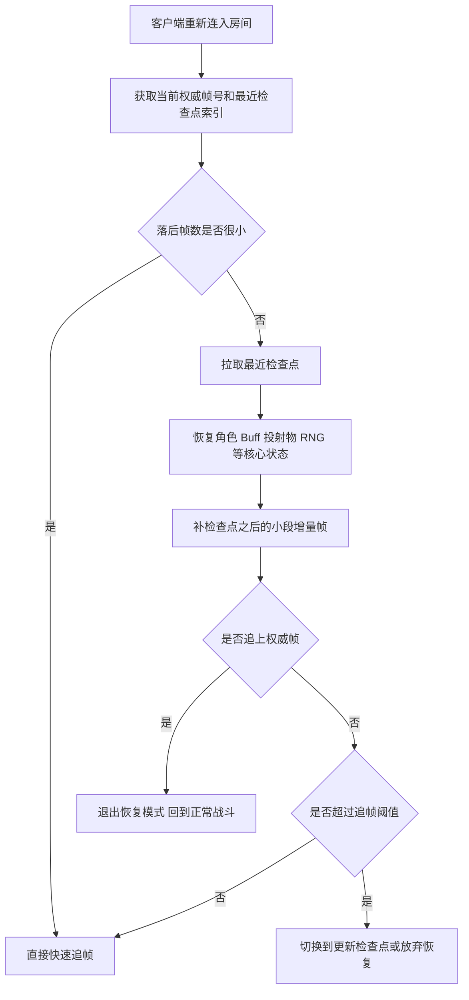

# 暂停、继续、追帧与断线重连

暂停和继续不是一个 UI 细节，而是同步体系里最容易暴露架构真相的场景。很多团队以为“客户端点了暂停，战斗时钟不步进”就叫支持暂停，结果一到联网战斗、后台挂起、掉线恢复、服务器不停跑和断线重连，系统立刻露馅。你提到的“帧同步里客户端断线后服务端继续跑，重连后一直追帧、一直加载”，就是典型例子。

## 先把四件不同的事分开

现实工程里，很多人把下面四种情况都叫“暂停”，其实它们不是一回事：

- 本地 UI 暂停：玩家打开菜单、暂停渲染或暂停输入，但房间逻辑可能继续跑。
- 房间级战斗暂停：整局战斗的权威逻辑时间停止推进，所有参与者停在同一帧。
- 客户端挂起或卡死：客户端本地停止推进，但服务器和其他人可能没停。
- 掉线重连与追帧：客户端离开了一段时间，回来时要重新追上权威帧。

这四类场景如果不先分开，后面所有设计都会互相打架。

## 什么才叫真正的“战斗暂停”

联网战斗里，真正的战斗暂停只有一种定义：权威战斗时钟暂停推进。也就是说，不只是客户端画面停住，而是服务端或房间协调端明确把逻辑帧锁在某一帧上，直到恢复命令生效。

如果只是某个客户端本地不再步进，但服务器仍在继续推进：

- 对服务器来说，这不是暂停，而是客户端掉队或挂起。
- 对其他玩家来说，这不是暂停，而是房间继续正常进行。
- 对重连客户端来说，它回来后面对的是追帧恢复问题，而不是暂停继续问题。

这正是很多失败案例的根因：系统以为自己实现了“暂停”，实际上只是某个端本地停了。

## 房间级暂停应该由谁控制

如果项目允许联网战斗暂停，比较稳妥的做法通常是：

- 由权威服务器或房间协调端决定是否进入暂停态。
- 暂停态绑定明确的房间状态和当前帧号。
- 暂停期间不再生成新逻辑帧，也不再消费未来输入。
- 恢复时从同一权威帧继续推进，而不是靠各端自己“接着跑”。

同时还要定义清楚暂停权限：

- 谁能发起暂停
- 暂停是否需要全员同意
- 暂停最多持续多久
- 掉线玩家是否触发自动暂停、托管还是直接继续比赛

这些规则不是产品细节，而是同步系统的一部分。

## 你提到的失败案例，本质上是什么问题

“服务器没有停止一直在跑，客户端断线重连之后一直在追帧，一直在加载”，通常不是单点 Bug，而是几个设计问题叠加：

- 把客户端挂起误当成了战斗暂停。
- 没有房间级权威暂停语义，服务器自然继续推进。
- 没有周期性战斗检查点，重连只能从很久以前逐帧补。
- 没有追帧上限，客户端会永远试图靠 CPU 把历史帧补完。
- 加载流程和追帧流程耦合，资源没准备好，逻辑也追不上。

这时客户端“在加载”的往往不是某个单一资源，而是在同时做几件不该同时硬做的事：拉房间状态、恢复对象图、补历史帧、重建技能/Buff/投射物时序、补齐表现资源、对齐当前权威帧。只要任何一项跟不上，就会出现持续 loading。

## 重连时到底应该加载什么

更合理的问题不是“重连时该不该追帧”，而是“先恢复到哪个基点，再追多少帧”。比较稳妥的答案通常是：

- 房间基础信息：地图、模式、当前局阶段、玩家列表、座位与阵营。
- 最近权威检查点：角色位置、朝向、血量、资源、Buff、冷却、投射物、召唤物、随机种子、战斗子状态。
- 检查点之后的增量帧：从检查点帧到当前权威帧这一小段输入或事件。
- 当前权威帧号与时间基准：告诉客户端现在要追到哪里。
- 最低必要表现资源：不是把全历史表现都重播，而是保证当前状态能正确显示。

关键点在于：重连恢复的目标是尽快回到“当前权威状态”，不是忠实重播断线期间的每一个历史表现细节。

## 为什么不能无脑逐帧追

逐帧追只有在落后很少时才合理。落后多了以后，它几乎一定会出问题：

- 客户端一边追逻辑，一边还要加载资源和重建对象，CPU 很容易炸。
- 如果渲染和逻辑没有彻底分离，追帧时体验会极差。
- 一旦又有新包进来，目标帧继续向前滚，客户端可能永远追不上。

因此，成熟系统通常会设置多个恢复档位：

- 落后很少：直接快速追帧。
- 落后中等：加载最近检查点，再补一小段增量帧。
- 落后太多：直接状态跳转到最新检查点，必要时丢弃部分中间表现。
- 超过恢复窗口：不再强行恢复，转为重新入局、托管或判负。

没有这些档位，重连恢复通常会演变成“理论正确，线上不可用”。

## 追帧应该怎样跑才不拖垮客户端

追帧本质上是一个受限的快速模拟过程，常见实践包括：

- 追帧期间降级或关闭部分表现系统。
- 限制单次渲染循环内最多追多少逻辑帧，防止卡死。
- 把资源加载与逻辑追帧拆开，避免互相阻塞。
- 对关键对象优先恢复，非关键表现延后补齐。
- 当发现差距越追越大时，立即切换到检查点恢复，而不是继续硬扛。

也就是说，追帧不是“把正常战斗循环开倍速”，而是专门设计的一种恢复模式。

## 战斗暂停和断线恢复为什么必须共用同一时钟模型

如果系统有房间级暂停，那么暂停和恢复都必须落在权威战斗时钟上。否则会出现几种常见灾难：

- 客户端以为自己停在第 2000 帧，服务器其实已经到了第 2150 帧。
- 暂停期间客户端还在局部推进动画或技能逻辑，恢复后状态错位。
- 恢复时不同客户端从不同本地时钟继续跑，整局立刻分叉。

所以比较好的设计通常是：

- 停或继续的对象是“权威帧推进器”，不是 UI。
- 暂停态是房间状态机的一部分，不是本地开关。
- 恢复时所有客户端对齐同一权威帧和同一检查点。

## 本地单机暂停和联网暂停不要混

单机或纯本地战斗里，“战斗独立时钟，暂停就不步进”是完全合理的方案。因为唯一权威就在本地，暂停就是逻辑时间停止。

但一旦进入联网战斗，这个方案只对本地单端成立。此时必须追加一个判断：

- 这次暂停是本地界面行为，还是房间权威行为。

如果不是后者，就不能假设整个战斗真的停了。

## 更接近最佳实践的恢复流程

这张图想说明的不是流程复杂，而是恢复策略必须分档，不能只有“从断线那一帧开始补到现在”这一条死路。

## 这一类问题的观测指标

如果系统支持暂停、恢复和重连，至少应该监控：

- 房间暂停次数与平均暂停时长
- 断线重连成功率
- 重连后平均恢复耗时
- 快照恢复命中率
- 平均追帧数与最大追帧数
- 因超出恢复窗口而失败的次数

没有这些指标，你根本不知道“恢复慢”是因为网络慢、快照太旧、资源加载阻塞，还是逻辑追帧策略本身有问题。

## 更接近最佳实践的结论

比较稳妥的做法通常是：

- 联网战斗里把暂停定义成房间级权威时钟暂停，而不是本地开关。
- 把客户端挂起、掉线和真正战斗暂停严格区分。
- 定期生成检查点，不依赖长距离逐帧追赶。
- 给追帧设置上限和分档恢复策略。
- 重连时优先恢复当前权威状态，而不是追求完整重播断线期间的所有表现。

你提到的那个失败例子，本质上就是没有把这几层区分开。

## 常见误区

最常见的误区，是把客户端本地停步进当成联网战斗暂停。第二类误区，是没有检查点，重连只能从断点开始一帧一帧补。第三类误区，是追帧流程和资源加载强耦合，客户端越恢复越落后。第四类误区，是没有恢复失败兜底，系统宁可永远 loading，也不肯明确判定这次恢复已经不可行。
