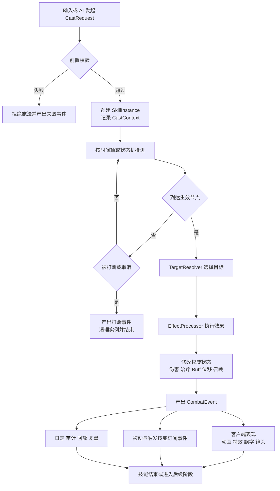

# 技能系统设计

技能系统不是“每个技能写一个脚本”这么简单。它本质上是在回答一组更硬的问题：技能如何描述、如何实例化、如何执行、如何同步、如何被调试、如何被内容团队持续扩展。如果这些问题没有被统一设计，项目早期也许只是“代码丑一点”，中后期就会演变成新技能越来越慢、线上问题越来越难查、平衡调整越来越容易误伤旧逻辑。

## 问题从哪里来

策划看技能，看到的是玩法、手感、连招、博弈和职业差异；客户端看技能，看到的是输入反馈、动画、特效、镜头和音效；服务端看技能，看到的是裁决、命中、冷却、资源、控制和反作弊；AI 和关卡系统看技能，看到的是可复用的行为能力；工具链看技能，看到的是配置、校验、灰度和日志。一个“冲锋并击飞”的技能，往往会同时牵涉位移、碰撞、霸体、目标过滤、击退、Buff、伤害、打断、表现广播和回放记录。技能系统之所以难，不是因为单个技能复杂，而是因为它天然跨了太多边界。

## 什么时候会变成主问题

只要项目里满足下面任意几条，技能系统就不再是局部实现，而会变成主架构问题：

- 技能数量持续增长，一个职业或一个怪物族群就有几十到上百个技能。
- 存在 PvP、竞技或强实时战斗，命中、控制和位移都需要严格裁决。
- 技能不只是瞬时伤害，还包含持续施法、引导、蓄力、多段命中、召唤、陷阱、光环、被动和触发链。
- AI、玩家、怪物、召唤物希望复用同一套技能能力，而不是四套平行实现。
- 版本迭代频繁，需要大量配表、新增效果类型、修数值和平衡，而不能每次都靠改代码救火。

满足这些条件时，技能系统设计得好不好，直接决定战斗系统是否还能继续扩展。

## 技能系统到底在设计什么

技能系统真正要设计的，不是“技能表长什么样”，而是以下几层东西如何分工：

- 技能定义：静态描述技能拥有什么行为。
- 施法请求：玩家或 AI 这一次想放什么技能，对谁放，在什么位置放。
- 技能实例：这次施法真正进入运行时后的对象，带有阶段、计时器、目标快照和上下文。
- 目标选择：谁会成为候选目标，如何过滤、排序、截断和锁定。
- 效果结算：伤害、治疗、Buff、位移、召唤、打断、净化等统一如何执行。
- 表现事件：动画、特效、音效、震屏、飘字、镜头语言如何订阅权威结果。
- 同步裁决：哪些结果由客户端预测，哪些必须等待服务端确认。
- 调试与回放：线上为什么没命中、为什么被打断、为什么多触发了一次，系统能不能说清楚。

如果这些层没有拆开，项目通常会退化成“技能 ID + if else + 到处发事件”的形态。

## 一般的技能分类

技能系统设计之前，最好先明确“你到底在统一哪些技能形态”。常见分类如下：

- 主动技能：玩家或 AI 主动发起，通常有冷却、费用、施法条件和目标规则。
- 被动技能：不直接施放，而是在特定事件上响应，比如暴击后回血、入场加护盾。
- 触发技能：本质上也是主动技能，只是由事件驱动触发，而不是输入驱动触发。
- 持续技能：开启后在一段时间内持续生效，可能附带维持费用或周期 Tick。
- 引导技能：施法期间持续保持，期间可被打断，常常伴随方向修正和持续伤害。
- 蓄力技能：施法时间决定最终效果，需要把输入时长、打断、释放窗口统一进阶段模型。
- 位移技能：冲锋、闪现、跳斩、钩索等，天然牵扯碰撞、穿模、阻挡和同步争议。
- 召唤技能：技能本身只是入口，真正复杂的是召唤物生命周期和控制权归属。
- 光环和领域技能：效果挂在区域或对象上持续影响周围单位，常常需要独立的运行时实体。

分类的意义不是做百科，而是提醒你：不要试图用一个“瞬时放招函数”去容纳所有形态。

## 一般推荐的运行时骨架

技能系统如果要长期可维护，通常至少需要以下运行时对象：

- `SkillDefinition`：技能静态定义。包含标签、施法方式、费用、冷却、阶段时间轴、目标规则、效果列表、表现引用等。
- `CastRequest`：施法请求。包含施法者、技能 ID、输入方向、目标点、目标对象、发起时间等。
- `CastContext`：一次施法上下文。包含当前 Tick、施法者快照、随机种子、地图环境、链路来源等。
- `SkillInstance`：运行中的技能实例。包含当前阶段、剩余时间、锁定目标、已触发效果、可中断状态等。
- `TargetResolver`：目标选择器。负责从候选集中找出最终命中集，而不是让每个技能自己写一份查找逻辑。
- `EffectProcessor`：效果处理器。统一执行伤害、治疗、Buff、位移、召唤、驱散、控制、镜像等效果类型。
- `BuffInstance`：状态效果实例。Buff 不应该只是技能系统的附属备注，而应是独立的一等运行时对象。
- `CombatEvent`：战斗事件。把施法开始、命中、躲避、打断、Buff 添加、护盾吸收、死亡等记录成标准事件流。

这套骨架的核心思想很简单：技能负责组织施法流程，不直接独占所有业务逻辑；效果负责具体改状态；Buff 负责持续性；表现层订阅事件，而不是反向改裁决。

## 一次施法的标准流程

一个成熟的技能系统，通常会把一次施法拆成下面的链路：



1. 输入或 AI 决策发起 `CastRequest`。
2. 进入前置校验，检查冷却、费用、死亡状态、控制状态、公共 CD、武器切换状态等。
3. 创建 `SkillInstance`，分配唯一实例 ID，并记录施法上下文。
4. 进入施法阶段，按时间轴推进前摇、生效点、持续段和收招。
5. 到达特定节点时执行目标选择，拿到命中集合或作用区域。
6. 将效果列表送入统一效果管线，逐个执行伤害、治疗、Buff、位移等。
7. 产出权威战斗事件，驱动客户端表现、日志、回放和后续触发链。
8. 技能结束、取消或被打断，清理运行时状态，进入冷却或恢复态。

把流程拆成这样，最大的好处不是“架构漂亮”，而是任何一个环节出了问题都能被定位到明确责任层。

## 一般的套路：时间轴驱动

大多数动作技能、RPG 技能和怪物技能，最常用也最稳定的套路是时间轴驱动。技能定义里不直接写一整段脚本逻辑，而是定义一条施法时间线：

- `startup`：前摇，通常决定能否被打断、是否锁朝向、是否开始播动作。
- `active`：生效段，可以是一个点，也可以是多个片段。
- `recovery`：后摇，决定角色什么时候恢复移动或接别的技能。
- `finish`：技能结束，释放实例占用，进入冷却。

在这个模型下，很多看似不同的技能都能被统一：

- 单段伤害技能：在某个生效点打一段效果。
- 多段连击技能：在多个时间点重复触发效果。
- 持续伤害技能：在持续窗口内周期性触发效果。
- 蓄力技能：前段持续累积参数，松手或到阈值后转入释放段。

时间轴的优点是直观、可视化、适合调试；缺点是碰到复杂分支时容易不够表达。它适合覆盖大多数常规技能。

## 一般的套路：状态机驱动

当技能存在明显的条件跳转、打断恢复、引导维持、阶段切换时，状态机会比简单时间轴更稳。典型例子包括：

- 引导技能：`casting -> channeling -> complete / interrupt`
- 蓄力技能：`hold -> charged_lv1 -> charged_lv2 -> release`
- 连段技能：`stage1 -> combo_window -> stage2 -> combo_window -> stage3`
- 霸体反击技能：`startup -> guard_window -> counter / fail`

状态机不是为了“显得高级”，而是为了把技能阶段切换变成显式规则，而不是散落在一堆时间回调和布尔标记里。一般实践是：普通技能走时间轴，复杂持续技能或条件分支技能走状态机，两者共享同一套效果与事件管线。

## 一般的套路：效果管线

技能系统最容易写崩的地方，是把每个技能都写成一段“自己算一切”的逻辑。更稳妥的做法是把技能和效果拆开：

- 技能定义“什么时候触发哪些效果”。
- 效果处理器定义“某类效果如何结算”。

常见效果类型包括：

- 伤害
- 治疗
- 加 Buff / 移除 Buff
- 位移 / 拉拽 / 击退 / 击飞
- 资源变更
- 召唤
- 护盾
- 打断 / 沉默 / 眩晕 / 免控
- 生成区域或陷阱

这样设计有几个直接收益：

- 新增一个技能时，大部分时候只是组合已有效果，而不是再写一段新脚本。
- 新增一种效果类型时，只需要扩展一个效果处理器，不需要改动所有技能。
- 伤害加成、抗性、穿透、标签修正、护盾吸收、暴击等可以统一挂到伤害处理器里。

简化讲，技能系统应该更像编排层，而不是业务杂糅层。

## 一般的套路：Buff 作为一等公民

很多项目前期把 Buff 当“技能附带的一点状态”，后面一定会出问题。Buff 实际上是战斗系统里的独立核心对象，因为它承担了太多持续性逻辑：

- 持续伤害和持续治疗
- 控制与免控
- 攻速、移速、伤害加深、减伤等属性修正
- 光环、领域、标记、叠层
- 触发器，例如“被攻击时反伤”“血量低于 30% 时护盾”

最佳实践通常是：

- 技能负责施加或移除 Buff。
- Buff 自己负责持续时间、叠层、周期 Tick、触发器和消失条件。
- 属性系统和 Buff 系统打通，不要在技能里直接临时改基础属性。

如果 Buff 不被建模成独立对象，越往后就越难处理叠层、覆盖、刷新、驱散、免疫和日志追踪。

## 一般的套路：被动和触发技能统一进事件系统

被动和触发技能看上去和主动技能不同，但工程上最好不要另起一套体系。更好的做法是：

- 所有关键战斗变化都产出标准事件，比如命中、暴击、死亡、进入战斗、Buff 添加、技能结束。
- 被动或触发技能只是在订阅这些事件。
- 触发后依旧创建标准的 `SkillInstance` 或 `EffectInstance`，而不是偷偷在事件处理里直接改状态。

这样做的好处是：

- 被动技能也能进入回放、日志和调试链路。
- 触发链能被限制和防循环。
- AI、怪物和玩家的被动逻辑可以复用同一机制。

很多项目的线上诡异问题，本质上都是“某个被动不是正常技能实例，所以没人知道它什么时候触发了两次”。

## 数据怎么设计才不容易失控

技能数据设计的原则，不是字段越全越好，而是要明确哪些属于通用结构，哪些属于特例扩展。一个相对稳妥的技能定义通常会包含：

- 基本信息：技能 ID、名字、标签、所属职业或单位模板。
- 施法信息：施法类型、目标类型、射程、朝向要求、是否锁定目标、是否可打断。
- 资源与冷却：法力、怒气、子弹、层数消耗，技能 CD 与公共 CD。
- 阶段信息：前摇、命中点、持续时间、后摇、窗口事件。
- 目标规则：友军/敌军/自身、扇形/矩形/圆形/弹道、最大目标数、过滤条件。
- 效果列表：伤害、治疗、Buff、位移、召唤等的参数与顺序。
- 表现引用：动画、特效、音效、镜头参数。这里只放引用，不直接写表现逻辑。
- 扩展参数：给少量特例脚本或处理器使用，但要受控，不能无限蔓延。

一个简化示例如下：

```yaml
id: warrior_charge
tags: [active, movement, control]
cast:
  targetType: enemy_unit
  range: 8
  interruptible: true
  lockFacing: true
cost:
  mp: 20
cooldownMs: 8000
phases:
  - name: startup
    durationMs: 300
  - name: active
    atMs: 300
    target:
      shape: capsule
      length: 6
      radius: 1.2
      maxTargets: 3
    effects:
      - type: dash
        distance: 6
      - type: damage
        formula: atk * 1.2
      - type: apply_buff
        buffId: knockup_800ms
  - name: recovery
    durationMs: 500
presentation:
  animation: charge_01
  hitFx: fx_charge_hit
```

关键点不在 YAML，而在于这份数据表达的是结构化意图，而不是一段临时脚本。

## 哪些内容应该进配置，哪些应该进代码

这是技能系统最常见的分界问题。一般经验如下：

- 技能结构、阶段时间、目标规则、效果组合、数值参数，适合进配置。
- 效果处理器、目标选择器、公式解释器、Buff 运行时、命中结算、叠层规则，适合在代码里实现。
- 少量高复杂度的特殊行为可以用脚本扩展，但脚本应当挂在受控扩展点上，而不是接管整套施法流程。

比较稳妥的原则是：绝大多数技能应该是“配出来的”，少量特殊技能是“基于统一骨架扩出来的”，而不是每个技能都拥有自己的执行器。

## 常见的最佳实践

- 把技能看成“施法流程 + 目标规则 + 效果列表”，不要把技能理解成一个任意脚本入口。
- 技能实例、Buff 实例、效果处理器分层明确，避免把持续性逻辑塞进技能本体。
- 目标选择、命中判定、效果结算、表现触发分离，任何一层都不要越权。
- 使用标签系统统一表达“可被打断”“免控”“火属性”“近战”“召唤物来源”等横切条件，少写职业专属分支。
- 主动、被动、触发技能尽量共享同一事件和结算框架。
- 所有关键裁决都产出标准战斗事件，日志、回放、表现和被动触发都基于事件流工作。
- 新增技能优先通过组合已有目标选择器和效果处理器完成，只有确实无法表达时才扩展新类型。
- 配置导入前做静态校验，包括引用有效性、循环触发风险、互斥标签冲突、时间轴非法重叠等。
- 保留技能实例级日志，至少能看见“谁在什么时候对谁放了什么，为什么命中或失败”。
- 对复杂技能准备可视化调试工具，能直接看到阶段、目标、Buff、事件和最终结算。

## 同步和裁决怎么落

技能系统一旦进入多人实时战斗，设计必须和同步模型绑在一起看。一般经验是：

- 输入由客户端尽早发起，但最终是否允许释放、是否命中、造成多少影响，通常由服务端权威裁决。
- 客户端可以对位移前摇、动作起手、非关键表现做有限预测，但关键伤害、控制、资源扣除和死亡不应完全本地决定。
- 位移技能和投射物技能要特别谨慎，因为它们最容易引入穿模、回弹、命中争议和回放不一致。
- 技能系统应能记录施法输入、目标快照、随机种子和事件顺序，否则线上争议无法复盘。

强实时 PvP 项目里，技能系统如果不考虑同步，就只是单机技能框架；而单机技能框架迁到联网环境时，返工通常非常重。

## 不同项目的常见选择

不是所有项目都需要同样复杂的技能系统。常见选择可以粗分为三类：

- 轻量 PvE 或单机项目：时间轴驱动加效果管线通常已经够用，重点是内容效率和表现联动。
- MMO / 长线养成项目：技能、Buff、被动、光环、触发链很多，优先保证数据驱动、标签系统、日志与可维护性。
- MOBA / 强实时竞技项目：同步、裁决、可回放、命中争议处理优先级最高，技能设计必须一开始就和网络模型协同。

最佳实践从来不是“上最复杂的系统”，而是按项目问题模型决定复杂度应该放在哪里。

## 工具链和调试能力

技能系统是否成熟，看线上排障能力往往比看运行效果更准。至少应该具备：

- 技能配置校验器：检查非法引用、阶段缺失、循环触发、数值越界、效果顺序错误。
- 技能预览工具：能在工具里直接播放阶段、显示目标形状和效果触发点。
- 战斗日志：记录施法、命中、未命中、被打断、Buff 增删、死亡、护盾吸收等关键事件。
- 回放或复盘工具：给策划、客户端、服务端和 QA 共同定位问题。
- 触发链保护：限制递归触发、无限反弹、光环相互激活等灾难性问题。

很多所谓“技能系统不稳定”，其实不是结算逻辑不行，而是完全没有工具看到它在干什么。

## 常见误区

最常见的错误，是把技能系统做成“技能 ID 对应一段专属代码”。这条路前期出内容很快，后期会彻底失控。第二类错误，是把表现逻辑和裁决逻辑写在一起，导致客户端表现时序、服务端权威状态和回放记录彼此污染。第三类错误，是把 Buff、被动、召唤、光环、陷阱都当作技能系统之外的“特殊模块”，最后每种东西都重造一套时序和触发逻辑。第四类错误，是没有标准事件流，任何线上问题都只能靠猜。第五类错误，是为了追求灵活性，把所有逻辑都放进脚本，结果性能、调试、一致性和静态校验全部失守。

## 一个更接近最佳实践的结论

多数项目里，比较稳妥的技能系统设计，不是“纯表”也不是“纯脚本”，而是下面这种组合：

- 用统一的技能定义描述施法流程、阶段时间、目标规则和效果组合。
- 用统一的技能实例承载一次施法的运行时状态。
- 用统一的目标选择器和效果处理器处理大多数技能。
- 用 Buff 系统承载持续性、叠层、周期和触发。
- 用事件系统统一主动、被动和触发技能。
- 用服务端权威裁决关键结果，用客户端做有限预测和表现预播。
- 用配置校验、日志和回放把系统做成可观测、可调试、可扩展。

这套东西看起来比“每个技能写个脚本”重，但它真正解决的是技能数量上来以后系统还能不能活下去的问题。
