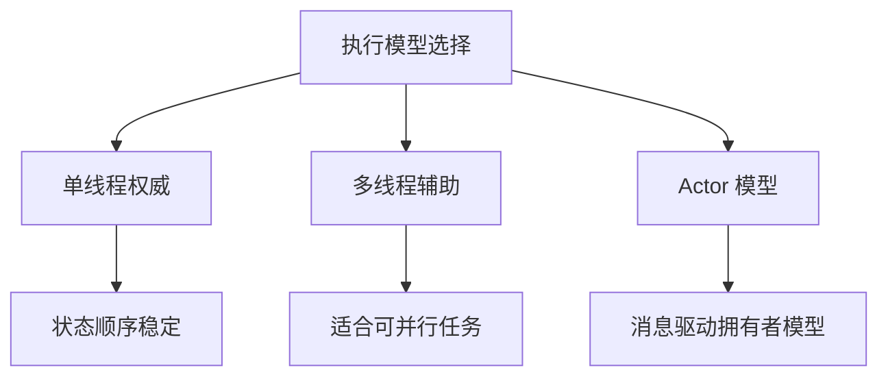
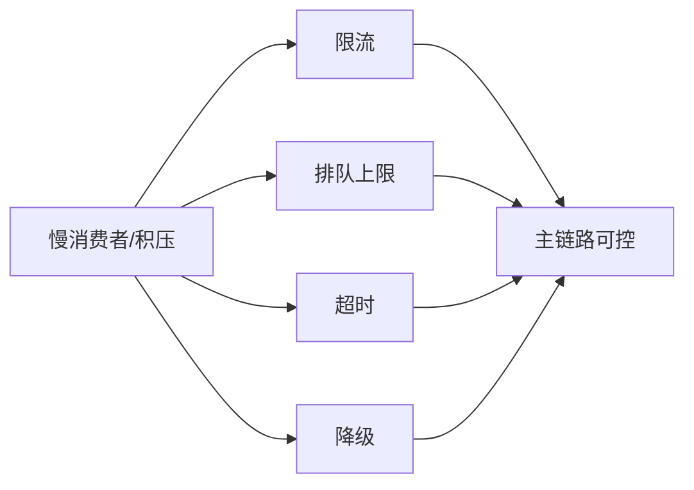

# 5. 执行模型与运行时

这一章讨论的是：在单个服务实例内部，逻辑到底怎么跑，任务怎么被调度，状态怎么被推进，系统又是如何在压力上来时保持可控。

很多人一谈并发就直接想到线程数，但对游戏服务来说，更关键的问题通常是：

- 谁拥有状态
- 谁能修改状态
- 修改发生在什么顺序里
- 慢任务会不会把主链路拖死

所以执行模型的核心不是“多线程是不是更快”，而是“状态管理是不是可控”。

边界约束：

- 这里主要处理单机或单服务实例内的执行模型
- 服务之间的拆分、协作、路由与恢复统一放到第 6 章

## 单线程、多线程与 Actor

游戏服务偏爱单线程或单权威执行，不是因为技术落后，而是因为共享状态一旦失控，排查成本会急剧上升。

### 单线程

单线程最重要的价值是：

- 状态更新顺序天然稳定
- 不容易出现锁竞争
- 逻辑可追踪性强
- 回放和复盘更容易做

对房间、战斗、局内状态这类强权威场景，单线程往往是非常高性价比的选择。

它的代价也很清楚：

- 单实例吞吐有限
- 慢任务会直接阻塞主循环
- 需要更严格地区分主链路和外围任务

### 多线程

多线程适合的不是“让所有逻辑一起跑”，而是把天然可并行的工作拆出去。

例如：

- 网络收发
- 序列化与压缩
- 资源加载
- 后台任务
- 部分独立计算

多线程真正的风险不在于线程本身，而在于状态共享边界不清楚。一旦多个线程都能碰核心状态，就很容易进入：

- 锁越来越多
- 排查越来越难
- 延迟波动越来越大

### Actor

Actor 模型的核心思想，是把状态和处理逻辑绑定到一个拥有者上，通过消息而不是共享内存协作。

这对游戏服务很有吸引力，因为它天然契合：

- 房间一个拥有者
- 场景一个拥有者
- 玩家会话一个拥有者

Actor 并不自动消灭复杂度，但它能把复杂度从“共享状态管理”转成“消息边界设计”，通常更容易控制。

## 协程、状态机与任务队列

当系统内部异步步骤变多以后，真正痛苦的不是性能，而是逻辑碎掉。

常见的问题是：

- 一个流程被拆成很多回调
- 状态跨多个异步点传递
- 超时、取消、失败路径越来越难补全

协程、状态机和任务队列，都是在解决这个问题。

### 协程

协程的价值不在于“更轻量”，而在于它能让异步流程看起来更像顺序流程，降低复杂度。

适合：

- 跨多个步骤的业务流程
- 需要等待外部结果但又不想阻塞线程
- 有明确取消、超时和恢复语义的任务

### 状态机

状态机更适合显式表达“对象当前处于什么阶段、下一步能做什么”。

例如：

- 房间从创建到开局到结算
- 订单从待支付到回调到发货
- 玩家从匹配到进入战斗到离开

状态机的价值在于减少“隐式流程”。

### 任务队列

任务队列用于把工作和执行时机解耦。它的关键不是有个队列，而是队列是否按优先级、耗时和重要性分层。

如果所有任务都塞进同一个队列，最终会出现主链路和后台任务互相拖累。

## Tick 驱动与逻辑执行

很多游戏逻辑天然适合 Tick 驱动，而不是“谁来消息就立即把所有事做完”。

Tick 驱动的价值在于：

- 更新节奏统一
- 逻辑观察点清晰
- 状态推进顺序稳定
- 预算更容易控制

但 Tick 不是万能药。真正要避免的是把所有工作都塞进每一帧：

- 可以延后处理的事情不要进主 Tick
- 可以批处理的事情不要逐帧细碎执行
- 不影响当前体验的工作不要抢主循环预算

一个成熟的运行时，通常会把工作分层：

- 主逻辑 Tick
- 网络收发
- 后台异步
- 定时任务
- 低优先级清理与统计

## 流控、背压与稳定性机制

系统真正开始出问题时，通常不是“完全崩了”，而是某些链路先慢下来，然后慢传染成系统性问题。

这时要解决的是流控和背压。

常见来源包括：

- 某玩家或某连接消费太慢
- 某房间产生事件过多
- 某下游服务响应变慢
- 队列积压持续增长

如果没有背压机制，常见结果是：

- 内存不断堆高
- 延迟不断拉长
- 最后出现级联超时

流控的重点不是“把流量挡住”，而是区分：

- 哪些请求必须保
- 哪些事件可以延后
- 哪些更新可以丢旧保新
- 哪些任务应该直接拒绝

稳定性机制通常包括：

- 限流
- 排队上限
- 超时
- 熔断
- 降级
- 慢消费者隔离

对游戏系统来说，优雅退化往往比“全都尽力处理”更重要。

## 锁竞争与性能代价

锁的问题不只是慢，而是它会让系统表现得越来越不可预测。

常见代价包括：

- 延迟抖动
- 吞吐下降
- 死锁风险
- 排查复杂度急剧增加

这也是为什么很多游戏核心逻辑会优先选择：

- 单线程权威
- Actor
- 明确消息边界

而不是一开始就把共享状态放进多线程自由访问。

真正高质量的运行时设计，不是“把所有核都榨满”，而是：

- 状态边界清楚
- 主链路预算可控
- 慢路径不会污染快路径
- 出问题时能看懂为什么慢
