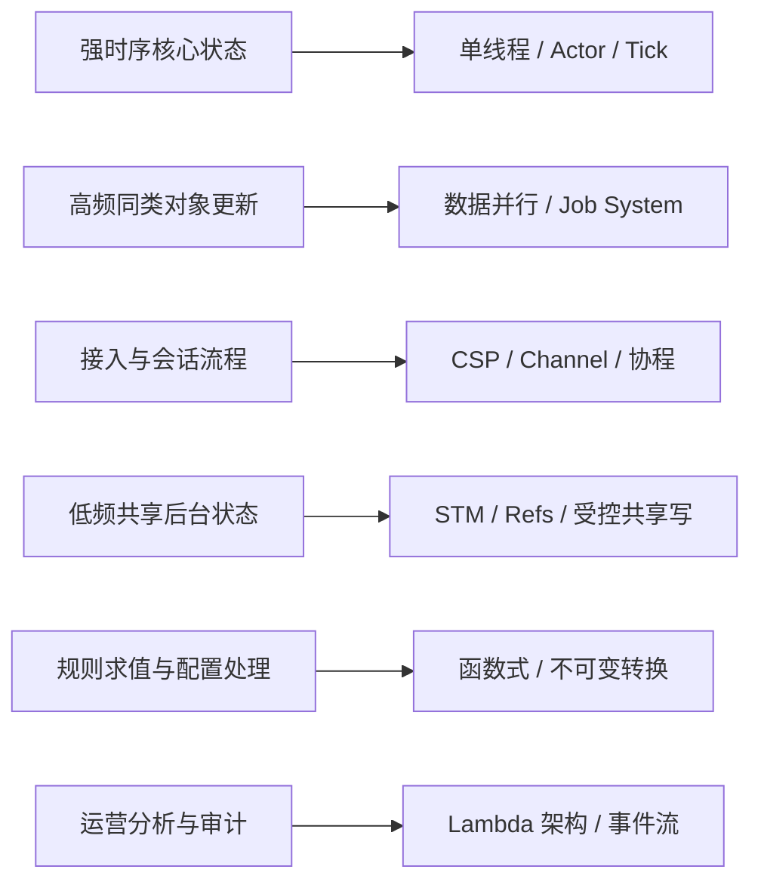

# 并发模型总览：从七周七并发到游戏运行时

如果第 5 章只讲“单线程、多线程、Actor、协程”几个词，范围其实是不完整的。因为并发问题从来不只有一种拆法，它背后至少有一整套不同立场：

- 共享内存并发
- 不可变数据与纯函数
- 把身份和状态拆开
- 用消息隔离状态
- 用 Channel 协调流程
- 用数据并行吃满批量计算
- 用批处理层和实时层分担不同延迟目标

这也是《Seven Concurrency Models in Seven Weeks》那类材料真正值钱的地方。它不是让你照着抄一套“圣经架构”，而是给你一张并发模型坐标图。  
游戏工程需要的，不是机械照搬，而是知道：`哪些模型适合做游戏主运行时，哪些只适合做局部工具，哪些更适合外围数据系统。`

## 先把七类模型摆出来

如果按那条经典并发脉络来拆，最常见的七类模型可以概括成：

1. 线程与锁
2. 函数式编程
3. 身份与状态分离，典型代表是 STM / Refs / Agents 这一类思路
4. Actor
5. CSP，也就是 Communicating Sequential Processes
6. 数据并行
7. Lambda 架构

这七类模型并不是互斥技术栈，而是七种不同的并发立场。  
它们回答的重点完全不同：

- 有的在解决共享内存怎么管
- 有的在解决状态怎样不被随手改
- 有的在解决流程如何被多个顺序单元协同
- 有的在解决大批量计算怎样并行
- 有的在解决在线与离线怎样分层

## 游戏工程为什么不能只照书抄

游戏不是纯后端业务，也不是纯科学计算，更不是纯离线数据平台。它通常要同时处理：

- 强实时链路
- 单写权威状态
- 高频对象更新
- 弱网、断线、重连
- 长线资产和外围服务

所以游戏运行时经常会长成“混合体”：

- 战斗主链路像单线程、Actor 或 Tick 驱动状态机
- 引擎热路径像数据并行和 Job System
- 会话和接入更像协程、状态机和 Channel
- BI、审计、推荐更像 Lambda 架构和事件流

也就是说，游戏项目真正做的，通常不是“选择一个模型”，而是把不同模型放到不同位置。

## 一张更有用的总览表

| 模型 | 核心思想 | 最强价值 | 主要代价 | 在游戏里更适合什么 |
| --- | --- | --- | --- | --- |
| 线程与锁 | 多线程共享内存，加锁保护 | 直接、通用、兼容遗留系统 | 争锁、抖动、时序难推理 | 工具链、后台任务、部分服务基础设施 |
| 函数式编程 | 不可变数据、纯函数、少副作用 | 易测试、易推导、利于并行 | 状态转移写法更抽象，热路径拷贝成本高 | 数值计算、规则函数、配置处理、回放推导 |
| STM / 身份与状态分离 | 状态更新通过事务和引用治理 | 降低共享写复杂度 | 热路径成本高，事务冲突难控 | 配置后台、工具系统、低频协调逻辑 |
| Actor | 状态封闭，消息驱动，单 Actor 顺序执行 | 边界清晰、单写者友好 | 热点 Actor、消息风暴、跨 Actor 一致性 | 房间、场景、玩家聚合、战斗权威 |
| CSP / Channel | 顺序进程 + Channel 协作 | 流程拆分清晰，组合性强 | Channel 设计不好会变成隐式阻塞网 | 网关、会话、流水线、内部协调链路 |
| 数据并行 | 同类数据批量并行处理 | 吃满 CPU / SIMD / Job System | 不擅长复杂共享状态工作流 | ECS、动画、寻路批处理、碰撞、渲染前处理 |
| Lambda 架构 | 实时层 + 批处理层分工 | 同时兼顾实时近似结果和离线精算 | 双写、双算、双链路治理成本高 | BI、审计、推荐、风控、画像系统 |

这张表最重要的不是记住术语，而是看清楚：  
同样叫“并发”，有的模型在治理共享状态，有的模型在治理流程，有的模型在治理批量计算，有的模型在治理数据分层。

## 线程与锁

### 它解决什么问题

线程与锁解决的是最经典的共享内存并发问题：

- 想同时利用多个 CPU 核心
- 又希望多个执行单元直接访问同一份内存状态
- 需要用互斥、读写锁、条件变量等机制控制并发访问

它的优势是直接。很多遗留系统、阻塞式库、传统服务框架天然就是这么组织的，所以它几乎总会是团队最早接触的并发模型。

### 它适合什么场景

- 任务之间相对独立，主要目标是把吞吐做上去
- 大量阻塞 I/O，需要线程把等待时间隐藏掉
- 工具链、后台任务、资源处理、日志落盘、压缩转码
- 无法改造第三方库，只能接受其线程模型

### 它的限制是什么

- 共享状态一多，锁竞争、尾延迟、抖动会迅速放大
- 时序可推理性差，线上偶发 Bug 很难复现
- 容易出现死锁、活锁、优先级反转
- 热点对象会把理论并行变成现实串行

线程与锁最典型的失败模式，是前期觉得“很灵活”，后期却发现所有热路径都在争同几把锁。

### 在游戏里怎么落

它更适合：

- 引擎外围工具
- 日志、存储、打点、压缩、导表
- 异步 I/O、线程池任务
- 和主状态弱耦合的后台计算

它不适合直接承接：

- 战斗主循环
- 房间权威状态
- 强顺序、强回放诉求的核心链路

所以在线游戏里，线程与锁通常是“外围通用并发手段”，不是“主运行时的第一选择”。

## 函数式编程

### 它解决什么问题

函数式思路真正解决的，不是“代码更优雅”，而是：

- 怎样减少副作用
- 怎样让状态转换只依赖输入
- 怎样让逻辑更容易测试、重算、回放和并行化

它把重点从“谁在什么时候修改共享状态”转向“输入经过什么纯转换得到输出”。

### 它适合什么场景

- 数值计算
- 规则求值
- Buff / 技能效果求值
- 配置转换与校验
- 回放重算
- 状态 Diff、派生结果计算

凡是“给定输入，希望得到稳定输出”的地方，它都很有价值。

### 它的限制是什么

- 不直接解决复杂对象生命周期和外部副作用治理
- 纯不可变数据在热路径上可能带来额外分配与拷贝成本
- 团队如果没有这套思维训练，容易写成半函数式半命令式的折中怪物
- 它不是天然的主循环框架，不能替代完整运行时组织

### 在游戏里怎么落

它最适合做局部层：

- 技能公式层
- 战斗效果求值层
- 数据校验和导表层
- 回放验证层

它不适合被神化成“整站必须纯函数”。  
更现实的做法通常是：把`规则求值层`尽量函数化，而把状态推进、网络 I/O、持久化这些部分留给其他运行时模型。

## 身份与状态分离 / STM

### 它解决什么问题

这类模型最想解决的是：  
`共享状态明明存在，但能不能不要让大家直接拿着它乱改。`

STM、Refs、Agents 这类思路会强调：

- 身份和当前状态不是一回事
- 更新应该通过受控引用或事务提交
- 多次修改应被放进更明确的协调机制里

它的价值在于提醒你，真正危险的不是“线程多”，而是“写状态没有边界”。

### 它适合什么场景

- 编辑器和工具后台
- 低频共享状态协调
- 需要事务式视图的一些管理逻辑
- 配置协作、审核流、后台管理系统

### 它的限制是什么

- 冲突重试在高争用热路径上成本很高
- 事务边界很难和实时逻辑时间模型完全对齐
- 不适合大量高频小更新
- 很难直接承接战斗、房间推进这类强顺序单写问题

### 在游戏里怎么落

这类模型更适合作为“理解状态治理”的思想资源，而不是主运行时的默认答案。  
在游戏里，它更适合：

- 工具系统
- 后台协作
- 低频共享配置状态

而不适合：

- 高频战斗热路径
- Tick 主循环
- 高争用实体状态更新

## Actor

### 它解决什么问题

Actor 解决的是：  
`能不能把并发问题从“大家一起改同一份状态”，改写成“每份状态归一个拥有者，别人只能发消息”。`

它的核心收益是：

- 状态边界清楚
- 单 Actor 内更容易保持顺序
- 并发冲突从共享写转成消息协作

### 它适合什么场景

- 有天然分区键或天然状态拥有者
- 房间、场景、玩家聚合、撮合桶
- 顺序状态机实例
- 需要故障隔离和单写者模型的地方

### 它的限制是什么

- 热点 Actor 会成为瓶颈
- 跨 Actor 协作会快速变复杂
- 消息风暴和邮箱积压必须被观测
- 不能天然解决跨 Actor 一致性

Actor 最大的误区，是把“局部顺序执行”误听成“全局一致性自动出现”。

### 在游戏里怎么落

它非常适合：

- 房间权威逻辑
- 场景或分区状态
- 玩家实体聚合
- 战斗状态机

它不太适合：

- 强耦合跨 Actor 的大事务流程
- 到处等待慢外部依赖的通用业务中台

在游戏服务端里，Actor 往往是最接近“主运行时核心形状”的模型之一。

## CSP / Channel

### 它解决什么问题

CSP 解决的是：  
`怎样让多个顺序执行单元通过明确通道协作，而不是靠共享内存纠缠在一起。`

它强调：

- 进程本身仍然顺序执行
- 协作靠 Channel
- 同步点和数据流是显式的

### 它适合什么场景

- 接入层流水线
- 会话流程
- 连接管理
- 内部协调链路
- 专用 Channel Runtime

凡是“一个复杂流程可以拆成多个阶段，每个阶段都有明确输入输出”的地方，它都很适合。

### 它的限制是什么

- Channel 设计不好会形成隐式阻塞网
- 如果作用域不清，容易把流程拆得过碎
- 不天然适合承接膨胀的大共享世界状态
- 调试时需要同时看多个通道的流动关系

### 在游戏里怎么落

它更适合：

- 网关接入
- 会话编排
- 管线式消息处理
- Actor / Runtime 内部专用通道

它不太适合直接承担：

- 长期膨胀的大世界状态所有权模型

所以 CSP 在游戏里通常是“流程与通道模型”，不是“世界状态主模型”。

## 数据并行

### 它解决什么问题

数据并行解决的是：  
`当大量对象都要做同一类计算时，怎样把 CPU / SIMD / Job System 吃满。`

它面对的是批量同构问题，而不是复杂共享状态问题。

### 它适合什么场景

- ECS
- 动画更新
- 碰撞广相检测
- 批量寻路
- 粒子和特效前处理
- 批量 AI 感知
- 客户端或引擎的热路径计算

### 它的限制是什么

- 不擅长复杂业务工作流
- 不擅长强依赖顺序的状态机
- 不擅长大量分支和跨对象事务
- 如果数据布局做不好，也吃不到真正的性能红利

### 在游戏里怎么落

这是客户端、引擎和高频服务计算里最容易拿到真收益的一类模型。  
它非常适合：

- 热路径对象更新
- ECS / Job System
- 大量同类对象的批处理

但它不能替代：

- 房间运行时
- 战斗状态裁决
- 长业务流程编排

所以数据并行最值钱的地方，是“把大量同类工作吃掉”，不是“替代所有运行时”。

## Lambda 架构

### 它解决什么问题

Lambda 架构解决的是：  
`实时层要快，批处理层要准，这两个目标能不能分开承接。`

它把系统分成：

- 实时层，快速给近似结果
- 批处理层，稍后给完整结果
- 服务层，把两边结果组合起来

### 它适合什么场景

- BI
- 审计
- 推荐
- 风控
- 用户画像
- 实时运营看板
- 行为分析

### 它的限制是什么

- 双链路、双算子、双存储治理成本很高
- 实时和离线结果对齐本身就是问题
- 业务语义如果不清楚，会出现两套口径互相打架
- 它对实时战斗主链路几乎没有直接帮助

### 在游戏里怎么落

它更像“平台侧并发与数据架构”，适合：

- 数据分析
- 审计回算
- 运营决策支撑

它不适合反向侵入：

- 房间战斗推进
- 实时裁决
- 权威状态主循环

所以 Lambda 架构在游戏里很重要，但重要的位置不在玩法内核，而在平台侧和数据侧。

## 游戏工程真正常见的“第八种答案”：单写者 + Tick + 任务系统

这也是为什么如果只照搬七种模型，仍然不够覆盖游戏。  
游戏里还有一个非常核心的组合式答案：

- 单写者
- Tick / Frame / Epoch 驱动
- 局部 Actor 或房间线程
- 外围任务系统
- 热路径数据并行

它不是某一本书里的单独术语，但几乎所有成熟游戏项目都会以某种形式长成这个样子。  
后面本章几篇，就是在把这个“游戏特化组合”拆开：

- [单线程、多线程与 Actor](./01.md)
- [协程、状态机与任务队列](./02.md)
- [Tick 驱动与逻辑执行](./03.md)
- [流控、背压与稳定性机制](./04.md)
- [锁竞争与性能代价](./05.md)
- [Epoch-driven Actor / Channel Runtime](./06.md)

## 一张更贴近游戏工程的落位图

这张图最想说明的是：  
没有哪个模型能统治全局，关键是把它放在对的位置。

## 该怎样把这些模型映射到游戏项目

一个更实用的判断方式，不是问“我们信仰哪种模型”，而是问下面四个问题：

1. 这块状态是否必须单写、顺序推进？
2. 这块工作是否可以批量、同构、数据并行？
3. 这条链路更像流程编排，还是状态推进？
4. 这块系统是实时玩法核心，还是外围平台能力？

如果答案分别不同，模型就不该一样。

## 更接近最佳实践的结论

第 5 章应该先给读者一张并发模型地图，再进入游戏化细节。  
比较接近现实工程的结论通常是：

- 主运行时优先考虑单写者、Actor、Tick 驱动和局部 Channel
- 热路径性能优先考虑数据并行和 Job System
- 异步流程优先考虑协程、状态机和任务队列
- 平台侧分析和审计优先考虑事件流与 Lambda 式分层
- 函数式与 STM 更适合作为局部设计方法，而不是整站教条

真正成熟的团队，不会争论“哪种并发模型最先进”，而是会知道：  
`不同模型分别该承接哪类问题。`

## 常见误区

最常见的误区，是把某一种并发模型当成全站银弹。第二类误区，是只讨论线程数，不讨论状态所有权和时间语义。第三类误区，是把数据并行、Actor、协程、事件流这些完全不同层次的东西混成一个“异步化”大词。第四类误区，是把平台数据系统的 Lambda 思路拿去指导实时战斗内核，或者反过来拿战斗 Tick 思路去套 BI 平台。
