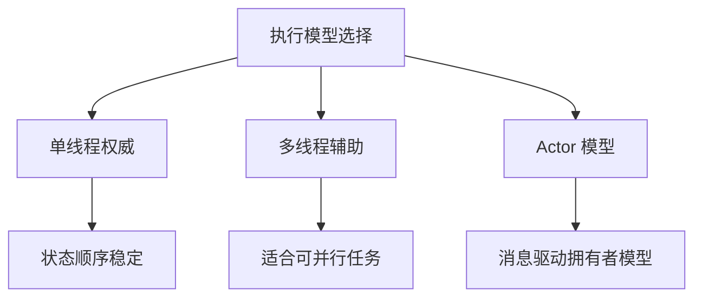

# 单线程、多线程与 Actor

游戏服务偏爱单线程或单权威执行，不是因为技术落后，而是因为共享状态一旦失控，排查成本会急剧上升。

真正难的从来不是“跑起来”，而是“出了问题能不能解释”。执行模型的价值，首先体现在可解释性，然后才是吞吐。

### 单线程

单线程最重要的价值是：

- 状态更新顺序天然稳定
- 不容易出现锁竞争
- 逻辑可追踪性强
- 回放和复盘更容易做

对房间、战斗、局内状态这类强权威场景，单线程往往是非常高性价比的选择。

它的代价也很清楚：

- 单实例吞吐有限
- 慢任务会直接阻塞主循环
- 需要更严格地区分主链路和外围任务

单线程的高性价比建立在一个前提上：你愿意主动约束逻辑，不把慢 I/O、重计算、序列化、日志风暴和外部调用塞进主链路。

### 多线程

多线程适合的不是“让所有逻辑一起跑”，而是把天然可并行的工作拆出去。

例如：

- 网络收发
- 序列化与压缩
- 资源加载
- 后台任务
- 部分独立计算

多线程真正的风险不在于线程本身，而在于状态共享边界不清楚。一旦多个线程都能碰核心状态，就很容易进入：

- 锁越来越多
- 排查越来越难
- 延迟波动越来越大

多线程本身不是错，错的是没有边界地共享状态。

### Actor

Actor 模型的核心思想，是把状态和处理逻辑绑定到一个拥有者上，通过消息而不是共享内存协作。

这对游戏服务很有吸引力，因为它天然契合：

- 房间一个拥有者
- 场景一个拥有者
- 玩家会话一个拥有者

Actor 并不自动消灭复杂度，但它能把复杂度从“共享状态管理”转成“消息边界设计”，通常更容易控制。

## 应该怎样做选择

一个更实用的原则是：

- 核心共享状态优先单权威
- 纯并行任务优先拆到辅助线程或后台执行器
- 跨拥有者协作优先走消息，不优先走共享内存

这样做通常比“默认多线程化一切”更稳定。
