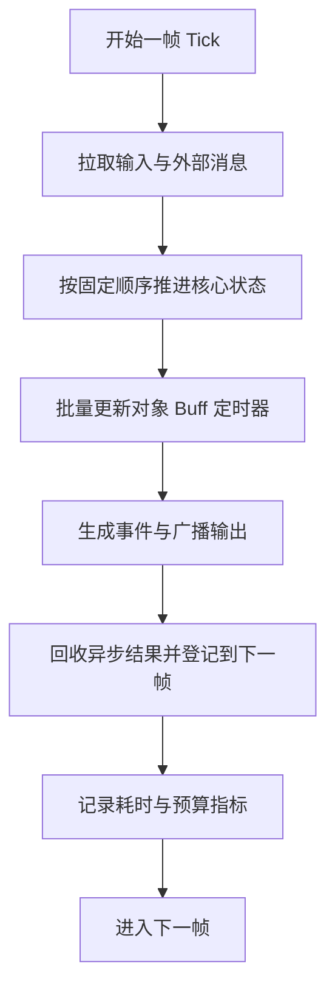

# Tick 驱动与逻辑执行

Tick 驱动与逻辑执行，讨论的不是“每秒跑多少次”这么简单，而是运行时如何围绕逻辑时间组织工作。只要你的系统里存在：

- 房间战斗
- Buff 和技能时序
- 帧同步或状态同步
- 周期任务和对象更新

Tick 就不再是一个定时器，而会成为主循环、调度单位、性能预算和恢复语义的共同底座。

## 为什么 Tick 是运行时问题，而不只是同步问题

第 4 章已经从战斗和同步角度讲过 Tick，这里要补的是运行时视角。  
从运行时角度看，Tick 决定的是：

- 一轮逻辑执行包含哪些步骤
- 哪些任务在本帧做，哪些延到下一帧
- 一帧超预算时如何追帧、跳帧或降级
- 哪些模块共享同一时间基准

所以 Tick 驱动不是网络特性，而是整个逻辑执行模型的一部分。

## Tick 循环真正包含什么

一个完整的逻辑 Tick，通常不只是“更新对象列表”，还可能包括：

1. 收集并整理输入
2. 消费跨线程或跨服务投递的消息
3. 推进核心状态机
4. 更新对象、Buff、投射物和定时器
5. 生成战斗事件或广播事件
6. 处理本帧的持久化或异步投递结果
7. 统计耗时、记录指标并准备下一帧

如果这些步骤的顺序没有被明确写下来，系统看似有 Tick，实际上只是多个模块各自“差不多每帧更新一下”。

## Tick 驱动的最大价值：把顺序说清楚

对很多游戏逻辑来说，顺序比并行更重要。Tick 的最大收益通常是：

- 执行顺序稳定
- 时间基准统一
- 事件产生点清晰
- 回放和重演更容易
- 问题定位可以落到具体帧

也正因为如此，很多核心运行时即使有多线程，也仍然会让关键逻辑围绕单一 Tick 主循环推进。

## Tick 驱动最怕什么

最常见的运行时问题通常包括：

- 单帧工作量不可控，突然超预算
- 某些异步结果随时插入，破坏执行顺序
- 不同模块各自维护自己的时钟
- 外围任务和核心逻辑争用同一帧预算

这些问题一旦出现，表现往往不是立即崩，而是：

- 时序越来越难解释
- 高峰期帧耗时抖动
- 追帧和补帧成本上升
- 回放和线上行为越来越不一致

## Tick 与任务调度应该怎样配合

Tick 驱动不意味着所有工作都必须在主循环里做完。更合理的做法通常是：

- 核心状态推进和顺序敏感逻辑放在 Tick 主链上
- 可异步的重任务外包到线程池或任务系统
- 异步结果以明确边界回到下一帧消费

关键点在于：  
`异步工作可以并行，最终写回和状态生效仍应被 Tick 序组织起来。`

这样既能利用并行能力，又不把主逻辑时序打碎。

## 帧预算和节流不能事后补

Tick 驱动系统非常需要预算思维。常见需要被预算化的包括：

- 单帧最多处理多少对象
- 单帧最多消费多少外部消息
- 单帧最多执行多少补帧
- 异步结果回收是否有上限

如果这些预算不存在，系统平时也许看不出问题，一到高峰就会出现“某几帧特别慢，然后整条链路开始雪崩”的情况。

## Tick 驱动和批处理天然相配

很多高性能运行时喜欢把 Tick 和批处理放在一起，是有原因的。因为一旦逻辑围绕固定周期推进，你就更容易：

- 批量处理同类对象
- 批量应用状态变化
- 批量输出事件
- 批量写统计和日志

这也是为什么 Tick 驱动经常和 ECS、批处理 AI、批量碰撞和事件聚合一起出现。它们都在利用“同一时间片里做同类事”的工程优势。

## 什么时候不应该强行 Tick 化

不是所有逻辑都值得放进 Tick 主循环。比如：

- 大文件下载
- 慢查询
- 外围通知
- 延迟容忍较高的后台统计

把这些东西强行塞进 Tick 主链，通常只会污染预算和时序。更稳妥的做法是让它们异步存在，但在进入核心状态时再回到 Tick 边界。

## 一个更贴近实践的主循环模型

这条链路的重点不是形式，而是把“什么时候做什么”固定下来。

## 更接近最佳实践的结论

比较稳妥的 Tick 驱动执行模型通常会：

- 用统一逻辑时间组织核心状态推进
- 明确主循环步骤和执行顺序
- 把异步结果收束到帧边界消费
- 给每一帧设置明确预算
- 用批处理和分层调度提升吞吐

Tick 真正值钱的地方，不是“整齐”，而是它让运行时变得可推理、可回放、可治理。

## 常见误区

最常见的错误，是以为有一个定时器就算 Tick 驱动，实际上模块各自维护时钟、各自决定执行顺序。另一类错误，是把所有任务都塞进主循环，导致帧预算被外围工作污染。第三类错误，是异步结果随时写回核心状态，不经过帧边界，最后把时序可推理性彻底破坏。
