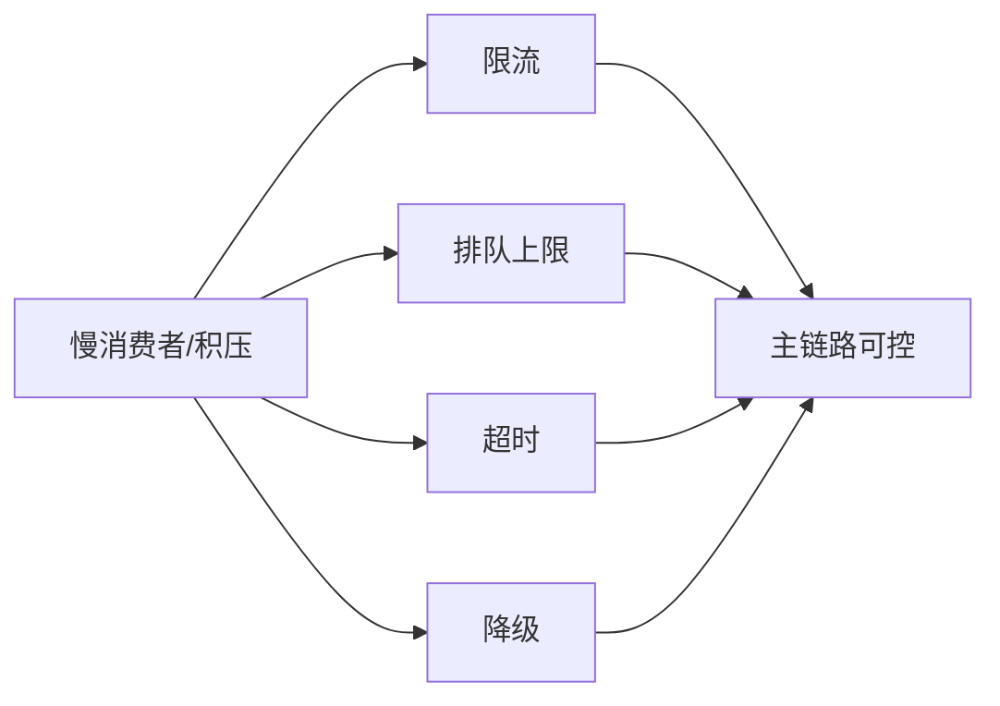

# 流控、背压与稳定性机制

系统真正开始出问题时，通常不是“完全崩了”，而是某些链路先慢下来，然后慢传染成系统性问题。

这时要解决的是流控和背压。

常见来源包括：

- 某玩家或某连接消费太慢
- 某房间产生事件过多
- 某下游服务响应变慢
- 队列积压持续增长

背压机制的价值，是让系统在压力异常时还能保持边界，而不是无限吞进去再一起爆。

如果没有背压机制，常见结果是：

- 内存不断堆高
- 延迟不断拉长
- 最后出现级联超时

流控的重点不是“把流量挡住”，而是区分：

- 哪些请求必须保
- 哪些事件可以延后
- 哪些更新可以丢旧保新
- 哪些任务应该直接拒绝

稳定性机制通常包括：

- 限流
- 排队上限
- 超时
- 熔断
- 降级
- 慢消费者隔离

对游戏系统来说，优雅退化往往比“全都尽力处理”更重要。
