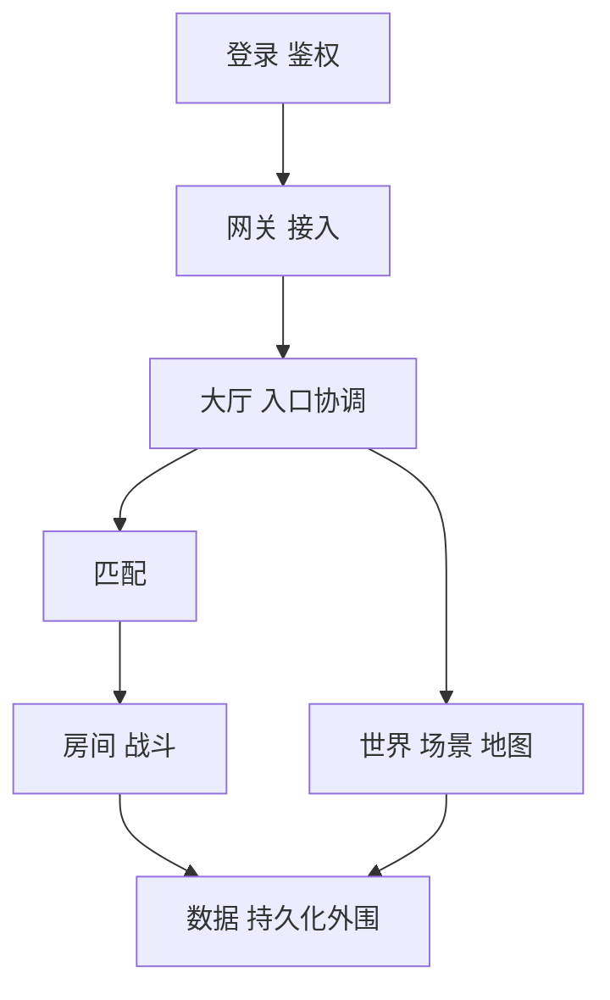
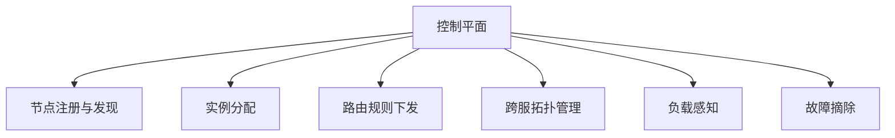

# 6. 服务拆分、分布式与控制平面

这一章讨论的是：当游戏不再是单进程逻辑时，服务应该如何分层、如何协作、如何被调度和治理。

边界约束：

- 这里主要讨论服务角色、分布式协作、路由、恢复和跨服组织
- 具体业务系统统一放到第 13 章
- 服务内部 / 服务间通信模式统一放到第 7 章

服务拆分不是为了“看起来先进”，而是为了把不同生命周期、不同负载形态、不同权威边界的能力分开管理。

## 服务拆分方法论

是否拆服务，首先取决于问题边界是否已经清楚。

比较稳的拆分依据通常有三类：

### 生命周期不同

例如登录连接、房间对局、世界在线状态、运营后台任务，它们的生命周期和伸缩方式明显不同，适合分开。

### 负载形态不同

例如接入层更偏连接管理，战斗服更偏短时高峰逻辑执行，BI 链路更偏吞吐与异步处理。这些能力混在一起，往往会互相污染。

### 权威边界不同

例如房间内状态天然适合由单实例权威维护；账号资产、支付订单和角色持久化则通常需要另外的权威服务。

反过来说，如果模块只是代码结构不同，但生命周期、负载和权威边界并没有分开，那就未必值得先拆成服务。

## 核心服务角色

游戏后端中常见的核心角色大致如下。

### 登录 / 鉴权

负责用户身份建立、令牌校验、账号层安全和初始入口治理。

### 网关 / 接入

负责连接、会话、心跳、基础限流、协议收发和把玩家路由到正确的后端逻辑节点。

### 大厅 / 入口协调

负责角色选择、局外状态汇总、功能入口组织和进入具体玩法前的协调。

### 匹配

负责玩家分桶、排队、规则匹配和把结果投递到房间或战斗实例。

### 房间 / 战斗

负责局内权威逻辑，是很多游戏里最核心的实时执行单元。

### 世界 / 场景 / 地图

负责长期在线状态、场景内玩家组织和世界分片。

### 数据 / 持久化外围

负责角色数据、资产数据、日志数据或其他长期状态的管理与对接。

这些角色不是所有项目都要齐全，但理解它们的职责差异，能帮助判断哪些能力必须分开。

## 协调层、跨服与控制平面

当系统规模扩大后，仅有“业务服”已经不够，需要出现更高层的协调能力。

控制平面不是具体玩法逻辑，而是负责系统如何组织和治理。

常见职责包括：

- 节点注册与发现
- 实例分配
- 路由规则下发
- 跨服拓扑管理
- 负载感知
- 故障摘除

跨服系统通常也是在这个层面长出来的。因为一旦玩家关系、排行榜、赛季活动、公会战或世界活动跨越单区单服，系统就需要一个统一协调者。

这里的关键不是“多一个中心服务”，而是明确：

- 什么信息由控制平面维护
- 什么状态仍归业务节点权威维护
- 节点失效后如何恢复

如果控制平面过度侵入业务，会演变成所有逻辑都依赖一个大中台；如果控制平面太弱，跨服和运维治理又会变成手工事故现场。

## 服务发现、路由与协作

一旦服务变多，路由就不再是一个简单的网络寻址问题，而是业务寻址问题。

需要回答的问题包括：

1. 玩家当前应该落在哪个节点
2. 某个房间或场景归谁权威维护
3. 状态迁移时路由如何切换
4. 节点下线时玩家如何转移

在游戏系统里，路由通常至少有三层：

- 基础网络地址
- 服务实例地址
- 业务对象归属

例如“某个角色在某个地图分片的哪个实例上”就不是单纯的服务发现能解决的，而需要业务路由表或目录服务。

协作方式上，也要尽量区分：

- 主链路同步协作
- 异步事件协作
- 后台任务协作

把这些链路一股脑混在一起，系统会非常难诊断。

## 一致性、恢复与重连

服务拆分之后，系统不会自动变得可靠，反而会立刻面对恢复问题。

常见场景包括：

- 网关与逻辑服连接断开
- 房间服或战斗服实例异常退出
- 玩家短时掉线后想回到原状态
- 节点扩缩容导致对象迁移

这时必须明确几个问题。

### 谁是权威状态的拥有者

只要权威边界不清楚，恢复时就一定会出现互相覆盖、状态回滚或重复结算。

### 恢复依赖哪些快照或日志

没有最低限度的快照、事件或检查点机制，恢复就只能靠猜。

### 重连是恢复会话，还是重新进入

这两个语义完全不同。前者要重建上下文，后者则更像一次新的进入流程。

### 补偿边界在哪里

不是所有失败都值得自动补偿。要区分：

- 可自动重试的问题
- 可恢复但需要校验的问题
- 只能人工介入的问题

真正成熟的服务架构，不是从不失败，而是失败后知道该怎么收敛。
