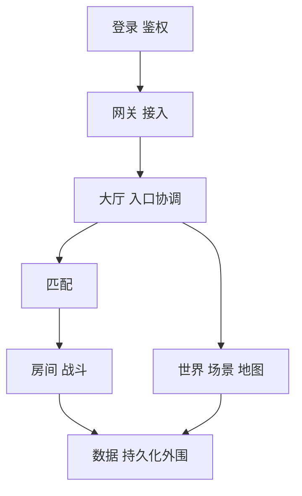

# 核心服务角色

游戏后端中常见的核心角色大致如下。

这些角色不是固定模板，而是一组常见责任中心。理解它们的价值，不是为了把图照抄出来，而是帮助你识别：哪些职责应该分开，哪些可以先放一起。

### 登录 / 鉴权

负责用户身份建立、令牌校验、账号层安全和初始入口治理。

### 网关 / 接入

负责连接、会话、心跳、基础限流、协议收发和把玩家路由到正确的后端逻辑节点。

### 大厅 / 入口协调

负责角色选择、局外状态汇总、功能入口组织和进入具体玩法前的协调。

### 匹配

负责玩家分桶、排队、规则匹配和把结果投递到房间或战斗实例。

### 房间 / 战斗

负责局内权威逻辑，是很多游戏里最核心的实时执行单元。

### 世界 / 场景 / 地图

负责长期在线状态、场景内玩家组织和世界分片。

### 数据 / 持久化外围

负责角色数据、资产数据、日志数据或其他长期状态的管理与对接。

这些角色不是所有项目都要齐全，但理解它们的职责差异，能帮助判断哪些能力必须分开。
