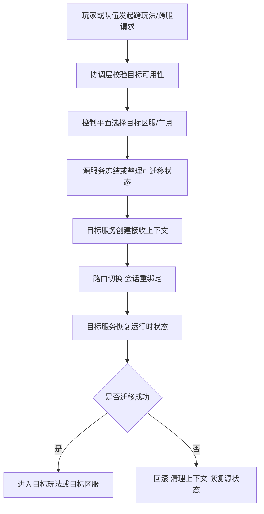

# 协调层、跨服与控制平面

很多项目一开始只有数据平面，没有控制平面。也就是说，业务节点能处理玩家请求、能推进房间和场景状态，但系统并没有一个正式层来回答这些更高一层的问题：

- 玩家该被分配到哪个节点
- 某个房间该创建在哪
- 场景热点爆了该怎么迁
- 某次跨服活动如何路由和编排
- 节点异常后谁来切流和恢复

当项目规模还小时，这些问题常常靠手工配置、业务代码里的分支逻辑或隐式约定勉强撑住；一旦进入多玩法、多区服、动态扩缩容和长期运营阶段，协调层与控制平面就会从“以后再说”变成主系统。

## 先区分数据平面和控制平面

这是理解这一章最关键的第一步。

### 数据平面

负责处理真实业务流量和状态推进，例如：

- 房间服推进一局战斗
- 场景服维护地图状态
- 活动服处理活动进度
- 支付服处理订单流转

### 控制平面

负责组织、配置、调度和治理这些数据平面节点，例如：

- 注册和发现哪些节点可用
- 把新房间分配到哪台机器
- 某个热点场景该如何扩容
- 节点故障后如何迁移或切流
- 某个区服是否允许进入维护态

一个非常常见的错误，就是只做数据平面，不做控制平面，结果所有调度和治理逻辑都散落在业务服务里。

## 协调层为什么会自然长出来

只要系统开始有下面这些现实，协调层几乎一定会出现：

- 玩家需要在多个玩法、多个节点之间切换
- 匹配成功后要把玩家分配到某个房间节点
- 世界或场景节点会动态变化
- 跨服活动要临时组织一套新拓扑
- 节点要做扩容、缩容、迁移和摘除

这些动作都不是某个单一业务服务该独自负责的，因为它们跨越了多个服务和多个节点。

## 跨服为什么不是“把区服连起来”这么简单

跨服最容易被低估。很多团队一开始理解成：

- 本服玩家去别的服打一局
- 打完再回来

但真正工程化以后，问题远比这复杂：

- 身份和会话怎么迁移
- 哪些状态跟着人走，哪些留在原服
- 跨服期间资产变更如何确认
- 失败中断后如何回退
- 活动结束后如何清算和归档

也就是说，跨服不是简单远程调用，而是一条带有状态迁移、会话重绑定和恢复语义的复杂链路。

## 控制平面通常承担哪些职责

成熟项目里的控制平面不一定是一个单独进程，但通常会承担下面几类能力：

- 服务注册与健康检查
- 节点分组与容量视图
- 房间、场景、玩法实例分配
- 区服状态管理，例如开启、维护、只读、下线
- 迁移、切流、扩缩容编排
- 全局配置下发和版本门禁

这类能力看似不产生业务价值，实际上决定了系统能不能稳定运营。

## 一个更贴近实际的跨服/协调链路

这条链路想说明的核心是：  
跨服和迁移真正难的，不是通信，而是控制权、状态和恢复语义。

## 为什么没有控制平面会越来越痛

没有控制平面时，常见后果通常包括：

- 房间分配策略写死在匹配服务里
- 场景迁移策略写死在场景服里
- 扩容靠人工改配置
- 节点摘除靠临时脚本和人工广播
- 玩家重连时找不到正确节点

系统前期也许还能运转，但后期一到热点活动、跨服玩法、故障切流和运维治理阶段，代价会急剧上升。

## 协调层最容易做坏的地方

### 把协调逻辑散落在每个业务服务里

这样做的短期好处是快，长期后果是任何调度策略调整都要改一堆服务，而且系统全局根本没有统一视图。

### 只有静态配置，没有实时状态

如果控制平面只知道“理论上有哪些节点”，不知道当前节点实际负载、健康和容量，就很难做正确调度。

### 只有分配，没有回滚和恢复

很多团队能做“把玩家发过去”，但做不好“发过去失败怎么办”。没有回滚与恢复语义，跨服和迁移迟早出事故。

## 什么时候这个问题会从架构讨论变成日常现实

当项目进入下面这些阶段时，协调层和控制平面通常不再是可选项：

- 多区服并行运营
- 多玩法节点独立部署
- 大型活动需要动态调度
- 热点房间或热点场景需要弹性扩缩容
- 运维需要明确摘流、迁移和维护态控制

这时，继续把调度逻辑埋在业务代码里，长期成本会非常高。

## 更接近最佳实践的结论

比较稳妥的做法通常是：

- 让数据平面只关心自己的状态推进和局部职责
- 把服务注册、分配、路由、迁移、扩缩容这些能力逐步收拢到协调层和控制平面
- 让跨服和迁移成为正式语义，而不是临时远程调用
- 在调度能力里内置失败回滚和恢复路径

控制平面的存在意义，不是让系统显得高级，而是让系统在规模和运营压力上来以后还能被指挥。

## 常见误区

最常见的错误，是只有数据平面，没有真正的控制平面。另一类错误，是把跨服理解成简单 RPC，不去处理状态迁移、会话切换和失败回滚。第三类错误，是把协调逻辑散落在各业务服务里，最后全局没有统一调度视图，也没有稳定运维入口。
