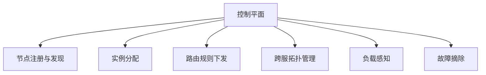

# 协调层、跨服与控制平面

当系统规模扩大后，仅有“业务服”已经不够，需要出现更高层的协调能力。

控制平面不是具体玩法逻辑，而是负责系统如何组织和治理。

常见职责包括：

- 节点注册与发现
- 实例分配
- 路由规则下发
- 跨服拓扑管理
- 负载感知
- 故障摘除

控制平面的关键价值，不是“有个中心”，而是把原本散落在人工脚本、临时配置、口头约定里的治理逻辑收拢到可观测、可审计、可自动化的一层。

跨服系统通常也是在这个层面长出来的。因为一旦玩家关系、排行榜、赛季活动、公会战或世界活动跨越单区单服，系统就需要一个统一协调者。

这里的关键不是“多一个中心服务”，而是明确：

- 什么信息由控制平面维护
- 什么状态仍归业务节点权威维护
- 节点失效后如何恢复

如果控制平面过度侵入业务，会演变成所有逻辑都依赖一个大中台；如果控制平面太弱，跨服和运维治理又会变成手工事故现场。
