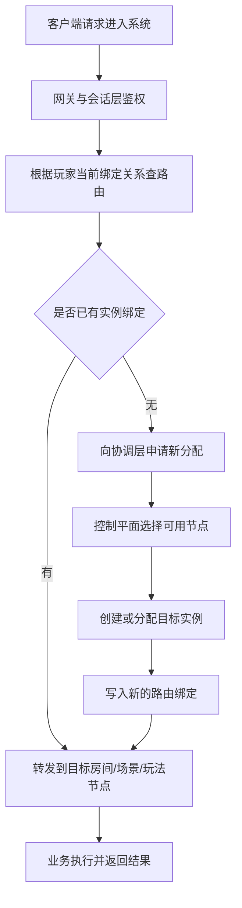

# 服务发现、路由与协作

服务一旦拆开，系统立刻要回答一个非常具体的问题：`这次请求到底该去哪里。`  
玩家登录后该落到哪个网关，会话该绑定到哪个节点，匹配完成后该进哪个房间服，重连时又该回哪个实例，服务之间相互调用时又该怎么找到正确目标。  
这些问题共同组成了“服务发现、路由与协作”。

很多项目前期会靠静态配置、进程内路由表或者简单哈希撑住；当节点数量、玩法数量和运维动作上来以后，这一层会迅速变成系统主问题。

## 服务发现到底在发现什么

“服务发现”不只是发现 IP 和端口。更贴近游戏工程的视角通常包括：

- 哪些节点当前可用
- 每个节点承载什么角色
- 某类玩法实例可以被分配到哪些节点
- 节点当前健康与容量如何
- 某个玩家当前绑定在哪个实例或场景

如果系统只发现“地址”，却不知道“职责、状态和容量”，路由决策很快就会变得粗糙而脆弱。

## 路由为什么在游戏里更复杂

普通业务系统里，请求很多时候可以直接打到统一入口，再由服务网格或负载均衡分发。游戏项目里，路由往往带有会话性和状态性：

- 同一玩家重连后要回原来的房间或场景
- 同一房间的多个玩家必须路由到同一实例
- 某次跨服活动要进入特定玩法集群
- 某个副本可能要求队伍整体落在同一节点

这意味着，游戏路由不是简单随机分流，而是强依赖会话和状态归属。

## 常见的几类路由

### 入口路由

负责把玩家从网关、登录入口导向正确业务域，例如区服、大区、平台分组、版本环境。

### 会话路由

负责维护玩家当前绑定在哪个房间、场景、玩法节点。重连、切线、迁移时都要依赖它。

### 服务间路由

负责服务调用目标选择，例如某活动请求该打到哪个活动实例、某房间该通知哪个结算节点。

### 迁移路由

负责在跨场景、跨玩法、跨服时变更绑定关系，并确保新旧绑定切换有序。

把这些路由混成一个“统一路由层”通常会很乱。更稳妥的方式是明确不同路由的触发条件和状态来源。

## 服务发现和路由最怕什么

最常见的事故通常不是“完全找不到服务”，而是：

- 找到了不该去的服务
- 路由信息是旧的
- 玩家绑定关系被更新了一半
- 服务发现层认为节点可用，实际已不可接单
- 重连时路由回旧节点，但旧节点已经迁走实例

所以发现和路由真正要解决的不是“能连上”，而是“能到正确且当前有效的目标”。

## 协作为什么比调用更重要

“服务协作”这个词经常被说空。更实际一点，它通常意味着：

- 多个服务需要围绕同一条业务链路达成职责分工
- 上游服务知道什么时候该同步等结果，什么时候该异步放手
- 下游服务知道失败该如何返回、重试或补偿

也就是说，协作的核心不是“能不能互调接口”，而是“多服务共同完成一件事时，边界是否清楚、失败语义是否清楚”。

## 一个更贴近真实工程的请求流

这条链路的关键是：路由决策和实例分配不应由每个业务节点各自临时决定，而应当有统一语义和统一绑定来源。

## 服务发现的实现手段不是重点，治理才是重点

无论你使用注册中心、自定义路由表、服务网格或其他方式，真正决定系统质量的通常不是中间件名字，而是：

- 节点状态多久刷新一次
- 健康检查是否可信
- 路由变更是否原子
- 节点摘流是否有明确流程
- 玩家绑定信息是否有单一真相源

没有这些治理规则，再成熟的服务发现组件也会被用坏。

## 重连和迁移会直接验证路由体系

路由体系最诚实的验收标准不是正常流量，而是：

- 玩家断线重连
- 节点故障切换
- 房间迁移
- 场景迁移
- 区服维护和摘流

只要这些场景经常出问题，说明路由和发现体系没有真正建立起来。

## 更接近最佳实践的结论

比较稳妥的做法通常是：

- 用统一来源维护玩家绑定和实例绑定关系
- 让服务发现不仅知道地址，还知道角色、健康和容量
- 把入口路由、会话路由和迁移路由区分开
- 把失败和重试语义写进协作契约，而不是靠调用方自己猜

服务发现和路由真正值钱的地方，不是让系统“能调用”，而是让系统在变化和故障中仍然能把请求送到正确位置。

## 常见误区

最常见的错误，是把服务发现理解成“拿到地址列表”，忽略了状态、容量和绑定关系。另一类错误，是让每个业务服务各自维护自己的路由逻辑，最后迁移和重连时全局没有统一真相源。第三类错误，是只设计正常路径，不设计节点摘流、路由失效和迁移失败时的协作语义。
