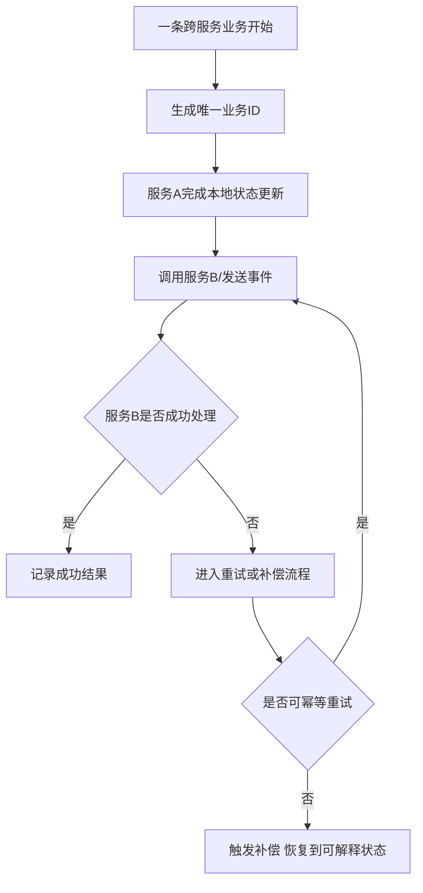

# 一致性、恢复与重连

服务一旦拆开，一致性、恢复和重连就不再是单点模块的问题，而会变成整条系统链路的共同课题。单体系统里，一个事务失败可能只是本地回滚；分布式系统里，你会面对更现实的情况：

- 这边写成功了，那边超时了
- 玩家会话已经迁移，旧节点还在跑
- 房间结束了，结算还没完全写回
- 客户端重连进来，但绑定关系还没更新完

所以这里真正要讨论的，不是分布式一致性的教科书，而是游戏项目里哪些状态需要多强一致，哪些状态允许最终一致，失败以后又靠什么恢复。

## 先分清两类一致性

比较稳妥的讨论方式，是先把一致性拆成两类：

### 运行时一致性

关注的是对局、房间、场景、匹配过程中的临时状态是否自洽。  
例如：

- 同一玩家是否只属于一个房间实例
- 房间结束后是否只会结算一次
- 玩家迁移时新旧场景是否不会同时持有控制权

### 长期资产一致性

关注的是奖励、货币、道具、任务、排行、支付结果等长期状态是否可信。  
例如：

- 奖励有没有重复发
- 战绩和排行是否一致
- 支付成功后发货是否最终收敛

这两类一致性的处理方式往往不同。试图用一种手段统一解决所有一致性问题，通常会很重也很差。

## 为什么恢复能力必须和一致性一起设计

很多系统设计只讨论“正常路径下状态如何一致”，却不讨论失败后怎么恢复。这会导致线上一出问题，团队只能靠人工修。  
而真实项目中，下面这些事情迟早会发生：

- 节点异常退出
- 服务间调用超时
- 控制平面调度失败
- 客户端断线重连
- 玩家迁移过程中中断
- 房间结算写到一半失败

恢复能力真正要回答的是：  
`失败后系统如何重新进入一个可解释、可继续、可补偿的状态。`

## 游戏项目里最常见的恢复问题

### 玩家重连

重连不是“重新连一下网关”这么简单，它往往涉及：

- 会话恢复
- 路由重新绑定
- 房间或场景实例定位
- 最近状态恢复
- 已完成但未确认结果的再确认

### 节点迁移

例如房间迁移、场景迁移、摘流、扩容或热点切流。  
这里关键不是“数据复制过去”，而是新旧节点的控制权交接是否清楚。

### 跨服务链路失败

例如房间结算成功了，但奖励发放超时；支付成功了，但回写失败；活动进度更新成功了，但战绩写入失败。  
这类问题几乎都要求幂等和补偿。

## 幂等和补偿为什么是分布式游戏系统的常备武器

很多跨服务链路都无法依赖一个全局大事务来解决。比较现实的做法通常是：

- 关键操作带唯一业务 ID
- 各服务基于业务 ID 做幂等处理
- 失败后有明确补偿或重试链路

例如：

- 同一场结算重复到达时，不会多发奖励
- 同一笔支付回调重复触发时，不会重复发货
- 同一份迁移请求重复执行时，不会让玩家出现双重绑定

幂等不是附加优化，而是让分布式恢复可行的基础设施。

## 为什么重连语义必须提前写清楚

重连是游戏系统最常见也最容易被低估的恢复链路。一个成熟系统通常要明确：

- 重连窗口有多长
- 玩家当前状态以哪个服务为准
- 断线期间房间或场景是否继续推进
- 回来以后是拉快照、追增量还是重新入局
- 已完成但客户端没收到的结果如何重新确认

如果这些语义没有先定，系统后面所有“偶发重连问题”其实都只是定义不完整的外显。

## 一条更贴近实际的跨服务恢复链路

这条链路真正重要的不是流程图本身，而是两件事：

- 必须有唯一业务标识
- 失败后必须有明确定义的去向，而不是停在半完成状态

## 恢复能力最常见的落点

比较稳妥的系统通常会在下面这些地方提前埋恢复能力：

- 房间和场景最近状态快照
- 玩家会话绑定和迁移记录
- 结算与奖励的唯一业务编号
- 控制平面的调度操作日志
- 关键长链路的重试与补偿记录

有了这些设施，故障后系统至少能朝着“可解释”恢复，而不是全靠人脑拼日志。

## 不同一致性要求该怎么取舍

并不是所有链路都要同样强的一致性。更现实的做法是：

- 局内高频状态：优先保证运行时语义清楚，允许局部最终收敛。
- 长期资产：优先保证幂等、审计和最终正确。
- 外围通知：允许延迟，不值得拖垮主链路。

这种分层取舍，比试图让所有状态都强同步更可持续。

## 典型失败模式

### 只有“成功路径”，没有恢复路径

这会导致一旦中间失败，系统不知道应该重试、补偿、回滚还是等待人工干预。

### 没有唯一业务 ID

一旦消息重复到达、回调重复触发或客户端重试，系统根本无法判断这是不是同一件事，最后重复发货、重复结算、重复迁移都会出现。

### 会话恢复和状态恢复脱节

玩家已经重新连上网关，但房间绑定、场景控制权或结算确认还没恢复一致，结果就是“连回来了，但状态不对”。

## 更接近最佳实践的结论

比较稳妥的做法通常是：

- 把运行时一致性和长期资产一致性拆开设计。
- 给跨服务关键链路定义唯一业务标识、幂等语义和补偿路径。
- 把重连看成正式恢复链路，而不是接入层小功能。
- 在控制平面、实例状态、资产链路里都预留恢复落点。

分布式系统的成熟，不体现在“从不失败”，而体现在“失败后仍能恢复成一个可解释的状态”。

## 常见误区

最常见的错误，是只讨论正常链路下如何协作，不讨论失败后怎么恢复。另一类错误，是把所有一致性问题都想用强事务解决，结果复杂度和性能都失控。第三类错误，是没有唯一业务 ID 和幂等语义，导致重试、回调、重连一来就出现重复副作用。第四类错误，是把重连只当接入层功能，不把它放回跨服务状态恢复链路中一起设计。
