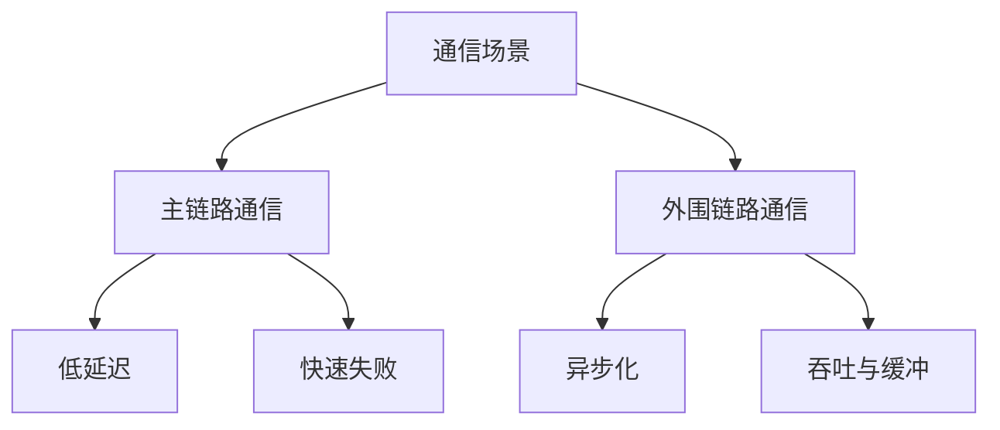
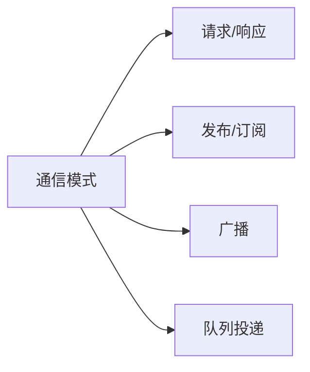

# 7. 消息系统与进程间通信

这一章讨论的是：当服务被拆开之后，它们如何在同机或跨机环境下交换信息，以及主链路和外围链路为什么不能用同一种通信思维处理。

边界约束：

- 这里主要讨论服务内 / 服务间通信模型
- 客户端接入协议和链路可靠性统一放到第 3 章

通信模型的选择，最终决定的是延迟、吞吐、耦合度和故障传播方式。

## IPC 基础与场景边界

IPC 不是一个单一技术，而是一类问题：`两个运行单元之间如何交换信息`。

在游戏系统里，常见场景包括：

- 同机进程间通信
- 跨机服务调用
- 节点内部消息分发
- 后台任务投递
- 异步事件广播

首先要分清楚的不是“用什么中间件”，而是通信发生在哪条链路上。

一个最有价值的区分是：

- 主链路通信
- 外围链路通信

主链路通常直接影响玩家当下体验，例如匹配结果投递、房间内关键事件、战斗内权威协作；外围链路则更偏向异步处理、日志、报表、通知、离线任务。

这两类链路的最优解经常完全不同。

## 通信模式

服务之间常见的通信模式大致有四类。

### 请求 / 响应

适合有明确调用方、被调用方和返回结果的场景。

优点：

- 语义直接
- 容易表达依赖关系

代价：

- 上下游耦合强
- 下游变慢会直接传染上游

### 发布 / 订阅

适合一个事件会影响多个消费者，且生产者不想直接耦合所有消费者的场景。

优点：

- 扩展性强
- 生产者和消费者解耦

代价：

- 调试和追踪更难
- 事件语义容易失控

### 广播

适合需要向一组目标分发相同信息的场景，例如某些跨节点通知、房间协作或状态同步辅助。

广播的问题不在“能不能发”，而在于目标集合、失败策略和风暴控制。

### 流水线 / 队列投递

适合把工作从主链路转移到异步处理链路上，例如日志汇聚、离线结算、报表计算、邮件投递。

它的价值在于削峰和解耦，但代价是延迟增加和一致性复杂度上升。

## 主链路与外围链路差异

这是整个通信设计里最重要的一条边界。

### 主链路

特点通常是：

- 延迟敏感
- 超时敏感
- 结果直接影响玩家体验
- 错误不能无限重试

主链路更关注：

- 稳定低延迟
- 失败快速暴露
- 调用边界清楚
- 权威链路短

### 外围链路

特点通常是：

- 更可接受延后处理
- 更重视吞吐和解耦
- 可以批处理或重试
- 更适合异步化

外围链路更关注：

- 吞吐
- 缓冲能力
- 最终一致
- 故障隔离

如果把主链路也做成“大家往队列里慢慢等”，实时体验通常会被拖垮；如果把外围链路全做成同步强依赖，请求链就会变得脆弱而冗长。

## 低延迟与高吞吐取舍

很多系统设计失败，不是因为技术不会，而是因为把低延迟和高吞吐当成同一个目标追。

它们经常是冲突的。

为了低延迟，你往往会选择：

- 更短的链路
- 更少的中转
- 更小的消息体
- 更快失败而不是堆积

为了高吞吐，你往往会选择：

- 批处理
- 队列缓冲
- 异步消费
- 更强的削峰能力

游戏系统设计里最常见的错误，是把本该低延迟的链路过度平台化，或者把本该异步化的外围处理硬塞进同步调用。

真正成熟的做法是先问：

1. 这条链路最怕慢还是最怕丢
2. 这条链路失败后是要立即反馈还是能稍后补偿
3. 这条链路有没有必要让上下游实时耦合

## 消息语义、幂等与顺序

一旦通信跨进程、跨节点，真正麻烦的往往不是“能不能送到”，而是“送到了以后，业务语义是否还成立”。

要重点处理的问题包括：

- 消息是否可能重复
- 顺序是否可能颠倒
- 消费是否可能成功一半
- 失败后是否可能重试

因此很多服务间消息都必须设计幂等语义。

例如：

- 发奖励消息不能因为重复消费多发一次
- 状态切换不能因为乱序回到旧状态
- 结算通知不能因为超时重试变成双写

顺序问题也不能想当然。很多系统不是“绝对有序”，而是“在某个对象作用域内需要局部有序”。比如同一个订单、同一个房间、同一个角色下的事件顺序往往比全局有序更重要。

## 如何选通信方案

通信方案的选择标准，不该是“公司都在用什么”，而应该回到链路问题本身。

适合重点看的维度包括：

1. 延迟要求
2. 吞吐要求
3. 失败处理方式
4. 顺序和幂等要求
5. 是否需要一对多扩散
6. 调试和追踪成本

真正好的消息系统，不是把所有通信统一到一个技术栈，而是让每类链路都用最符合它语义的协作方式。
