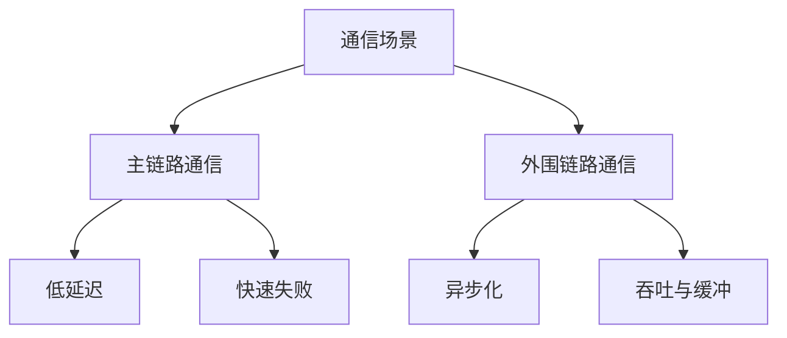

# IPC 基础与场景边界

IPC 不是一个单一技术，而是一类问题：`两个运行单元之间如何交换信息`。

在游戏系统里，常见场景包括：

- 同机进程间通信
- 跨机服务调用
- 节点内部消息分发
- 后台任务投递
- 异步事件广播

首先要分清楚的不是“用什么中间件”，而是通信发生在哪条链路上。

一个最有价值的区分是：

- 主链路通信
- 外围链路通信

主链路通常直接影响玩家当下体验，例如匹配结果投递、房间内关键事件、战斗内权威协作；外围链路则更偏向异步处理、日志、报表、通知、离线任务。

这两类链路的最优解经常完全不同。
