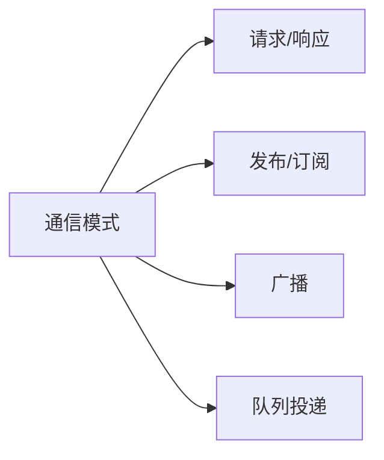

# 通信模式

服务之间常见的通信模式大致有四类。

### 请求 / 响应

适合有明确调用方、被调用方和返回结果的场景。

优点：

- 语义直接
- 容易表达依赖关系

代价：

- 上下游耦合强
- 下游变慢会直接传染上游

### 发布 / 订阅

适合一个事件会影响多个消费者，且生产者不想直接耦合所有消费者的场景。

优点：

- 扩展性强
- 生产者和消费者解耦

代价：

- 调试和追踪更难
- 事件语义容易失控

### 广播

适合需要向一组目标分发相同信息的场景，例如某些跨节点通知、房间协作或状态同步辅助。

广播的问题不在“能不能发”，而在于目标集合、失败策略和风暴控制。

### 流水线 / 队列投递

适合把工作从主链路转移到异步处理链路上，例如日志汇聚、离线结算、报表计算、邮件投递。

它的价值在于削峰和解耦，但代价是延迟增加和一致性复杂度上升。
