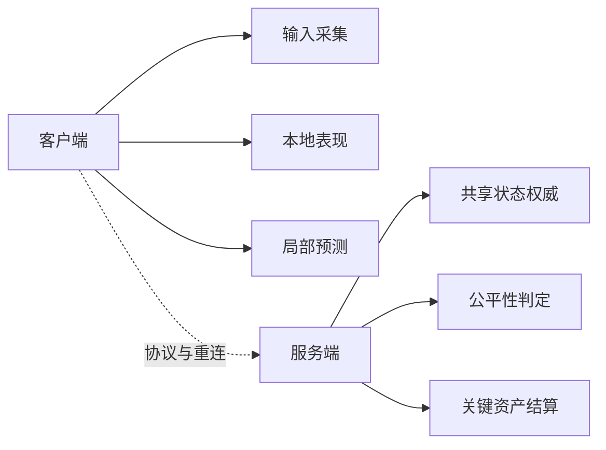
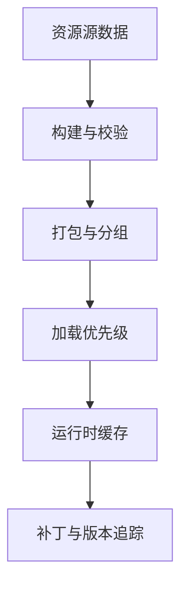

# 8. 客户端架构与引擎体系

这一章讨论的是：客户端不是“把服务端结果画出来”这么简单，它本身就是一个复杂运行时，负责输入、表现、资源、状态管理和大量用户体验问题。

边界约束：

- 这里主要讨论客户端架构、状态管理、资源系统和引擎能力
- 脚本层、热更新和逻辑扩展统一放到第 9 章
- 横向选型对照统一放到第 18 章

## 客户端技术栈与引擎

客户端技术栈的选择，不该先从“哪个引擎最流行”开始，而应该先回答：

1. 产品主要强调什么体验
2. 平台约束是什么
3. 团队现有能力是什么
4. 内容生产方式是什么

引擎本质上提供的是一套运行时和工具链，包括：

- 渲染能力
- 资源管理
- 场景组织
- 动画和 UI 系统
- 编辑器与内容工作流
- 脚本与扩展能力

真正的选择标准通常是匹配度，而不是参数表。

例如：

- 强表现 3D 项目更依赖渲染能力、工具成熟度和资源工作流
- 轻量 2D 或小游戏项目更看重包体、迭代速度和平台适配
- 长线运营项目会非常在意热更新、资源管理和工程协作

所以引擎选择的核心不是性能单项赛，而是项目整体组织方式是否匹配。

## 前后端边界与网络层

客户端和服务端的边界，不是“客户端做少一点就安全”，而是：

- 哪些逻辑必须由服务端权威裁决
- 哪些逻辑必须由客户端本地立即反馈
- 哪些逻辑允许两边分别承担不同职责

客户端通常负责：

- 输入采集
- 本地表现
- 局部预测
- UI 与交互
- 资源调度

服务端通常负责：

- 共享状态权威
- 公平性相关判定
- 关键资产结算
- 多玩家协调

客户端网络层的难点不只是“发包收包”，而是要协调：

- 连接状态
- 断线重连
- 消息分发
- 本地缓存与状态恢复
- UI 反馈与错误处理

如果客户端网络层和业务状态紧耦合，后期一旦协议变复杂，整个上层逻辑会非常难维护。

## 资源系统与工具链

客户端性能问题，很多时候不是代码不够快，而是资源系统没有设计好。

真正会决定运行体验的常见问题包括：

- 资源如何组织
- 加载和释放策略是什么
- 大资源什么时候预加载
- 场景切换时如何避免卡顿
- 补丁和资源版本如何对应

一个成熟的资源系统至少要处理：

1. 依赖关系
2. 加载优先级
3. 生命周期
4. 缓存策略
5. 失败恢复

工具链也同样重要。对长线项目来说，客户端工程效率很大程度取决于：

- 资源构建是否自动化
- 编辑器扩展是否够用
- 美术资源是否容易校验
- 包体和补丁是否可追溯

工具链不是锦上添花，而是决定团队能不能长期维护客户端复杂度。

## 脚本语言与 ECS

客户端架构最终都会面对两个问题：

1. 逻辑如何组织
2. 对象如何组织

脚本语言通常用于提升迭代效率、隔离部分业务逻辑和支撑热更新能力；ECS 或更数据导向的组织方式，则更多是在解决高频对象更新和复杂对象关系的问题。

它们常常被一起提起，但其实解决的是不同层面的事情。

脚本层更关心：

- 逻辑扩展
- 运行时解耦
- 迭代效率

ECS 更关心：

- 对象组织
- 更新效率
- 数据访问局部性

不要把脚本层等同于“灵活”，也不要把 ECS 等同于“性能一定更高”。二者的价值，都取决于产品复杂度是否真的需要它们承担这些问题。

## AI 在客户端与游戏系统中的应用场景

AI 在客户端和游戏系统中的角色，至少可以分成三类：

- 内容生产辅助
- 行为逻辑辅助
- 玩家体验增强

例如：

- 内容生产中做资源生成、标注或辅助配置
- 游戏内做 NPC 行为、辅助引导或个性化体验
- 运营和系统层面做推荐、分析或异常识别

这里最重要的不是“能不能接 AI”，而是：

- 是否真的解决当前问题
- 是否符合运行时成本和平台约束
- 是否会引入不可控行为

对客户端来说，任何会增加包体、耗时、不可解释性或平台审核风险的能力，都必须谨慎看待。
