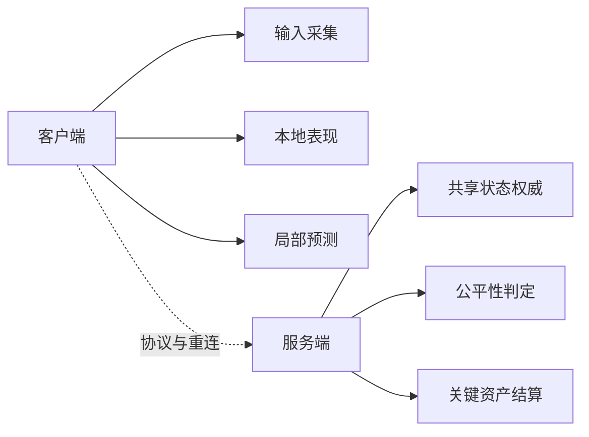

# 前后端边界与网络层

客户端和服务端的边界，不是“客户端做少一点就安全”，而是：

- 哪些逻辑必须由服务端权威裁决
- 哪些逻辑必须由客户端本地立即反馈
- 哪些逻辑允许两边分别承担不同职责

客户端通常负责：

- 输入采集
- 本地表现
- 局部预测
- UI 与交互
- 资源调度

服务端通常负责：

- 共享状态权威
- 公平性相关判定
- 关键资产结算
- 多玩家协调

客户端网络层的难点不只是“发包收包”，而是要协调：

- 连接状态
- 断线重连
- 消息分发
- 本地缓存与状态恢复
- UI 反馈与错误处理

如果客户端网络层和业务状态紧耦合，后期一旦协议变复杂，整个上层逻辑会非常难维护。
