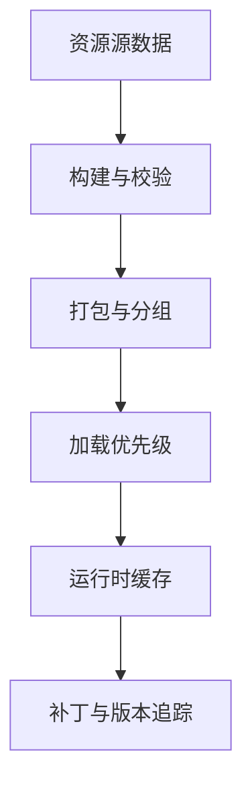

# 资源系统与工具链

客户端性能问题，很多时候不是代码不够快，而是资源系统没有设计好。

真正会决定运行体验的常见问题包括：

- 资源如何组织
- 加载和释放策略是什么
- 大资源什么时候预加载
- 场景切换时如何避免卡顿
- 补丁和资源版本如何对应

一个成熟的资源系统至少要处理：

1. 依赖关系
2. 加载优先级
3. 生命周期
4. 缓存策略
5. 失败恢复

工具链也同样重要。对长线项目来说，客户端工程效率很大程度取决于：

- 资源构建是否自动化
- 编辑器扩展是否够用
- 美术资源是否容易校验
- 包体和补丁是否可追溯

工具链不是锦上添花，而是决定团队能不能长期维护客户端复杂度。
