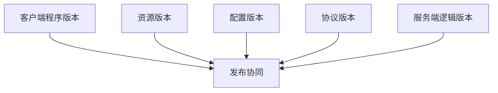
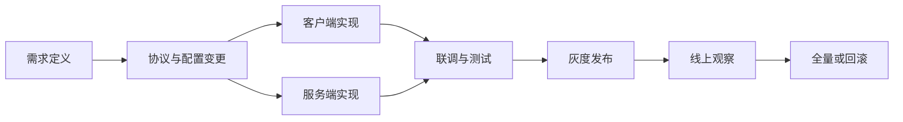

# 10. 版本发布、配置与研发管线

这一章讨论的是长线游戏最容易被低估的一条主线：`功能不是写出来就结束了，而是要能被配置、被发布、被回滚、被协同维护`。

很多项目前期只盯着玩法开发，等内容变多、团队变大、版本变密之后，才发现真正拖垮效率的不是逻辑实现，而是：

- 版本边界不清楚
- 配置来源混乱
- 发布流程靠人工记忆
- 前后端改动无法协同落地

## 版本体系总览

游戏项目里的“版本”从来不止一个。

至少要区分：

1. 客户端程序版本
2. 资源版本
3. 配置版本
4. 协议版本
5. 服务端逻辑版本

如果这些版本不分开管理，常见结果是：

- 修一个配置要发整个客户端
- 改一个协议字段导致多端同时崩
- 回滚服务端时发现资源或配置已经向前兼容不了

一个成熟的版本体系，首先不是定义复杂规则，而是明确每种版本各自负责什么变化、通过什么渠道发布、允许和哪些其他版本共存。

## 客户端、资源、配置与协议版本

这几类版本的变更性质完全不同。

### 客户端程序版本

用于承载代码逻辑、运行时能力、引擎升级和底层行为改变。它的变更成本最高，受平台审核和分发节奏影响最大。

### 资源版本

用于承载图片、音频、特效、地图、脚本资源等内容更新。它通常比程序版本更频繁，但也更依赖资源管理和补丁策略。

### 配置版本

用于驱动数值、掉落、活动、开放条件和大部分运营内容。它的更新频率往往最高，因此必须具备：

- 可校验
- 可追踪
- 可回滚
- 可审计

### 协议版本

用于定义客户端和服务端之间的契约变化。协议版本最大的问题不是“怎么编号”，而是如何定义兼容窗口。

真正要避免的是：

- 客户端已经发了新字段，老服务端不认识
- 服务端已经依赖新语义，老客户端无法理解
- 协议升级和发布节奏没有绑定关系

所以版本治理的关键不是“统一成一个大版本号”，而是明确依赖关系和兼容边界。

## 灰度、回滚与兼容窗口

只要是在线产品，就必须默认发布会出问题。

因此一套可用的发布体系，至少要先设计三件事：

1. 怎么小范围放量
2. 怎么快速回滚
3. 新旧版本允许共存多久

### 灰度

灰度可以按多种维度进行：

- 区服维度
- 用户维度
- 渠道维度
- 功能开关维度

灰度的目的不是“显得专业”，而是把未知风险限制在可控范围内。

### 回滚

回滚一定要区分层次：

- 服务端逻辑回滚
- 配置回滚
- 资源回滚
- 客户端程序回滚

这四者的难度完全不同。服务端和配置通常可相对快速回退，但客户端程序一旦通过平台分发出去，回滚空间会小很多。

### 兼容窗口

兼容窗口是线上现实，不是理论问题。特别是在移动端和小游戏平台上，新旧版本同时在线往往不可避免。

因此必须提前约束：

- 老版本还能活多久
- 哪些接口必须向后兼容
- 哪些功能只能在新版本启用

## 前后端协同与平台约束

很多发布事故，不是单点实现错误，而是协同关系失控。

最常见的链路是：

- 策划改配置
- 客户端改表现和交互
- 服务端改规则和校验
- 数据团队补埋点
- 测试验证多个版本组合

只要其中任何一环没有被纳入统一节奏，最终线上就会出现“功能半生不熟”的状态。

平台约束会进一步放大这个问题。例如：

- App Store 和主机平台审核让程序版本变更更慢
- 安卓渠道包管理会增加分支复杂度
- 小游戏平台的更新形式会限制资源和代码的组织方式

因此前后端协同不是简单的排期同步，而是要把“哪些变更可以解耦，哪些必须绑版本”写清楚。

## 配置表与数据驱动管线

长线游戏如果没有配置驱动，最终一定会在内容生产和版本迭代上失速。

配置表的价值，不只是让策划改数值，而是把高频变化的业务知识从代码里抽出来。

一个成熟的配置管线，至少要解决：

1. 数据源如何维护
2. 配置如何校验
3. 如何导出为运行时可消费格式
4. 前后端如何共享或裁剪
5. 如何做版本追踪和回滚

配置表设计时，重点不在“格式流行不流行”，而在：

- 结构是否稳定
- 引用关系是否清楚
- 错误是否能尽早暴露
- 是否能被机器校验

比起“用 Excel 还是 JSON”，更重要的是：

- 主键、外键、枚举是否规范
- 多表关系是否清楚
- 数值是否合法
- 是否存在循环依赖或脏引用

配置系统真正难的地方不是导出，而是防事故。

## 研发协作与发布工作流

当团队变大后，版本体系最终要落成一条清晰工作流。

这条链路通常至少包括：

1. 需求定义
2. 协议和配置变更
3. 客户端和服务端实现
4. 联调与测试
5. 灰度发布
6. 线上观察
7. 回滚或全量

真正高价值的工作流，不是多几张流程图，而是减少“靠人记得住”的环节。

比较值得平台化的能力包括：

- 配置校验自动化
- 协议和代码生成
- 构建与打包自动化
- 发布单与变更记录
- 灰度开关与观察面板
- 事故后可追溯的发布时间线

对游戏项目来说，研发效率不是“写代码的人有多快”，而是从需求到上线的整条链路有多稳。
