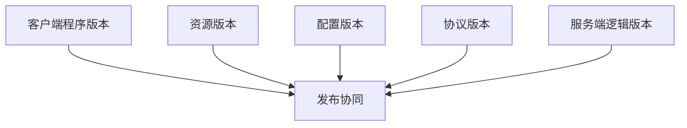

# 版本体系总览

游戏项目里的“版本”从来不止一个。

至少要区分：

1. 客户端程序版本
2. 资源版本
3. 配置版本
4. 协议版本
5. 服务端逻辑版本

如果这些版本不分开管理，常见结果是：

- 修一个配置要发整个客户端
- 改一个协议字段导致多端同时崩
- 回滚服务端时发现资源或配置已经向前兼容不了

一个成熟的版本体系，首先不是定义复杂规则，而是明确每种版本各自负责什么变化、通过什么渠道发布、允许和哪些其他版本共存。
