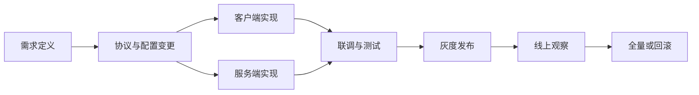

# 研发协作与发布工作流

当团队变大后，版本体系最终要落成一条清晰工作流。

这条链路通常至少包括：

1. 需求定义
2. 协议和配置变更
3. 客户端和服务端实现
4. 联调与测试
5. 灰度发布
6. 线上观察
7. 回滚或全量

真正高价值的工作流，不是多几张流程图，而是减少“靠人记得住”的环节。

比较值得平台化的能力包括：

- 配置校验自动化
- 协议和代码生成
- 构建与打包自动化
- 发布单与变更记录
- 灰度开关与观察面板
- 事故后可追溯的发布时间线

对游戏项目来说，研发效率不是“写代码的人有多快”，而是从需求到上线的整条链路有多稳。
