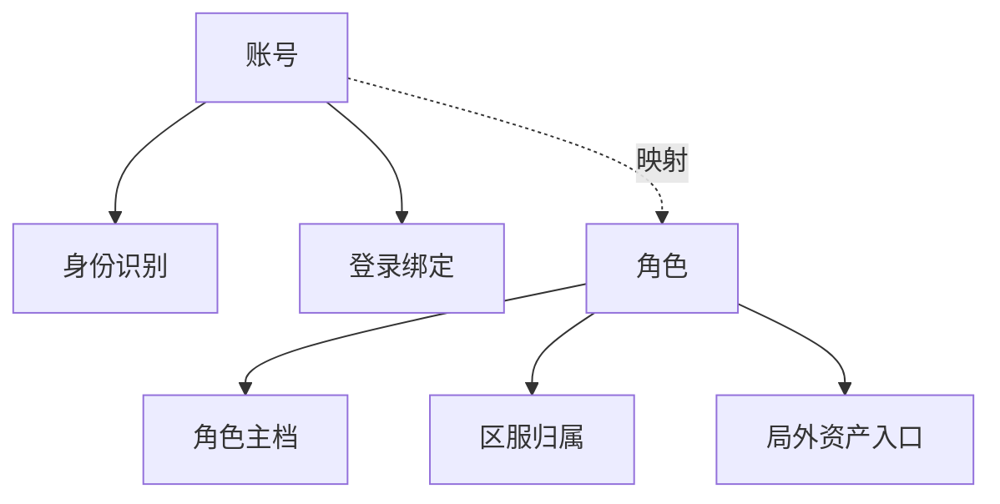
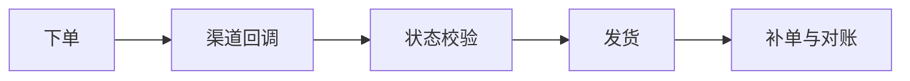

# 13. 通用游戏服务

这一章讨论的是那些在大多数长线游戏里都会反复出现的公共业务系统。

它们叫“通用服务”，不代表简单，反而往往是最容易积累历史包袱的部分。因为这些系统会被多个玩法、多个活动、多个版本持续叠加使用。

## 账号、角色与基础系统

账号和角色是大多数游戏的根部对象。

账号层通常负责：

- 身份识别
- 登录方式绑定
- 安全控制
- 平台账号关系映射

角色层通常负责：

- 角色主档
- 区服归属
- 基础成长状态
- 局外资产入口

这两层不要轻易混成一个对象。账号更偏用户身份，角色更偏游戏内实体。分层不清楚时，跨服、换绑、多角色管理和封禁治理都会变得很乱。

基础系统例如：

- 背包
- 道具
- 任务
- 邮件
- 公告

这些系统的共同特征是调用频率高、耦合范围广、事故影响大。因此它们必须优先强调：

- 接口稳定
- 状态清楚
- 幂等和可审计

## 活动、排行、匹配与社交

这类系统的共同特点是：它们不一定最底层，但会显著改变玩家活跃方式和系统负载形态。

### 活动

活动系统本质上是内容投放和规则编排系统。它的复杂度往往来自：

- 配置极多
- 生命周期复杂
- 和奖励、任务、商店、埋点高度耦合

### 排行

排行看起来只是排序，但实际会碰到：

- 排行更新频率
- 跨服汇总
- 奖励结算
- 作弊与异常数据处理

### 匹配

匹配系统不是简单排队，它通常要处理：

- 规则平衡
- 等待时长
- 区域与延迟
- 组队关系
- 失败重试

### 社交

社交系统包括好友、公会、联盟、聊天、组队等能力。它们最大的工程特点是关系型很强、跨在线和离线边界、经常需要和通知及运营能力联动。

这类系统一旦边界没想清楚，很容易互相缠绕成“一个改动影响十几个模块”。

## 交易、支付与经济系统

这是整个通用服务里最需要谨慎对待的一组系统，因为它们直接承载商业资产。

支付链路至少会涉及：

- 下单
- 渠道回调
- 状态校验
- 发货
- 补单
- 对账

真正难的不是“接一个支付 SDK”，而是保证：

- 每一笔订单状态清楚
- 回调重复不会重复发货
- 发货失败能补偿
- 对账时能追溯完整链路

经济系统则更进一步，因为它不仅要处理充值，还要处理：

- 虚拟货币
- 道具价值流转
- 产出与消耗
- 风险控制

真正成熟的经济系统，必须默认未来需要：

- 审计
- 追溯
- 异常回滚
- 风控分析

## 风控、审计、GM 与客服

当产品进入长线运营后，治理能力会逐渐从“外围工具”变成“核心系统”。

### 风控

风控不只是反作弊，还包括：

- 异常交易
- 工作室行为
- 资产异常波动
- 刷量和批量账号

### 审计

审计的价值在于让关键操作可追踪，尤其是在：

- 资产变更
- GM 操作
- 补发与回滚
- 处罚与申诉

### GM 与客服

GM 后台和客服平台本质上是治理和运营的执行工具。它们需要在“操作能力强”和“权限收敛”之间平衡。

如果后台能力过弱，线上问题处理效率低；如果后台能力过强但无审计，事故风险会非常高。

所以这类系统真正要解决的，不只是做一个管理界面，而是把治理动作纳入可控流程。
