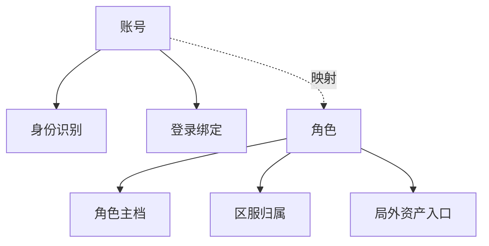

# 账号、角色与基础系统

账号和角色是大多数游戏的根部对象。

账号层通常负责：

- 身份识别
- 登录方式绑定
- 安全控制
- 平台账号关系映射

角色层通常负责：

- 角色主档
- 区服归属
- 基础成长状态
- 局外资产入口

这两层不要轻易混成一个对象。账号更偏用户身份，角色更偏游戏内实体。分层不清楚时，跨服、换绑、多角色管理和封禁治理都会变得很乱。

基础系统例如：

- 背包
- 道具
- 任务
- 邮件
- 公告

这些系统的共同特征是调用频率高、耦合范围广、事故影响大。因此它们必须优先强调：

- 接口稳定
- 状态清楚
- 幂等和可审计
