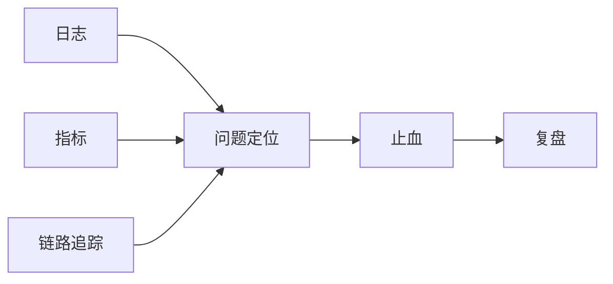
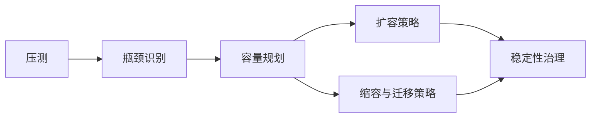

# 16. 可观测性、性能、容量与稳定性

这一章讨论的是：系统上线以后，如何看见它、理解它、压它、扩它，并在出问题时把它拉回来。

很多团队会把这些事情拆成四摊分别做：

- 日志和监控
- 性能分析
- 压测和扩容
- 故障处理

但在真正的在线系统里，这四件事是一条连续链路。没有观测，就没有定位；没有压测，就没有容量判断；没有容量判断，就没有稳定性治理。

## 日志、指标、Tracing 与 OTel

可观测性的核心不是“采多少数据”，而是“出现问题时，能不能沿着一条线把原因追出来”。

常见三类基础信号是：

- 日志
- 指标
- 链路追踪

### 日志

适合记录离散事件、状态变化、错误上下文和业务关键信息。

日志最大的问题不是不会打，而是：

- 关键链路没有统一字段
- 日志量失控
- 错误发生时上下文拼不起来

### 指标

适合回答趋势和健康度问题，例如：

- 延迟是否变差
- 某类错误是否飙升
- 某区服负载是否异常

指标不适合还原细节，但适合快速发现异常面。

### 链路追踪

适合穿透一条请求或业务链路经过了哪些节点、在哪一段变慢、在哪一段报错。

对分布式游戏后端来说，Tracing 的价值在于把“猜哪个服务有问题”变成“看到问题在链路哪一跳出现”。

OTel 这类标准化方案的价值不在于追新，而在于让指标、日志和追踪能以更一致的方式接起来。

## 专项可观测与 Tick 指标

通用监控只能解决一半问题，游戏服务器还需要专项观测。

例如：

- Tick 执行时长
- 房间帧耗时分布
- 战斗逻辑热点
- 地图或场景实例人数分布
- 广播包大小与发送频率
- 重连成功率

这些指标的价值在于，它们直接对应业务体验，而不是只对应基础设施。

如果只看 CPU、内存、带宽，很多游戏问题根本看不出来。玩家感知到的是“这局卡了”“技能延迟了”“重连失败了”，因此观测面也必须能贴近这些问题。

## Profiling、火焰图与热点分析

当系统已经知道“慢了”，下一步要回答的是“慢在哪里”。

这时需要进入更细颗粒度的性能分析。

常见手段包括：

- CPU Profiling
- 火焰图
- 内存分析
- 锁竞争分析
- on-CPU / off-CPU 分析

高价值的分析方式不是盯着某个函数名看，而是先确认热点属于哪一类问题：

1. 算法或数据结构问题
2. 锁或同步原语问题
3. 频繁分配与回收问题
4. I/O 或网络等待问题
5. 业务逻辑无节制膨胀问题

很多性能问题并不是底层库不够快，而是系统没有做边界控制。例如：

- 房间人数上升后广播成本线性爆炸
- 场景对象太多，更新范围没裁剪
- 配置查询走了错误路径

Profiling 的意义不是证明自己会用工具，而是找到真正值得改的热点。

## Debug、故障定位与复盘

线上故障处理最怕两种情况：

1. 看到了很多现象，但不知道主因
2. 修好了表面现象，但不知道为什么会再发生

一套可用的故障定位流程，通常应该按这个顺序推进：

1. 确认影响面
2. 判断是局部还是全局
3. 定位是在接入、逻辑、存储还是外部依赖
4. 确定临时止血方案
5. 再做根因追查

Debug 能力的核心不是个人经验，而是系统是否提供了足够的现场信息，例如：

- 关键对象快照
- 核心链路 Trace
- 统一请求或玩家标识
- 崩溃现场和核心指标时间线

复盘也不能只写“问题已修复”。真正有价值的复盘至少要回答：

- 为什么它能发生
- 为什么之前没发现
- 为什么这次影响这么大
- 下次如何更早发现或更快止血

## 压测、容量规划与扩缩容

压测的目的不是做一张漂亮图，而是建立容量认知。

真正要回答的是：

1. 哪个环节最先撞墙
2. 撞墙时现象是什么
3. 扩一台机器能缓解哪里
4. 哪些瓶颈不是简单横向扩容能解决的

游戏系统压测和普通接口压测不同的地方在于，它经常需要模拟真实行为模型，而不是只堆并发请求。

例如：

- 匹配涌入
- 大量房间同时开局
- 战斗高峰集中结算
- 世界服晚间在线峰值
- 活动开启瞬时流量冲击

容量规划时，不能只看平均值，要看：

- 峰值
- 尾延迟
- 波峰持续时间
- 扩缩容反应时间

扩容通常比大家想象中容易，缩容和迁移反而更难。因为扩容可以新增资源，而缩容会碰到状态收敛、会话迁移和节点摘除问题。

因此一个成熟的扩缩容体系，必须明确：

- 哪些实例可直接增减
- 哪些实例只能优雅下线
- 哪些状态必须迁移
- 哪些状态只能自然消亡

## 稳定性治理的真正目标

稳定性不是“永远不出事”，而是：

- 问题能尽早被看见
- 出问题时能快速止血
- 容量边界提前知道
- 事故会转化成系统性的改进

对长线游戏来说，稳定性最终是一种工程纪律，而不是某个监控面板。
