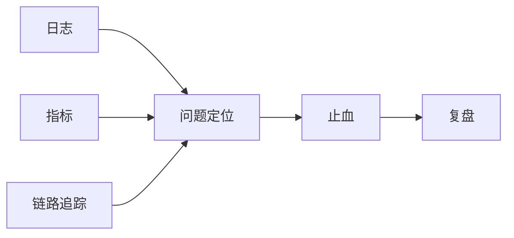

# 日志、指标、Tracing 与 OTel

可观测性的核心不是“采多少数据”，而是“出现问题时，能不能沿着一条线把原因追出来”。

常见三类基础信号是：

- 日志
- 指标
- 链路追踪

### 日志

适合记录离散事件、状态变化、错误上下文和业务关键信息。

日志最大的问题不是不会打，而是：

- 关键链路没有统一字段
- 日志量失控
- 错误发生时上下文拼不起来

### 指标

适合回答趋势和健康度问题，例如：

- 延迟是否变差
- 某类错误是否飙升
- 某区服负载是否异常

指标不适合还原细节，但适合快速发现异常面。

### 链路追踪

适合穿透一条请求或业务链路经过了哪些节点、在哪一段变慢、在哪一段报错。

对分布式游戏后端来说，Tracing 的价值在于把“猜哪个服务有问题”变成“看到问题在链路哪一跳出现”。

OTel 这类标准化方案的价值不在于追新，而在于让指标、日志和追踪能以更一致的方式接起来。
