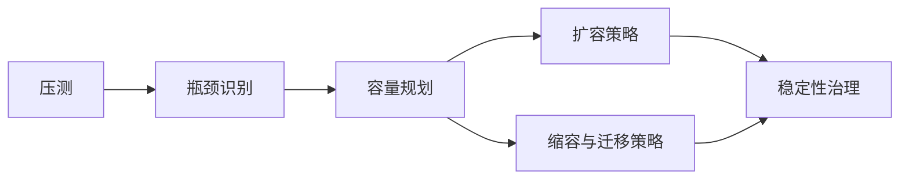

# 压测、容量规划与扩缩容

压测的目的不是做一张漂亮图，而是建立容量认知。

真正要回答的是：

1. 哪个环节最先撞墙
2. 撞墙时现象是什么
3. 扩一台机器能缓解哪里
4. 哪些瓶颈不是简单横向扩容能解决的

游戏系统压测和普通接口压测不同的地方在于，它经常需要模拟真实行为模型，而不是只堆并发请求。

例如：

- 匹配涌入
- 大量房间同时开局
- 战斗高峰集中结算
- 世界服晚间在线峰值
- 活动开启瞬时流量冲击

容量规划时，不能只看平均值，要看：

- 峰值
- 尾延迟
- 波峰持续时间
- 扩缩容反应时间

扩容通常比大家想象中容易，缩容和迁移反而更难。因为扩容可以新增资源，而缩容会碰到状态收敛、会话迁移和节点摘除问题。

因此一个成熟的扩缩容体系，必须明确：

- 哪些实例可直接增减
- 哪些实例只能优雅下线
- 哪些状态必须迁移
- 哪些状态只能自然消亡
