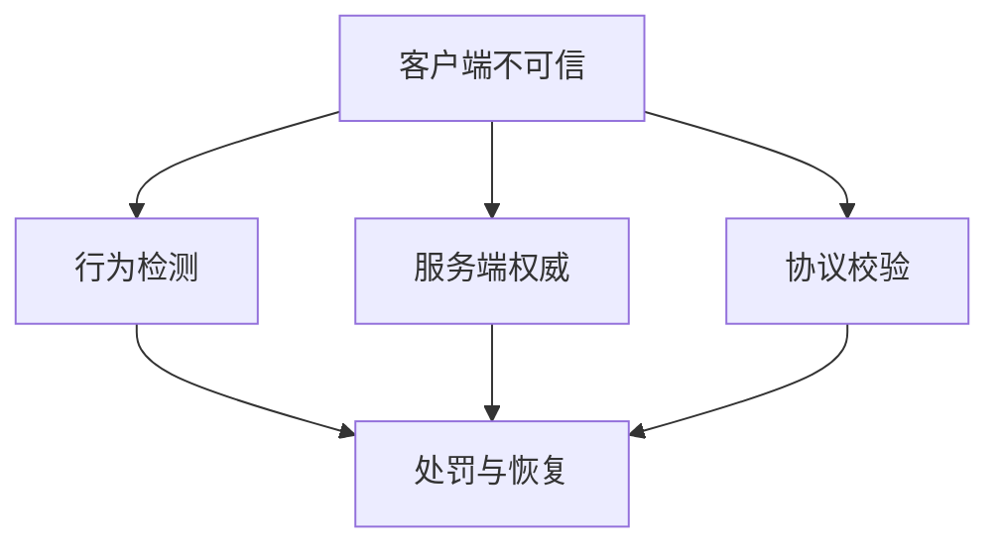
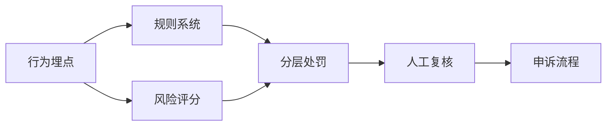

# 17. 安全、风控与合规

这一章讨论的是：当游戏真正上线并持续运营后，系统不再只面对功能问题，还要面对攻击、作弊、异常行为、平台约束和法律边界。

安全、风控和合规不是三件完全独立的事，它们共同决定一个系统能不能长期稳定运营。

## 安全与反作弊

游戏安全的第一原则是：`不要假设客户端可信`。

客户端天然暴露在玩家设备上，因此你必须默认以下事情都会发生：

- 协议被抓包
- 请求被重放
- 参数被篡改
- 客户端逻辑被修改
- 自动化脚本被接入

所以真正重要的不是“能不能完全阻止攻击”，而是：

- 哪些能力必须由服务端权威裁决
- 哪些关键状态必须在服务端校验
- 哪些异常行为必须能被检测和追溯

反作弊也不能只理解成“外挂检测”。常见作弊和异常来源包括：

- 客户端内存修改
- 自动化脚本和模拟器批量化行为
- 协议重放和伪造
- 非法资源或表现层篡改
- 利用结算、发货、匹配或排行逻辑漏洞获利

对游戏来说，反作弊最有效的手段通常不是单点技术，而是多层次组合：

- 服务端权威
- 协议校验
- 行为检测
- 奖励与资产审计
- 快速处罚与恢复机制

## 审计、隐私与数据安全

一旦系统承载账号、支付、社交和运营数据，数据安全就不只是“数据库别丢了”，而是要处理：

- 谁能看数据
- 谁能改数据
- 什么操作能被追踪
- 用户数据如何最小化暴露

审计的价值在于让关键行为可回溯，尤其是：

- 资产变更
- 后台操作
- 权限变更
- 封禁和处罚
- 补发和回滚

如果这些动作不可追踪，线上事故和申诉处理都会非常被动。

隐私和数据安全还要求团队明确：

- 采哪些数据是真正必要的
- 哪些数据需要脱敏
- 哪些访问必须分权
- 日志和分析链路里是否泄露了敏感信息

很多团队会把“安全”理解成外部攻击防护，但实际运营中，内部权限失控和数据治理混乱同样危险。

## 行为风控与治理体系

风控和反作弊有交集，但不完全相同。

风控更关注的是：`系统中有没有异常行为模式正在破坏规则、商业结果或生态秩序`。

典型场景包括：

- 工作室批量账号
- 刷号和薅活动
- 交易异常
- 资产异常流转
- 机器化行为

这类问题很多时候不是单次攻击，而是长期行为模式，因此风控更依赖：

- 行为埋点
- 规则系统
- 风险评分
- 分层处罚
- 人工复核和申诉流程

真正成熟的治理体系，不是“一刀切封禁”，而是能区分：

- 疑似异常
- 高风险异常
- 明确违规
- 需要人工介入的边界案例

处罚系统也必须和审计、客服、申诉链路打通，否则一旦误判，代价会很高。

## 合规、版号与平台约束

合规不是发布前才临时补的一张清单，它会直接塑造产品和工程实现。

常见约束包括：

- 版号与发行规则
- 实名和防沉迷要求
- 内容审核
- 渠道和平台审核
- 数据存储与跨境要求

这些约束对技术的影响很直接。例如：

- 账号体系必须支持实名和未成年人限制
- 文本、头像、UGC 可能需要审核链路
- 某些地区或平台对数据收集和使用有限制
- 某些商业化能力会被平台政策影响

真正危险的不是“合规要求复杂”，而是研发把它当作上线前最后一周再处理的问题。很多时候，合规必须提前进入架构设计。

## 许可风险与依赖治理

游戏项目往往会接入大量第三方：

- 开源库
- 商业 SDK
- 中间件
- 引擎插件
- 资源处理工具

这些依赖不只是技术资产，也带来许可和供应链风险。

需要重点关注的问题包括：

- 开源协议是否和项目形态冲突
- 商业授权是否覆盖当前平台和规模
- 第三方 SDK 是否会长期维护
- 依赖是否存在安全漏洞或停更风险

依赖治理真正重要的不是做一张表，而是明确：

- 当前项目依赖了什么
- 谁负责升级和审查
- 出问题时如何替换
- 哪些依赖进入了核心链路，不能随便失控

对长线项目来说，安全从来不是单点能力，而是一种持续治理。
