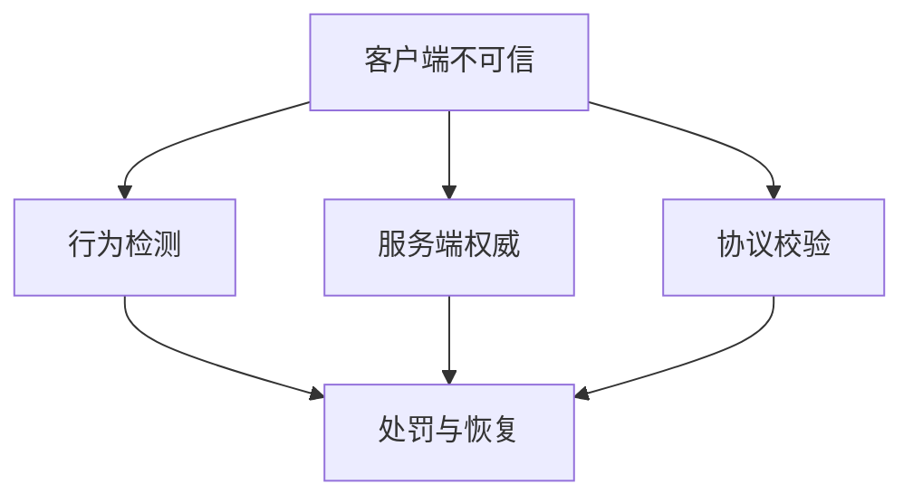

# 安全与反作弊

游戏安全的第一原则是：`不要假设客户端可信`。

客户端天然暴露在玩家设备上，因此你必须默认以下事情都会发生：

- 协议被抓包
- 请求被重放
- 参数被篡改
- 客户端逻辑被修改
- 自动化脚本被接入

所以真正重要的不是“能不能完全阻止攻击”，而是：

- 哪些能力必须由服务端权威裁决
- 哪些关键状态必须在服务端校验
- 哪些异常行为必须能被检测和追溯

反作弊也不能只理解成“外挂检测”。常见作弊和异常来源包括：

- 客户端内存修改
- 自动化脚本和模拟器批量化行为
- 协议重放和伪造
- 非法资源或表现层篡改
- 利用结算、发货、匹配或排行逻辑漏洞获利

对游戏来说，反作弊最有效的手段通常不是单点技术，而是多层次组合：

- 服务端权威
- 协议校验
- 行为检测
- 奖励与资产审计
- 快速处罚与恢复机制
